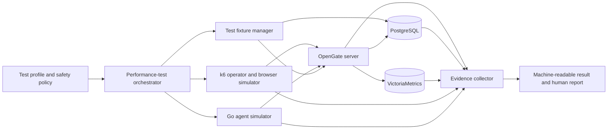

# Performance-Test Strategy — Load, Breakpoint, Soak, Spike, Volume, and Scalability

**Created:** 2026-08-07  
**Status:** Draft — alignment required before implementation  
**Owner:** Ivan  
**Decision gate:** The eight product and environment decisions in §15 must be
answered before source code is changed.

## 1. Objective

Turn OpenGate's two existing load generators into one coordinated,
evidence-producing performance-test capability:

- Grafana k6 models technicians, authenticated API traffic, and browser-side
  WebSocket traffic.
- The Go load harness models long-lived agents, mutual Transport Layer Security,
  QUIC connections, heartbeats, telemetry, reconnects, backfill, and the agent
  side of remote sessions.
- A small orchestrator coordinates phases, fixtures, safety limits, evidence
  collection, and cleanup. It is not a third load generator.

The capability must cover:

1. expected normal and peak traffic, including 95th-percentile latency and
   error-rate objectives;
2. progressive overload to identify the last passing and first failing load,
   followed by graceful-failure and recovery checks;
3. sustained moderate load to detect memory, connection, file, goroutine,
   storage, and latency degradation;
4. abrupt traffic and reconnection spikes;
5. growing PostgreSQL and VictoriaMetrics data volume; and
6. vertical scalability now, with horizontal scalability gated on the future
   distributed architecture.

No production-capacity claim may be made from the current shared staging cluster
or a variable GitHub-hosted runner.

## 2. Current-state evidence

### 2.1 Existing k6 coverage

| Scenario | Direct proof | What it covers | Gap |
|---|---|---|---|
| API baseline | [`api-baseline.js`](../../load/k6/scenarios/api-baseline.js) | A short HTTP regression at 20 simulated users; the existing threshold is 95th-percentile latency below 200 milliseconds and errors below 1% | Only two minutes; four simple reads; no representative fleet data or realistic journey mix |
| Concurrent agents | [`concurrent-agents.js`](../../load/k6/scenarios/concurrent-agents.js) | Health, device-list, and empty-session-list HTTP behavior at 30 simulated users | It does not simulate agents despite its name |
| Relay throughput | [`relay-throughput.js`](../../load/k6/scenarios/relay-throughput.js) | Health and group HTTP calls | It opens no WebSocket and populates `relay_msg_latency_ms` from health-request duration |

### 2.2 Existing Go-harness coverage

The harness in [`server/tests/loadtest`](../../server/tests/loadtest) starts every
configured agent concurrently, performs QUIC and the application handshake,
writes an agent-registration frame, emits any optional one-shot telemetry or
backfill traffic, then closes.

Important evidence:

- [`main.go`](../../server/tests/loadtest/main.go) has no duration, ramp, pacing,
  stable-connection, heartbeat-cadence, or reconnect-cycle option.
- Its registration duration ends after writing the frame. Actual device upsert
  and status persistence occur later in
  [`conn.go`](../../server/internal/agentapi/conn.go), so the current number is
  not server-confirmed registration latency.
- The optional telemetry, log-pull, and backfill controls exist, but the
  scheduled invocation in
  [`.github/workflows/load-test.yml`](../../.github/workflows/load-test.yml) uses
  only agent count, address, and certificate directory.
- The tenant flag creates tenant-looking hostnames/cohorts. The server assigns
  the authoritative tenant from the enrolled device, so a real multi-tenant test
  requires identities enrolled into real test tenants.

### 2.3 Empirical performance history

A read-only VictoriaMetrics audit on 2026-08-07 found these 90-day ranges:

| Measurement | Minimum | Median | Maximum |
|---|---:|---:|---:|
| API baseline, 95th percentile | 7.0 ms | 62.5 ms | 81.1 ms |
| Concurrent-agents HTTP, 95th percentile | 8.8 ms | 44.0 ms | 81.5 ms |
| Relay-labelled HTTP, 95th percentile | 11.0 ms | 62.2 ms | 108.3 ms |
| QUIC connect, 95th percentile | 166 ms | 247 ms | 1,154 ms |
| Application handshake, 95th percentile | 120 ms | 207 ms | 772 ms |
| QUIC aggregate throughput | 77/s | 211/s | 259/s |

The history contained an isolated 2% QUIC-error run and an isolated 25% API-error
run. The saved summaries lack phase-level time series, so the causes cannot be
established.

The regression gate documents why its relative bands are deliberately broad:
the shared environment has produced throughput between 0.36 and 1.22 times its
median and connection latency up to 4.5 times its median. See
[`loadtest-regression-check.sh`](../../scripts/loadtest-regression-check.sh).
This is suitable for collapse detection, not for measuring small capacity
regressions.

A three-day staging observation also found resident memory around 23–44
mebibytes and 23–57 goroutines, while connected-agent and relay-session gauges
never exceeded zero during the brief 100-agent runs. The server gauge updates
and VictoriaMetrics scrape are too slow to observe the current short-lived
connections.

### 2.4 Infrastructure and data constraints

- Production and staging share the same two-processor, 12-gigabyte ARM node.
  The source capacity values are in the
  [`oke` variables](../../deploy/terraform/modules/oke/variables.tf).
- Staging's server resource budget is defined in
  [`values-staging.yaml`](../../deploy/helm/opengate/values-staging.yaml). A load
  pod on the same node competes with the server and production.
- OpenGate is one combined API, QUIC, Intel management, and relay server. Relay
  ownership is process-local; turning on multiple full server replicas is not a
  correct scalability experiment. The accepted boundary is documented in
  [`Multiscale-Readiness.md`](../../docs/Multiscale-Readiness.md).
- The application database pool's defaults are in
  [`postgres.go`](../../server/internal/db/postgres.go), but pool open/active/idle/
  waiting values are not exported as application metrics.
- The device-list API is unpaginated. Its contract is in
  [`openapi.yaml`](../../api/openapi.yaml) and its query loads all matching rows
  in [`postgres_device.go`](../../server/internal/device/postgres_device.go).
- The telemetry cardinality test already establishes a measured reference model
  in [`spike_test.go`](../../server/tests/vmcardinality/spike_test.go): a
  500-agent reference, 50,000-series budget, and approximately 40 active series
  for a typical agent.
- The disposable stack in
  [`docker-compose.test.yml`](../../deploy/docker-compose.test.yml) is a useful
  starting point, but it lacks a performance-monitoring store, explicit resource
  limits, externally accessible QUIC, and a separate load-generator resource
  boundary.

## 3. Test taxonomy

The six test types answer different questions and must produce distinct results.

| Test | Question | Remote Monitoring and Management example |
|---|---|---|
| Normal and peak load | Does the system meet response-time and error objectives at expected traffic? | Technicians begin work, open fleet dashboards, filter devices, inspect inventory, and start normal remote sessions |
| Progressive stress and breakpoint | Where are the last passing and first failing loads, and does the system recover? | Increase connected agents, dashboard requests, and remote sessions until an objective fails |
| Soak or endurance | Does moderate sustained traffic cause resource growth or degradation? | Connected agents heartbeat and report telemetry all day while technicians perform normal work |
| Spike | Can the system absorb an abrupt burst and return to baseline? | A branch network returns after an outage and many agents reconnect and request backfill together |
| Volume | Does performance remain acceptable as stored data grows? | A service-provider tenant grows from hundreds to many thousands of devices with inventory, processes, audit events, and telemetry history |
| Scalability | How does added capacity change sustainable load and efficiency? | Compare the singleton under staging and production resource envelopes; later compare multiple gateways and API replicas after distributed ownership exists |

External strategy references:

- [Grafana API load-testing guidance](https://grafana.com/docs/k6/latest/testing-guides/api-load-testing/)
  distinguishes expected load, stress, spike, breakpoint, and soak testing and
  recommends reusable flows with different load profiles.
- [Microsoft performance-testing guidance](https://learn.microsoft.com/en-us/azure/well-architected/performance-efficiency/performance-test)
  defines load, stress, soak, and spike tests and requires measurable criteria
  and production-like environments.

## 4. Scope

### 4.1 In scope

- Authenticated operator journeys.
- Connected, disconnected, and reconnecting agents.
- Heartbeat, telemetry, process reports, backfill, logs, and history.
- Actual browser-to-agent relay pairing and binary WebSocket traffic.
- PostgreSQL control-plane data volume.
- VictoriaMetrics telemetry volume and active-series count.
- Graceful rejection, backlog drainage, and post-load recovery.
- Single-tenant, multi-tenant, large-tenant, and noisy-neighbour behavior.
- Vertical scalability of the current singleton.
- Future horizontal scalability activation gates, without claiming it works now.

### 4.2 Out of scope

- Production as a load target.
- Absolute production-capacity claims from shared staging or GitHub-hosted
  hardware.
- Multiple full server replicas before distributed session ownership and peer
  routing exist.
- Combining overload and infrastructure fault injection in the first delivery.
- Customer data or customer credentials.
- Agent host-operating-system resource cost; that requires real agents on
  representative endpoint hardware.

## 5. Proposed architecture and ownership

### 5.1 Component boundaries

- **k6:** HTTP requests, operator pauses, arrival rates, browser WebSockets,
  response checks, and client-observed latency.
- **Go simulator:** QUIC, certificates, stable connections, control frames,
  heartbeat cadence, reconnect behavior, telemetry, backfill, and the agent side
  of relay sessions.
- **Fixture manager:** tenants, organizations, sites, users, enrolled devices,
  inventory, processes, audit events, sessions, and telemetry. Public APIs are
  used in deployed staging; direct database loading is allowed only inside a
  disposable isolated environment.
- **Orchestrator:** profile selection, target allowlist, safety policy, phase
  coordination, component lifecycle, evidence collection, and cleanup.
- **Evidence collector:** observes without generating workload. It captures
  client, server, database, telemetry-store, node, and generator measurements.

For operator request rates, use k6's open arrival-rate model so slow responses do
not silently reduce offered load. See the
[constant-arrival-rate executor](https://grafana.com/docs/k6/latest/using-k6/scenarios/executors/constant-arrival-rate/).
For agents and remote sessions, use connection counts and lifecycle events because
their state is intentionally long-lived.

## 6. Execution-environment options

| Option | Shape | Honest coverage | Decision |
|---|---|---|---|
| A. Shared staging only | Extend the current scheduled workflow | Normal/peak and a tightly bounded spike; weak soak evidence | Insufficient for the requested scope |
| B. Hybrid | Shared staging for bounded regression; extended Compose stack for destructive and data-heavy tests | All test definitions, vertical scalability, and relative breakpoints | **Recommended immediate path** |
| C. Dedicated production-shaped environment | Separate node or cluster with matching network, storage, limits, and monitoring | Defensible capacity, long soak, and future horizontal scalability | Required before production-capacity claims |

Shared staging must not run unbounded stress, breakpoint, large-volume, or
sustained high-load tests. Kubernetes resource limits constrain individual
containers but do not make co-located production immune to node contention. See
[Kubernetes resource management](https://kubernetes.io/docs/concepts/configuration/manage-resources-containers/).

## 7. Domain objects and relationships

- **Test plan:** purpose, owner, environment, safety classification, and evidence
  requirements.
- **Load profile:** ordered phases such as warm-up, baseline, peak, recovery, and
  cool-down.
- **Fleet fixture:** tenant, organization, site, device, inventory, audit,
  session, and telemetry population.
- **Operator journey:** a weighted sequence such as dashboard, device list,
  device detail, and metrics.
- **Agent behavior:** connect, register, stay connected, heartbeat, report,
  disconnect, reconnect, and backfill.
- **Remote session:** paired browser and agent connections with message size,
  rate, duration, and disconnect behavior.
- **Gate:** a measurable rule scoped to a journey and phase.
- **Test run:** one immutable execution tied to a source revision, fixture,
  profile, environment, and generator capacity.
- **Observation:** a timestamped client, server, database, telemetry-store, or
  infrastructure measurement.
- **Finding:** a failed gate, last passing load, first failing load, resource
  bottleneck, invalid run, or recovery defect.

Relationships:

1. A test plan selects one load profile and one fleet fixture.
2. A load profile contains multiple phases.
3. Each phase activates operator journeys, agent behaviors, and remote sessions
   at defined rates or counts.
4. A test run produces observations.
5. Gates evaluate observations per journey and phase.
6. Failed gates become findings; they do not mutate the workload definition.

## 8. Remote Monitoring and Management workload catalogue

### 8.1 Operator journeys

1. Fleet dashboard: current user, organizations, sites, device summary, and
   device list.
2. Investigation: device detail, hardware, inventory, metrics, history, and
   logs.
3. Patch window: maintenance changes, restart commands, update manifests, and
   update status.
4. Remote operation: create session, pair browser and agent, send binary frames,
   and close the session.
5. Administration: enrollment, organization/site changes, user/security-group
   management, and audit reads.
6. Lifecycle: device deletion, tombstone enforcement, tenant purge, and
   purge-status polling.

### 8.2 Agent behaviors

1. Stable connected agent with heartbeat and default telemetry cadence.
2. Newly enrolled agent.
3. Known-agent reconnect using the fast path.
4. Reconnect storm with jitter.
5. Backfill requester receiving grants or deferrals.
6. Slow or non-responsive logs/history agent.
7. Duplicate connection for the same device.
8. Tombstoned agent attempting to reconnect and write.
9. Agent sending maximum valid payloads or malformed/oversized frames.
10. Intel management connection and remote power action.

### 8.3 Required edge and error cases

- An offline restart returns the documented conflict promptly; it is not counted
  as an unexpected server error.
- One log request per device succeeds while a concurrent request returns busy; a
  slow agent returns the documented timeout.
- Correlation at capacity returns an explicit retryable response without
  starving agent heartbeats.
- Backfill is deferred before live telemetry or control traffic is sacrificed.
- A newer duplicate connection remains authoritative when the older connection
  closes.
- A deleted device cannot recreate data during reconnect or backfill.
- A large tenant cannot read another tenant's data or degrade a small tenant
  beyond the agreed noisy-neighbour allowance.
- One missing or slow relay peer does not leak a session or block unrelated
  sessions.
- Abrupt relay disconnect cleans in-memory state and the database session row.
- The documented WebSocket message limit is enforced without unbounded memory
  growth.
- Long tests reauthenticate before the operator login token expires, rather than
  misclassifying authentication expiry as performance degradation. The token
  duration is configured in
  [`server/cmd/meshserver/main.go`](../../server/cmd/meshserver/main.go).

## 9. Measurements and result classification

### 9.1 Client outcomes

- 50th, 95th, and 99th percentile latency per journey and phase.
- Expected and unexpected error rates, reported separately.
- Offered and achieved request rate.
- Dropped or unscheduled iterations.
- Response correctness, not merely successful status.
- WebSocket connect, pair, message round-trip, throughput, close, and cleanup.
- QUIC connect, application handshake, server-confirmed registration,
  heartbeat, reconnect, and backfill completion.

Every k6 request and custom measurement is tagged by test type, phase, journey,
route, and expected outcome. k6 supports tag-scoped pass/fail rules; see
[thresholds](https://grafana.com/docs/k6/latest/using-k6/thresholds/).

### 9.2 Server and dependency outcomes

- Route latency and status.
- Agent-registration outcomes and server-side duration.
- Connected agents and active relay sessions.
- Database query duration and errors.
- Database-pool open, active, idle, and waiting connections.
- Telemetry accepted, dropped, and deferred.
- Backfill slots, grant rate, and time to drain.
- Process memory, heap, goroutines, open files, garbage-collection pauses, and
  restarts.
- PostgreSQL connections, locks, dead rows, autovacuum activity, database size,
  and input/output pressure.
- VictoriaMetrics active series, ingest rate, query latency, and disk growth.

PostgreSQL volume tests include updates and deletes rather than measuring seed
time alone. Vacuuming recovers deleted-row space, refreshes query-planner
statistics, and creates its own input/output load. See
[PostgreSQL routine vacuuming](https://www.postgresql.org/docs/current/routine-vacuuming.html).

### 9.3 Recovery

Recovery begins when offered load returns to the normal baseline. A run recovers
only when:

- latency and unexpected errors return to their accepted baseline band;
- request and backfill queues drain;
- agent and session counts settle to expected values;
- database connections, goroutines, and open files stop growing;
- the server and dependencies remain healthy; and
- the next normal operator and agent journeys succeed.

Aggregate end-of-run percentiles are insufficient because they blend baseline,
burst, and recovery. Every test produces timestamped data. See
[k6 results output](https://grafana.com/docs/k6/latest/get-started/results-output/)
and [spike-recovery measurement](https://grafana.com/docs/learning-paths/k6-spike-testing/measure-recovery/).

### 9.4 Expected rejections versus failures

The result model separates:

- expected protective outcomes, such as offline conflict, busy log pull,
  capacity response, timeout from a deliberately slow agent, and deferred
  backfill;
- unexpected application errors;
- workload-generator failures; and
- invalid runs caused by environment or generator saturation.

Expected protective outcomes still carry latency and correctness gates. They
must be timely, explicit, tenant-safe, and recoverable.

### 9.5 Generator validity

A result is invalid rather than failed if the generator is saturated. Capture
its processor, memory, network, file-descriptor, and dropped-work measurements.
The initial safety rule follows Grafana's large-test guidance: preserve at least
20% processor headroom and keep physical-memory use below 90%. See
[running large tests](https://grafana.com/docs/k6/latest/testing-guides/running-large-tests/).

## 10. Test-family acceptance contracts

Numeric product objectives remain gated by §15. Structural criteria are fixed.

### 10.1 Normal and peak

- The configured load is achieved.
- Every required journey runs against representative populated data.
- Per-journey 95th-percentile latency and unexpected errors meet the agreed
  objectives.
- No restart, memory-limit termination, cross-tenant response, or growing
  backlog occurs.
- Expected conflict, busy, timeout, and capacity responses match their contracts.

The current 200-millisecond and 1% API rule is an existing engineering threshold,
not yet a ratified product objective.

### 10.2 Progressive stress and breakpoint

- Increase one load dimension at a time.
- Record the last passing and first failing step.
- Stop automatically at a safety limit or objective breach.
- Failure remains bounded: no data corruption, tenant leak, uncontrolled restart
  loop, or unbounded queue.
- After load returns to baseline, recovery passes within the agreed interval.
- The report identifies the limiting resource and supporting evidence; it does
  not emit an unsupported single “maximum users” number.

### 10.3 Soak or endurance

- Exclude warm-up from leak evaluation.
- Compare the first and final stable windows and calculate resource-growth
  slopes.
- Fail only when sustained growth and an agreed material increase are both
  present.
- Database connections, goroutines, open files, sessions, and backfill slots
  return to expected steady ranges.
- Latency and errors do not trend upward.
- Storage growth matches the fixture's calculated write volume.
- Authentication renewal and cleanup are proven.

### 10.4 Spike

- Record baseline, burst, and recovery independently.
- Test operator traffic and agent reconnections separately before combining them.
- Measure burst errors, queueing, backfill deferral, and recovery time.
- Never decide the result from a whole-run percentile alone.

### 10.5 Volume

Run the same traffic against:

1. the current reference size;
2. the committed fleet target; and
3. the agreed headroom size.

Measure device-list response size and memory, summary queries, inventory/history
reads, audit pagination, database growth, telemetry series, telemetry-query
latency, dead rows, vacuum behavior, and cleanup. The unpaginated device-list
endpoint is a predicted bottleneck; evidence confirming it is a finding, not a
reason to hide it behind a smaller fixture.

### 10.6 Scalability

For the current architecture:

- keep fixtures and workload constant;
- compare at least the existing staging and production resource envelopes;
- record sustainable throughput, latency, errors, memory, and throughput per
  processor allocation; and
- report whether added resources increase capacity or move the bottleneck.

Horizontal scalability is deferred until the dependencies in
[`Multiscale-Readiness.md`](../../docs/Multiscale-Readiness.md) are implemented.
Testing two full replicas now would test a known-invalid topology.

## 11. Security, performance, and maintainability constraints

### 11.1 Security

- Hard-deny production hostnames and namespaces; a user-provided URL cannot
  bypass the allowlist.
- Use synthetic test data only. AWS also recommends synthetic or sanitized
  production data in a production-like environment; see
  [AWS load-testing guidance](https://docs.aws.amazon.com/wellarchitected/2024-06-27/framework/perf_process_culture_load_test.html).
- Keep load-test tenants and users separate from standing staging fixtures.
- Never write login tokens, relay tokens, certificate private keys, or full
  sensitive identifiers to artifacts.
- Replace the staging workflow's certificate-authority private-key extraction
  with enrollment-issued test certificates.
- Generate a test-only certificate authority inside disposable environments.
- Perform certificate creation and fixture loading outside timed workload phases.
- Make cleanup idempotent and verify residue.
- Apply zero tolerance to tenant-isolation failures.

### 11.2 Performance fidelity

- Run the load generator outside the tested server's resource boundary.
- Record target and generator resource fingerprints with every run.
- Use a production release build, not a debug build.
- Measure offered load separately from achieved load.
- Capture timestamped measurements at a resolution capable of seeing short
  bursts.
- Keep fixture setup, certificate generation, and cleanup outside measured
  workload phases.

### 11.3 Long-term maintainability

- One shared journey library; profiles change rates and phases rather than
  copying scripts.
- One versioned profile format for all test families.
- Deterministic seeded fixtures and behavior.
- One versioned result schema.
- Reviewed thresholds with rationale and calibration evidence.
- Production-useful instrumentation only; no test-only runtime endpoints or
  bypasses in the shipped server.
- A small smoke execution before every expensive test.
- Test-first source changes under the repository's enforced workflow.
- Canonical documentation updates in [`docs/`](../../docs), plus phases,
  technical debt, and an architectural decision record when required.

## 12. Expected output from every run

Each run produces one evidence bundle containing:

- source revision and profile version;
- target environment and target resource fingerprint;
- generator resource fingerprint;
- tenant, organization, site, device, inventory, history, and telemetry fixture
  counts;
- phase start/end timestamps;
- offered and achieved load;
- per-phase and per-journey latency, error, correctness, and throughput;
- server, PostgreSQL, VictoriaMetrics, node, and generator time series;
- expected-rejection counts separate from unexpected failures;
- last passing and first failing load where applicable;
- recovery time and settled-resource evidence;
- pass, fail, or invalid classification with reasons;
- cleanup actions and zero-residue verification; and
- a concise human-readable report linking the raw evidence.

The current VictoriaMetrics trend remains useful for stable summary series, but
raw phase data is retained as a run artifact so the summary store is not the
only evidence.

## 13. Concrete implementation sequence

Implementation does not start until §15 is resolved.

### Phase 0 — Freeze targets and safety policy

1. Answer §15.
2. Record normal, peak, recovery, soak, volume, and scalability objectives.
3. Record environment permissions, maximum load, maximum duration, cost limit,
   and emergency-stop behavior.
4. Decide which tests gate pull requests, scheduled runs, releases, or remain
   informational.

### Phase 1 — Repair measurement credibility

1. Write failing tests for profile parsing, expected-error classification,
   recovery calculation, and result completeness.
2. Rename or replace misleading k6 scenarios.
3. Add journey and phase tags and correctness thresholds.
4. Export timestamped k6 and Go measurements.
5. Add server-side registration outcome/duration metrics.
6. Add database-pool open/active/idle/waiting metrics.
7. Add test-resolution collection that can see bursts shorter than the standing
   monitoring scrape interval.

### Phase 2 — Reproducible fixtures

1. Define the versioned fixture schema.
2. Create real tenants, organizations, sites, users, devices, and enrollments.
3. Add representative inventory, process, audit, session, and telemetry data.
4. Support bounded public-API setup for staging and bulk direct loading only for
   isolated environments.
5. Emit a cleanup manifest and verify no unintended residue.

### Phase 3 — Stateful Go agent simulator

1. Add duration, ramp, cadence, seeded jitter, and graceful-stop behavior.
2. Hold connections open and send heartbeats at the configured cadence.
3. Schedule telemetry cycles rather than sending them immediately.
4. Model known reconnect, duplicate connection, backfill, slow response,
   tombstone, and disconnect behaviors.
5. Verify registration using the server outcome metric plus sampled authenticated
   API confirmation; do not add a test-only wire acknowledgement.
6. Enroll devices into real tenant cohorts.

### Phase 4 — Real relay coverage

1. The Go simulator receives the session request and joins the agent relay side.
2. k6 creates the session and joins the browser side using a real WebSocket.
3. Exercise binary frames, message-rate and byte-rate profiles, maximum valid
   messages, missing peers, slow peers, and abrupt closes.
4. Verify frame delivery, ordering, bounded failure, and complete cleanup.

k6's supported WebSocket API is documented at
[k6/websockets](https://grafana.com/docs/k6/latest/javascript-api/k6-websockets/).

### Phase 5 — Orchestration and artifacts

1. Implement the target allowlist and production deny-list.
2. Implement maximum load, duration, resource, and cost guards.
3. Coordinate fixtures, agents, k6, observations, cleanup, and emergency stop.
4. Build the versioned evidence bundle and fail on missing mandatory evidence.
5. Classify generator/environment saturation as invalid rather than as an
   application regression.

### Phase 6 — Scenario delivery order

1. Normal and peak load.
2. Bounded staging spike and isolated full spike.
3. Isolated progressive stress and breakpoint.
4. Isolated control-plane and telemetry volume matrix.
5. Short soak qualification followed by scheduled long soak.
6. Vertical scalability matrix.
7. Dedicated-environment production-capacity measurement.
8. Horizontal scalability only after the distributed architecture is correct.

### Phase 7 — Calibration and activation

1. Run at least three calibration repetitions per candidate gate.
2. Verify generator and environment validity.
3. Freeze reviewed absolute objectives and noise bands in version control.
4. Activate blocking gates only after repeated runs produce stable verdicts.
5. Update canonical documentation, project state, technical debt, and relevant
   architectural decisions.

## 14. Three-dimensional delivery definition

### 14.1 Core logic

- Reusable operator journeys.
- Stateful agent behaviors.
- Phase scheduling and synchronization.
- Expected-outcome classification.
- Recovery calculation.
- Resource-growth and leak evaluation.
- Progressive breakpoint search.
- Volume and scalability comparison.
- Complete, deterministic evidence generation.

### 14.2 Scope boundaries

- k6 owns operator and browser behavior.
- Go owns agent behavior.
- The fixture manager owns test data.
- The evidence collector observes and never generates workload.
- Shared staging permits bounded regression and bounded spikes only.
- Destructive and data-heavy tests run in isolation.
- Production is prohibited.
- Horizontal scale is prohibited until distributed correctness exists.

### 14.3 Definition of done

The capability is complete when:

- all six test families have reviewed, versioned profiles and environment
  classifications;
- every run records source, environment, fixture, generator, offered load,
  achieved load, phases, gates, and cleanup;
- actual registration persistence and actual relay traffic are measured;
- expected protective outcomes are separated from faults;
- every run uploads raw time series and a concise human report;
- breakpoint reports identify the last passing load, first failing load,
  bottleneck, and recovery;
- soak reports include memory, goroutine, open-file, database-pool, dead-row,
  active-series, and storage trends;
- volume reports compare performance and storage by fixture size;
- scalability reports compare capacity and efficiency by resource shape;
- three consecutive calibration runs produce the same verdict, otherwise the
  environment remains non-gating;
- test fixtures, sessions, pods, credentials, and temporary series leave no
  unintended residue;
- no test can resolve to production;
- canonical documentation and decisions are current; and
- known limitations, especially horizontal scale, are explicit.

## 15. Alignment decisions required before implementation

These requirements cannot be inferred from the repository or measured history.
There must be no source-code work until they are answered.

1. **Fleet targets:** What are the current and 12-month targets for enrolled
   devices, simultaneously connected agents, simultaneous reconnects, active
   technicians, concurrent remote sessions, and telemetry cadence?
2. **Performance objectives:** Should the existing API objective—95th percentile
   below 200 milliseconds and unexpected errors below 1%—become the normal-load
   objective? What are the peak objectives for dashboard reads, device detail,
   command acceptance, and relay messages?
3. **Recovery objective:** Should overload and spike recovery initially use the
   fault-test convention of returning to normal within 60 seconds after load
   clears, or is another interval required?
4. **Degradation priority:** Is the desired priority order: live agent control
   and remote sessions; operator commands; operator reads; live telemetry; then
   historical backfill?
5. **Environment investment:** Adopt the hybrid approach with relative capacity
   results now, or include a paid production-shaped test environment in the
   first delivery?
6. **Soak duration:** Is the staged proposal acceptable: two hours during
   development, eight hours weekly, and 24 hours before a capacity release?
7. **Volume target:** Is the primary risk PostgreSQL control-plane volume,
   VictoriaMetrics telemetry volume, or both? What maximum tenant and fleet
   sizes must the first matrix cover?
8. **Scalability boundary:** Deliver vertical scalability of the singleton now
   and leave horizontal scalability as a future activation gate, or include the
   Large-tier distributed-architecture work?

## 16. Definition of ready

This plan becomes implementation-ready only when:

- all eight §15 decisions have explicit answers;
- every selected test family has numeric load, duration, and pass/fail criteria;
- the allowed execution environment and cost boundary are approved;
- the production deny-list and cleanup contract are accepted;
- expected protective responses have agreed classifications;
- the profile/result schemas and component ownership boundaries are accepted;
  and
- no requirement is left as “to be determined.”

