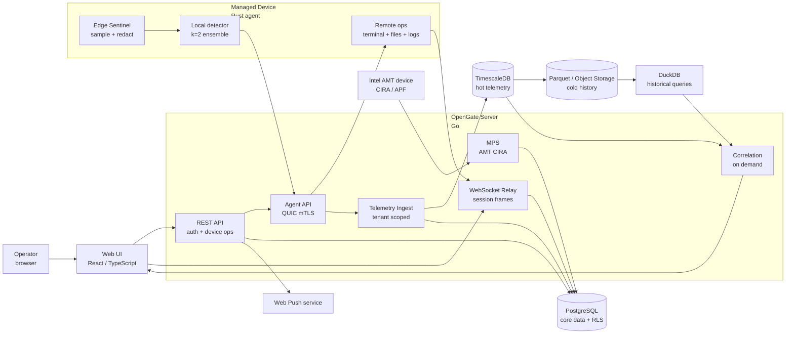

<h1 align="center">OpenGate</h1>

<h3 align="center">Secure RMM with edge-first health intelligence.</h3>

OpenGate is a browser-based remote management and infrastructure monitoring platform. Monitor, detect, and take secure remote control across your entire infrastructure.

<!-- Badges track `dev` because that is the only branch CI runs on: per
     .claude/rules/git.md all work lands on dev; main only receives `[skip ci]`
     auto-merge commits, so a default-branch badge would freeze on whatever ran
     last on main. -->

  
  
  
  

  <a href="#what-it-is">What It Is</a> |
  <a href="#core-advantages">Core Advantages</a> |
  <a href="#key-features">Key Features</a> |
  <a href="#architecture">Architecture</a> |
  <a href="#observe-control">Observe &amp; Control</a> |
  <a href="#how-it-works">How It Works</a> |
  <a href="#agent-capabilities">Agent Capabilities</a> |
  <a href="#documentation">Documentation</a>

---

## What It Is

OpenGate provides secure remote access and Intel AMT out-of-band
endpoint management via remote agents. Agent`s edge-first health inteligence provides
telemetry, host anomaly detection, and investigation-oriented correlation.

The three-part architecture is built around these main components: a Zero-Configuration ML-Powered agent, a centralized server for configuration, user and data management, central alerts, and a web client for remote fleet operations, data visualisations, and dashboards.

## Core Advantages

- **Outbound-first fleet access** - agents connect to the server over QUIC with
  mTLS, so managed devices do not need inbound administrative exposure.
- **Secure enrollment and updates** - first boot uses CSR-based enrollment, and
  agent updates are signed before being applied.
- **Browser-native operations** - operators manage devices, terminal sessions,
  files, logs, updates, and out-of-band actions from the web UI.
- **Edge health intelligence** - Edge Sentinel samples host health locally, 
  detects anomalies on the device, and sends summarized telemetry 
  avoiding raw high-volume streams by default.
- **Investigation first** - anomaly panels, timelines, and correlation drill-down
  are designed as operator aids before automatic alerting.

## Key Features

| Area | Capability |
|---|---|
| Fleet inventory | Devices, groups, online/offline state, hardware inventory, and on-demand device logs |
| Remote sessions | Browser-to-agent sessions over relay with terminal, file, desktop protocol frames, permissions, and teardown cleanup |
| Terminal | PTY-backed terminal frames between web and agent |
| File manager | Directory browsing plus file download/upload protocol support |
| Intel AMT / MPS | CIRA/APF management presence server with AMT device tracking and power actions |
| Agent lifecycle | CSR enrollment, QUIC mTLS registration, heartbeat, deregistration, restart, and signed OTA updates |
| Web Push | Browser subscriptions for device and session lifecycle notifications |
| Edge Sentinel telemetry | CPU, memory, disk, network, process, and service telemetry summarized at the edge |
| Correlation drill-down | On-demand anomaly advisor using KS-test and anomaly-rate ranking with bounded concurrency |
| Dense timelines | uPlot-based device timelines, anomaly badges, fleet overview, and drill-down UI |

## Architecture

| Component | Stack | Responsibilities |
|---|---|---|
| **Agent** | Rust workspace | CSR enrollment, QUIC mTLS control, registration, session handling, terminal/file/log/hardware paths, signed updates, local Edge Sentinel sampling, cmdline redaction, anomaly detection, and telemetry windows |
| **Server** | Go module | REST API, QUIC agent API, WebSocket relay, auth, certificates, PostgreSQL persistence, Intel AMT MPS, Web Push, update manifests, tenant context/RLS, telemetry ingest, correlation, and cold-tier access |
| **Web** | React / TypeScript | Dashboard, device list/detail, session UI, terminal, file manager, update settings, admin views, anomaly badges, telemetry timelines, fleet overview, and correlation drill-down |

## Observe & Control

| Surface | OpenGate view |
|---|---|
| Fleet state | Devices, groups, status, capabilities, and audit trail |
| Remote operations | Browser sessions, terminal I/O, file operations|
| Host inventory | CPU, memory, disk, network interfaces, hardware snapshots, and on-demand refresh |
| Logs | Agent-collected device logs with filtering |
| Edge telemetry | CPU, memory, disk, network, process, and service families sampled locally by the agent |
| Process visibility | Top-N process/service metrics by rank with process names and command lines |
| Anomaly state | Node anomaly rate, per-family rates, recent bitmask, model/sampler version, and device health badge |
| Investigation | Device timelines, downsampled metric windows, selected-window correlation, and ranked likely contributors |
| AMT | Intel AMT device inventory, CIRA connectivity, WSMAN device info, and power actions |
| Security | JWT auth, bcrypt passwords, security groups, mTLS, CSR validation, RLS, secret redaction, and no standing edge storage credentials |

## How It Works

The remote-management path and the telemetry path share the same authenticated
control plane. Edge Sentinel failures are designed to degrade silently so remote
management remains the priority path.

## Agent Capabilities

| Capability | What it does |
|---|---|
| First-boot enrollment | Generates identity material, submits a CSR, receives the CA-signed certificate, and stores the server CA for future QUIC mTLS connections |
| Control connection | Opens the QUIC control stream, performs the binary handshake, registers hostname/OS/architecture/version/capabilities, and maintains heartbeats |
| Session handling | Accepts session requests and connects to the relay for terminal, file, desktop/control, and WebRTC upgrade flows |
| Terminal | Spawns a PTY and bridges stdin/stdout with terminal frames |
| File manager | Lists directories and transfers file chunks through the relay protocol |
| Hardware and logs | Collects hardware inventory and log entries on demand through control messages |
| Signed updates | Downloads update binaries, verifies SHA-256 and Ed25519 signatures, atomically replaces the agent, and signals service-manager restart |
| Local sampling | Samples CPU, memory, disk, network, process, and service families with bounded memory/disk use |
| Secret redaction | Redacts known secret patterns from process command lines at the source, with a server-side guard for defense in depth |
| Anomaly detection | Runs clean-room local k-means ensemble detection and reports anomaly rates and recent anomaly bitmasks |
| Telemetry windows | Sends summarized health, metric windows, and process reports over existing control frames with payload and interval bounds |

## Documentation

| Topic | Where to start |
|---|---|
| Docs index | [docs/Home.md](./docs/Home.md) |
| Architecture | [docs/Architecture.md](./docs/Architecture.md) |
| API and OpenAPI | [docs/API-Reference.md](./docs/API-Reference.md), [Scalar API Reference](https://volchanskyi.github.io/opengate/docs/api/) |
| Wire protocol | [docs/Wire-Protocol.md](./docs/Wire-Protocol.md) |
| Agent updates | [docs/Agent-Updates.md](./docs/Agent-Updates.md) |
| Security and dependencies | [docs/Security-and-Dependencies.md](./docs/Security-and-Dependencies.md) |
| Testing and quality | [docs/Testing.md](./docs/Testing.md), [docs/CI-Pipeline.md](./docs/CI-Pipeline.md) |
| Deployment | [docs/Continuous-Deployment.md](./docs/Continuous-Deployment.md), [docs/Kubernetes.md](./docs/Kubernetes.md), [docs/Infrastructure.md](./docs/Infrastructure.md) |
| Monitoring | [docs/Monitoring.md](./docs/Monitoring.md) |
