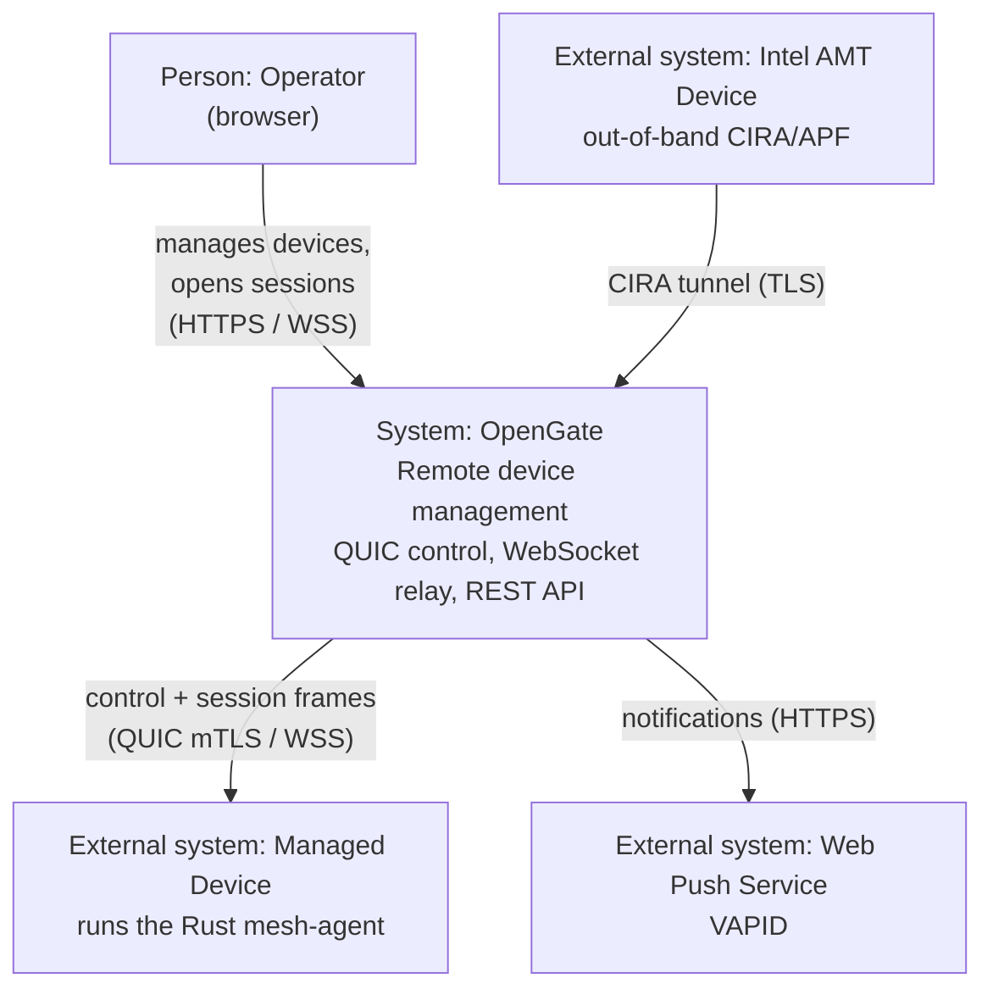
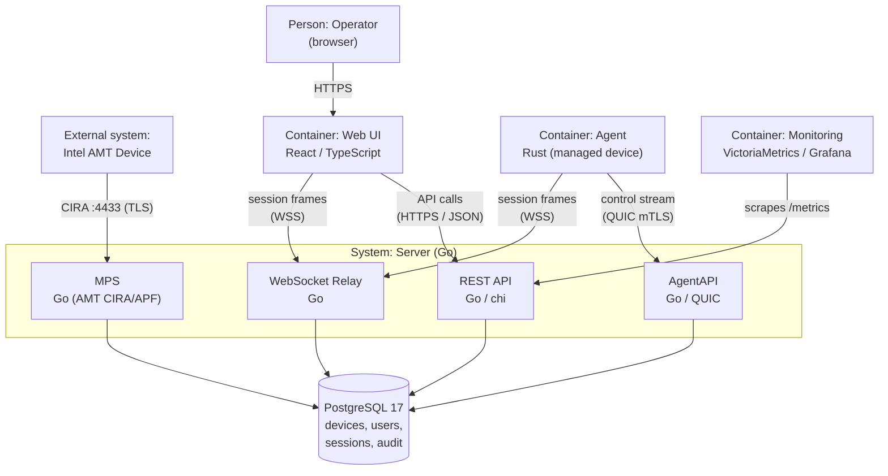
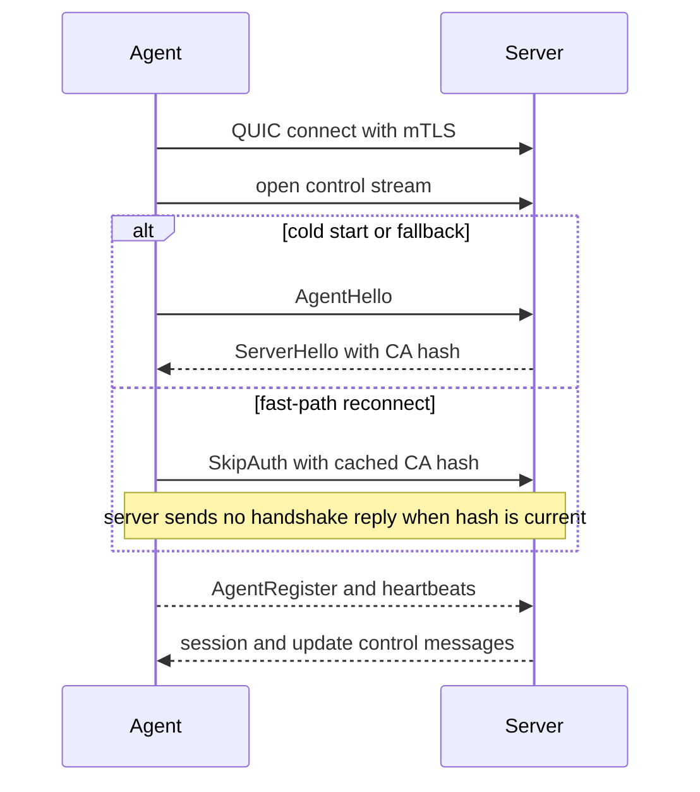
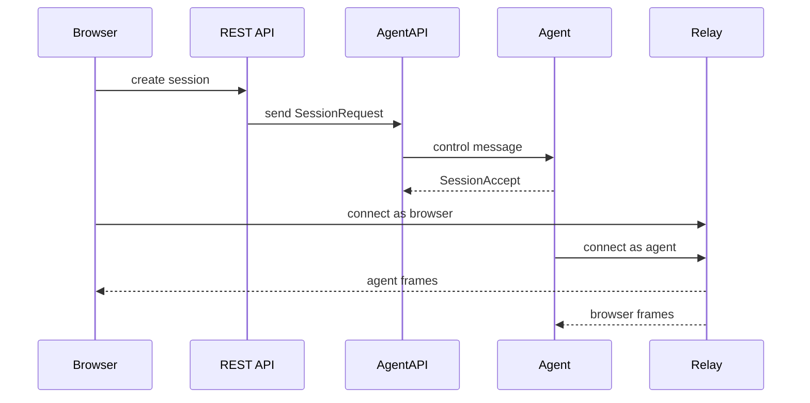
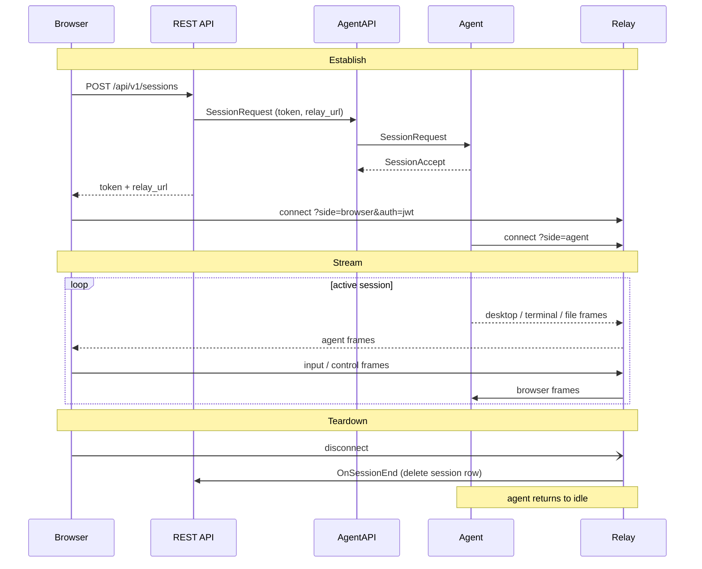

# Architecture

## System Overview

OpenGate is a three-component platform for remote device management:

| Component | Language | Role |
|-----------|----------|------|
| **Agent** | Rust | Runs on managed devices (Windows/Linux) |
| **Server** | Go | Central hub — QUIC + WebSocket + REST API |
| **Web** | React/TypeScript | Browser-based management UI |

## System Context (C4 Level 1)

The L1 view places OpenGate among the people and external systems it interacts
with. It is drawn as a `flowchart` arranged along the C4 context level — the
documented fallback (see [docs/README.md](README.md)) because native Mermaid C4
overlaps its relationship labels on GitHub's renderer. The C4 roles are carried
in the node labels.



## Container View (C4 Level 2)

The L2 view decomposes OpenGate into its deployable containers (same C4 fallback
notation; the `Server (Go)` boundary is a subgraph).



## Architecture Drift Checks

The diagrams are hand-curated Mermaid blocks. Structural drift is caught by the
existing boundary gates rather than generated diagrams: the
[precommit gauntlet](../scripts/precommit-gauntlet.sh) and
[CI workflow](../.github/workflows/ci.yml) run the Go, Rust, and web boundary
checks recorded in [ADR-020](adr/ADR-020-modular-monolith-full-hexagonal.md).
[`scripts/tests/docs-diagrams.test.sh`](../scripts/tests/docs-diagrams.test.sh)
keeps docs diagrams on the Mermaid-only, no-rendered-blob path.

## Connection Model

### Agent → Server (QUIC + mTLS)



#### CSR-Based Enrollment (First Boot)

On first boot (no identity files on disk), the agent performs CSR-based enrollment:

1. Agent generates an ECDSA P-256 key pair and PKCS#10 CSR with device UUID as CN
2. Agent POSTs the CSR to `POST /api/v1/enroll/{token}` with `{"csr_pem": "..."}`
3. Server validates the enrollment token, signs the CSR with its CA, returns the signed cert PEM + CA PEM
4. Agent saves the CA-signed cert, CA PEM, device ID, and private key to disk
5. Agent proceeds to QUIC mTLS connection using the CA-signed cert

The `--enroll-url` and `--enroll-token` CLI flags (or `OPENGATE_ENROLL_URL`/`OPENGATE_ENROLL_TOKEN` env vars) provide the enrollment parameters. On subsequent restarts, the agent loads its saved identity and skips enrollment.

The enrollment response also includes the server's Ed25519 update signing key (if configured), which the agent saves to disk for verifying future OTA updates without requiring the `--update-public-key` CLI flag.

The agent opens the control stream and speaks first; the server branches on the
first handshake byte in
[`handshaker.go`](../server/internal/agentapi/handshaker.go). The cold path
binds `AgentHello` to the mTLS peer certificate, while reconnects may use
`SkipAuth` with the cached CA hash before framed MessagePack control messages
begin. Message layout details live in [Wire Protocol](Wire-Protocol.md).

### Agent Binary (`mesh-agent`)

The `mesh-agent` binary (`agent/crates/mesh-agent/src/main.rs`) is the entry point for the Rust agent. It handles:

- **CSR enrollment**: On first boot, generates CSR and enrolls via HTTP to obtain a CA-signed certificate
- **QUIC mTLS connection**: Connects to the server using `quinn` with ALPN protocol `"opengate"`, client cert from the agent's identity, and the server CA for root verification
- **Binary handshake**: Sends `AgentHello` first on the cold path, reads `ServerHello` for the CA hash, and may use `SkipAuth` on reconnect
- **Registration**: Sends `AgentRegister` with hostname, OS, architecture, version, and capabilities. Linux reports Terminal, FileManager, HardwareInventory, and DeviceLogs; desktop capture/input capabilities are platform-specific.
- **Control loop**: Dispatches `SessionRequest` (spawns session handler), capability-gated hardware/log requests, `AgentUpdate` (semver check, apply, ack, exit code 42 for systemd restart), and pings
- **Edge Sentinel sampler**: Optional `--edge-sentinel` / `OPENGATE_EDGE_SENTINEL=true` background sampler logs bounded local host/process metrics through a pure-Rust k=2 ensemble kernel; it is default-off, does not publish telemetry yet, and has local allocation/RSS guards plus a Criterion footprint bench before ARM default-on evidence is recorded.
- **Auto-update**: Downloads binary, verifies SHA-256 + Ed25519 signature, atomic replace with `.prev` backup, rollback watchdog on restart. See [Agent Updates](Agent-Updates.md)
- **Deregistration**: On receiving `AgentDeregistered`, removes local identity files (certs, keys, device ID) and exits cleanly. The server maintains an in-memory tombstone set to reject reconnection attempts from deleted devices
- **Reconnection**: Exponential backoff (1s→30s cap, 10 max attempts) via `reconnect_with_backoff`
- **Graceful shutdown**: `tokio::select!` on SIGINT/SIGTERM with systemd `sd_notify` lifecycle notifications

### Web → Server (HTTP + JWT)

Standard HTTP with JWT bearer-token authentication. Passwords are bcrypt-hashed and stored in PostgreSQL. The REST API is defined by an OpenAPI 3.0.3 spec (`api/openapi.yaml`) and served by an `oapi-codegen` strict server on a chi v5 router. The same spec generates TypeScript types for the web client via `openapi-typescript` + `openapi-fetch`. See [API Reference](API-Reference.md) for endpoint details.

## Data Flow

```
                    ┌─────────────────────────────────────────────┐
                    │               Server                        │
                    │                                             │
 Agent ──QUIC──►  AgentAPI  ──►  Postgres ◄──  REST API  ◄──HTTP── Web
                    │               │                             │
                    │           migrations                        │
                    │           (golang-migrate)                  │
                    └─────────────────────────────────────────────┘
```

- **AgentAPI** handles QUIC connections: handshake, registration, heartbeat, disconnect
- **REST API** serves device/group/user management and authentication endpoints
- **PostgreSQL 17** (via `pgx/v5` stdlib adapter) is the shared persistence layer — see [Database](Database.md) and [ADR-014](adr/ADR-014-postgres-migration.md)
## WebSocket Relay

The server includes a message-oriented WebSocket relay (`server/internal/relay/`) for browser↔agent sessions:



1. Browser creates a session via REST API (`POST /api/v1/sessions`), gets back `{token, relay_url}`
2. Agent receives a `SessionRequest` control message with the same token
3. Both sides connect to the relay WebSocket at `/ws/relay/{token}` with their side parameter
4. The relay pipes binary frames bidirectionally — desktop, terminal, file, and control frames all flow through the same connection
5. Browser authenticates via `?auth=<jwt>` query parameter (browser WebSocket API cannot set custom headers)
6. On disconnect, the relay's `OnSessionEnd` callback deletes the DB session record, keeping the session table consistent with active connections

### Relay Limits and Cleanup

- **Max message size**: 4 MiB per WebSocket message (prevents memory exhaustion from oversized frames)
- **Orphaned session cleanup**: When a relay send to an agent fails, the server automatically cleans up the orphaned session record from the database

### Relay Observability

The relay uses structured logging via `*slog.Logger` (injected at construction):

| Event | Level | Key Fields |
|-------|-------|------------|
| Session started | `Info` | `token_prefix` |
| Session ended | `Info` | `token_prefix` |
| Read/write error | `Error` | `direction`, `token_prefix`, `msgs_copied`, `error` |
| Connection established | `Info` | `token_prefix`, `side` |
| Connection disconnected | `Info` | `token_prefix`, `side` |
| Upgrade/register failure | `Error` | `token_prefix`, `side`, `error` |

Set `LOG_LEVEL=debug` for per-message tracing. All tokens are redacted to 8-char prefixes via `protocol.RedactToken`.

### Middleware Compatibility

The relay WebSocket route passes through global HTTP middleware (metrics, security headers, request logger). Any middleware that wraps `http.ResponseWriter` **must** implement `http.Hijacker` — WebSocket upgrades require connection hijacking. See `server/internal/metrics/middleware.go` for the reference implementation.

## Session Lifecycle

End-to-end view of a browser↔agent session: establish (REST + control plane),
stream (bidirectional frames over the relay), and teardown (relay `OnSessionEnd`
deletes the session row so the table tracks live connections).



## Web Client Features

The React web client (`web/`) provides management and session features:

| Feature | Path | Description |
|---------|------|-------------|
| **Dashboard** | `/` | Landing page — overview of devices and groups |
| **Device List** | `/devices` | Device listing with search/filter, group sidebar |
| **Device Detail** | `/devices/:id` | Device info, AMT power actions, group reassignment, hardware inventory, on-demand device logs, agent restart |
| **Session View** | `/sessions/:token` | Tab container with toolbar and connection status |
| **Remote Desktop** | Desktop tab | Canvas-based screen viewer with mouse/keyboard input forwarding |
| **Terminal** | Terminal tab | xterm.js terminal connected to relay |
| **File Manager** | Files tab | Directory browsing, file download/upload with progress, in-browser file viewer |
| **Messenger** | Chat tab | Real-time chat over relay control messages |
| **Profile** | `/profile` | Self-service display name editing |

All features use the binary frame protocol (`web/src/lib/protocol/`) and share a single WebSocket connection managed by a Zustand store (`web/src/state/connection-store.ts`).

**Capability-based tab visibility**: The Session View dynamically shows/hides tabs based on the device's reported capabilities. Linux agents report Terminal + FileManager only; Windows/Mac agents additionally report RemoteDesktop. The web client receives capabilities via the Device API and passes them to Session View via React Router state. Devices without the `RemoteDesktop` capability will only show Terminal and Files tabs; Desktop and Chat tabs require it.

### UI Infrastructure

- **ErrorBoundary**: Top-level `<ErrorBoundary>` wraps the app for crash resilience — catches render errors and displays a recovery UI instead of a blank screen
- **Lazy loading**: All feature pages use `React.lazy` + `<Suspense>` for code-splitting, producing 16+ chunks that load on demand
- **Breadcrumbs**: Context-aware breadcrumb navigation rendered on every page via `<Breadcrumbs />`
- **Toast notifications**: Global toast system (`useToast` hook + `<ToastContainer />`) for success/error feedback. Toast IDs use `crypto.randomUUID()` for uniqueness. The toast container has `aria-live` for screen reader accessibility
- **Device search/filter**: Inline search on the device list page to filter devices by hostname

## Agent Session Handler

When the server assigns a session to an agent, the agent connects to the relay and streams data:

```
Server                         Agent
  │                              │
  │──── SessionRequest ────────►│  (token, relay_url, permissions)
  │◄─── SessionAccept ──────────│  (confirms intent)
  │                              │
  │   Agent connects to relay    │
  │   at relay_url?side=agent    │
  │                              │
  │◄── Desktop/Terminal/File ────│  (binary frames via relay)
  │──── Input/Control ──────────►│  (mouse, keyboard, file ops)
```

The `SessionHandler` (Rust) manages the full lifecycle:

- **Desktop capture**: Streams JPEG-encoded screen frames at ~10 FPS via the relay (quality 70, falls back to raw on encode failure)
- **Terminal**: Spawns a PTY (`portable-pty`) and bridges stdin/stdout over terminal frames
- **File operations**: Directory listing, chunked download (256 KiB), permission-gated access
- **Input injection**: Mouse/keyboard events forwarded to the OS via platform traits
- **Chat echo**: `ChatMessage` from the browser is echoed back with `sender: "agent"`, enabling basic chat between the browser user and the agent

## WebRTC Upgrade (Optional P2P)

Sessions start on the relay (always works) and can optionally upgrade to a direct WebRTC connection for lower latency:

```
Browser                    Relay                      Agent
  │                          │                          │
  │── SwitchToWebRTC ───────►│──── SwitchToWebRTC ─────►│
  │   (SDP offer)            │    (SDP offer)           │
  │                          │                          │
  │◄─ SwitchToWebRTC ────────│◄─── SwitchToWebRTC ─────│
  │   (SDP answer)           │    (SDP answer)          │
  │                          │                          │
  │◄─► IceCandidate ────────►│◄──► IceCandidate ───────►│
  │   (trickle ICE)          │    (trickle ICE)         │
  │                          │                          │
  │◄─ SwitchAck ─────────────│◄─── SwitchAck ──────────│
  │   (upgrade complete)     │                          │
  │                          │                          │
  │◄═══════ Data Channels ══════════════════════════════│
  │   control (ordered)      │                          │
  │   desktop (unordered)    │                          │
  │   bulk (ordered)         │                          │
```

Three data channels match the frame routing:

| Channel | ID | Ordered | Reliable | Purpose |
|---------|-----|---------|----------|---------|
| `control` | 0 | Yes | Yes | Control messages, signaling |
| `desktop` | 1 | No | No (maxRetransmits=0) | Screen frames (latest wins) |
| `bulk` | 2 | Yes | Yes | Terminal I/O, file transfers |

The signaling state machine (`server/internal/signaling/`) tracks upgrade progress: `Relay` → `Offered` → `Answered` → `ICEGathering` → `Connected` (or `Failed`). On failure, the relay connection remains active as fallback.

### ICE Configuration

The server provides STUN/TURN server URLs in the `CreateSession` response (`ice_servers` field). The browser and agent both use these to establish connectivity. Default configuration uses Google's public STUN server.

## Notifications

The server supports Web Push notifications (`server/internal/notifications/`) for device and session lifecycle events:

- **VAPID keys**: ECDSA P-256, auto-generated on first startup, stored in `{data-dir}/vapid.json`
- **Notifier interface**: Decouples notification logic from handlers (like `AgentGetter` pattern)
- **PushNotifier**: Sends Web Push via `webpush-go`; auto-deletes stale subscriptions on 410 Gone
- **NoopNotifier**: Used in tests and when push is disabled
- **Events**: `device_online`, `device_offline`, `session_started`, `session_ended`
- **Service Worker**: `web/public/sw.js` handles push events, offline caching, and notification click navigation

## Audit Log

Security-relevant actions are recorded to the `audit_events` table via fire-and-forget goroutines:

- `user.register`, `user.login`, `user.delete`, `user.update`
- `session.create`, `session.delete`
- `device.delete` (triggers agent deregistration)

The audit log is queryable via `GET /api/v1/audit` (admin-only) with optional `user_id`, `action`, `limit`, and `offset` parameters.

## Intel AMT Management Presence Server (MPS)

The server includes an MPS (`server/internal/amt/transport/`) that accepts CIRA (Client Initiated Remote Access) connections from Intel AMT devices over TLS:

```
Intel AMT Device              MPS Server
  │                              │
  │──── TLS connect :4433 ──────►│  RSA 2048 server cert (TLS 1.2+)
  │                              │
  │──── ProtocolVersion ────────►│  UUID identifies device
  │◄─── ProtocolVersion ────────│
  │                              │
  │──── ServiceRequest (auth) ──►│  APF handshake sequence
  │◄─── ServiceAccept ──────────│
  │──── UserAuthRequest ────────►│
  │◄─── UserAuthSuccess ────────│
  │                              │
  │──── ServiceRequest (pfwd) ──►│
  │◄─── ServiceAccept ──────────│
  │──── GlobalRequest ──────────►│  tcpip-forward registration
  │◄─── RequestSuccess ─────────│
  │                              │
  │◄────► Channel Open/Data ────►│  APF channels for port forwarding
```

### Key Design Decisions

- **RSA 2048 certs**: Intel AMT firmware requires RSA keys (not ECDSA). The MPS cert is signed by the same ECDSA CA using `cert.SignMPS()`
- **TLS 1.2 minimum**: Supports AMT 11.0+ firmware (2015+) while maintaining modern security
- **APF protocol**: Based on SSH channel semantics (RFC 4254) with Intel extensions — message types for service request/accept, user auth, channel open/data/close, and port forwarding
- **AMT device tracking**: Separate `amt_devices` table (UUID primary key, hostname, model, firmware, status) independent from the agent `devices` table
- **Connection lifecycle**: Devices are set `online` on handshake completion, `offline` on disconnect, with per-device connection storage in `sync.Map`
- **Port forwarding channels**: Each AMT device can open multiple APF channels for forwarding TCP traffic to internal network services (e.g., AMT WSMAN on port 16993)

### Server Flag

| Flag | Default | Description |
|------|---------|-------------|
| `-mps-listen` | `:4433` | MPS TLS address for Intel AMT CIRA connections |

## Settings (Admin)

The web client includes a settings section (`/settings`) protected by `AdminGuard`. Old `/admin/*` routes redirect to `/settings`.

| Route | Component | Description |
|-------|-----------|-------------|
| `/settings/users` | `UserManagement` | List, toggle admin, delete users |
| `/settings/audit` | `AuditLog` | Searchable, paginated audit event viewer |
| `/settings/updates` | `AgentUpdates` | Agent update manifests, push updates, enrollment tokens, signing key display |
| `/settings/security/permissions` | `Permissions` | Security groups and membership (RBAC) |

The "Settings" link appears in the navbar only for users with `is_admin=true`. State is managed by `admin-store.ts` and `push-store.ts` (Zustand).
