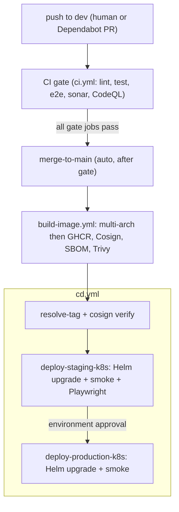

# Continuous Deployment

## Pipeline

The deployment chain is defined by the repository workflows:

1. [`ci.yml`](../.github/workflows/ci.yml) validates changes.
2. [`build-image.yml`](../.github/workflows/build-image.yml) publishes the signed
   server image.
3. [`cd.yml`](../.github/workflows/cd.yml) verifies the image, deploys staging,
   validates it, and then deploys production after environment approval.

The CD workflow also supports a manual image-tag dispatch. Deployments are
serialized by the workflow's concurrency configuration.



## Deployment Model

Both environments run on OKE and are managed by the
[`opengate` Helm chart](../deploy/helm/opengate/):

- Staging uses [`values-staging.yaml`](../deploy/helm/opengate/values-staging.yaml).
- Production uses
  [`values-production.yaml`](../deploy/helm/opengate/values-production.yaml).
- Cluster credentials and kubeconfig setup are owned by
  [`oci-kube-setup`](../.github/actions/oci-kube-setup/action.yml).

The workflow creates an environment Secret only when it is absent. Shared
enrollment and signing keys are maintained independently so a deploy cannot
accidentally rotate agent identity material.

## Workflow Jobs

| Job | Purpose |
|-----|---------|
| `resolve-tag` | Resolves the image tag, verifies the image and signature, and evaluates the unchanged-deploy fast path. |
| `deploy-staging-k8s` | Applies the staging Helm release and runs smoke and browser tests. |
| `deploy-production-k8s` | Applies the production Helm release after staging succeeds. |
| `notify-failure` | Creates or updates the deployment failure issue. |

The exact job dependencies and environment approvals are canonical in
[`cd.yml`](../.github/workflows/cd.yml).

## Staging Validation

The staging job:

- waits for the server Deployment rollout;
- port-forwards the server Service to the runner;
- executes [`smoke-test.sh`](../deploy/scripts/smoke-test.sh);
- resets the disposable staging database;
- runs the staging
  [Playwright configuration](../web/playwright.staging.config.ts);
- records the successful image digest for the next pre-flight comparison.

The port-forward is temporary and does not expose staging publicly.

## Production Validation

Production is deployed only after staging succeeds and the production
environment gate is approved. The workflow waits for rollout completion and
runs the same smoke-test script through a temporary Service port-forward.

## Image Verification

[`resolve-tag`](../.github/workflows/cd.yml) verifies both image existence and
the keyless Cosign signature before either environment can deploy. Image build,
SBOM, signing, and attestation details live in
[`Container-Images.md`](./Container-Images.md).

## Skip-When-Unchanged

Two checks avoid unnecessary work:

- [`build-image-gate.sh`](../scripts/build-image-gate.sh) decides whether a new
  image build is required.
- The `resolve-tag` job compares the target digest and `deploy/` changes against
  the state cached after the last successful staging validation.

Manual dispatch always performs the deployment.

## Rollback

Kubernetes release history is the production rollback boundary. Operators use
Helm history and rollback against the appropriate release and namespace:

```bash
helm history "$RELEASE" -n "$NAMESPACE"
helm rollback "$RELEASE" "$REVISION" -n "$NAMESPACE" --wait
kubectl -n "$NAMESPACE" rollout status "deploy/${RELEASE}-server"
```

The Compose manifests and host deployment scripts under [`deploy/`](../deploy/)
remain dormant disaster-recovery artifacts. GitHub Actions no longer invoke
that path.

## Load Testing

[`load-test.yml`](../.github/workflows/load-test.yml) validates staging without
host access:

- k6 runs on the GitHub runner through an HTTP Service port-forward;
- the static Go QUIC harness runs in a short-lived cluster pod and targets the
  ready staging server pod over the cluster network;
- the test pod and local certificate material are removed after the run.

## Configuration and Secrets

The workflows reference OCI API credentials, the OKE cluster identifier, and
environment-specific application secrets directly. Their exact names and
scope are canonical in [`cd.yml`](../.github/workflows/cd.yml) and
[`load-test.yml`](../.github/workflows/load-test.yml).

## Failure Notifications

Deployment failures are handled by
[`notify_failure.py`](../.github/scripts/notify_failure.py), which maintains a
single actionable issue per failing workflow context.
