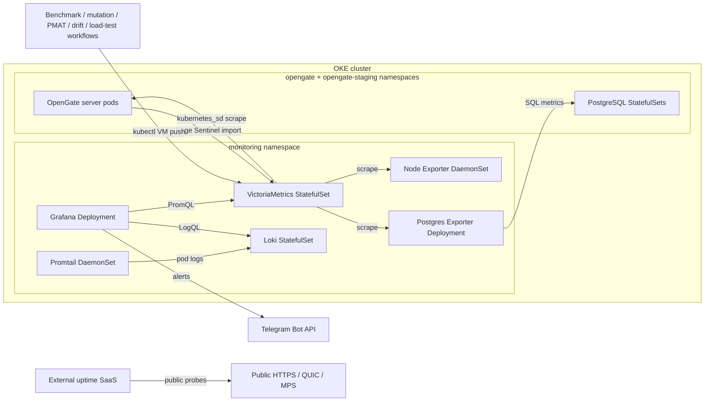

# Monitoring & Observability

## Overview

OpenGate monitoring runs inside the same OKE cluster as the application. The
intended topology is the Helm chart at
[`deploy/helm/monitoring`](../deploy/helm/monitoring/); live reconciliation on
2026-06-18 showed the `monitoring` Helm release deployed with all monitoring
workloads Ready, plus the production and staging app releases running in their
own namespaces.

Production monitoring is entirely Kubernetes-native, delivered by the
`monitoring` Helm release.

## Architecture



## Sources Of Truth

| Concern | Source |
|---|---|
| Monitoring chart | [`deploy/helm/monitoring`](../deploy/helm/monitoring/) |
| Monitoring values | [`values.yaml`](../deploy/helm/monitoring/values.yaml) |
| App chart and overlays | [`deploy/helm/opengate`](../deploy/helm/opengate/) |
| Grafana dashboards and alerting ConfigMaps | [`deploy/grafana/provisioning`](../deploy/grafana/provisioning/) |
| VictoriaMetrics scrape config | [`vmagent-scrape.yaml`](../deploy/helm/monitoring/files/vmagent-scrape.yaml) |
| Edge Sentinel stream aggregation | [`edge-sentinel-stream-aggr.yaml`](../deploy/helm/monitoring/files/edge-sentinel-stream-aggr.yaml) |
| Promtail pod-log config | [`promtail-config.yaml`](../deploy/helm/monitoring/files/promtail-config.yaml) |
| Loki retention/config | [`loki-config.yml`](../deploy/helm/monitoring/files/loki-config.yml) |
| CI trend VM transport | [`scripts/lib/vm-push.sh`](../scripts/lib/vm-push.sh) |
| CI trend-store decision | [ADR-038](./adr/ADR-038-victoriametrics-ci-trend-store.md) |
| Load-test regression decision | [ADR-045](./adr/ADR-045-load-test-regression-gate.md) |
| Edge Sentinel telemetry-store decision | [ADR-044](./adr/ADR-044-edge-sentinel-server-telemetry-ingest.md) |

## Components

The component inventory is rendered from the monitoring chart, not manually
maintained here. Current chart components are:

| Component | Kubernetes object | Purpose |
|---|---|---|
| VictoriaMetrics | StatefulSet + Service + RBAC | Metrics store and Kubernetes service-discovery scraper. |
| Loki | StatefulSet + Service | Log store for pod logs. |
| Grafana | Deployment + Service | Dashboards, datasource provisioning, and alert UI. |
| Promtail | DaemonSet + RBAC | Node-level pod-log collection from `/var/log/pods`. |
| Node Exporter | DaemonSet + Service | Node metrics. |
| Postgres Exporter | Deployment + Service | PostgreSQL metrics for the production Postgres service. |

Image tags, resource requests/limits, retention, storage class, and persistence
settings live in [`values.yaml`](../deploy/helm/monitoring/values.yaml). Do not
copy those values into prose; link to the values file when exact numbers matter.

## Storage Model

The intended free-tier storage model is recorded in
[ADR-035](./adr/ADR-035-oke-free-tier-block-volume-remediation.md):

- VictoriaMetrics and Loki keep block-backed PVCs.
- Grafana uses `emptyDir`; dashboards, datasources, and alerting config are
  provisioned from ConfigMaps.
- Uptime Kuma is not deployed in-cluster; public uptime monitoring is external.

Live reconciliation on 2026-06-18 matched this intended shape: only three PVCs
were present across the app and monitoring namespaces — production Postgres,
VictoriaMetrics, and Loki.

## Access

| Tool | Access method | Source |
|---|---|---|
| Grafana | `make tunnel` → `kubectl port-forward svc/monitoring-grafana` | [`Makefile`](../Makefile) |
| VictoriaMetrics | ClusterIP Service, queried by Grafana or one-shot kubectl pods | [`values.yaml`](../deploy/helm/monitoring/values.yaml) |
| Loki | ClusterIP Service, written by Promtail and queried by Grafana | [`promtail-config.yaml`](../deploy/helm/monitoring/files/promtail-config.yaml) |
| Public uptime | External SaaS probing the public app endpoints | [ADR-035](./adr/ADR-035-oke-free-tier-block-volume-remediation.md) |

No monitoring ingress is rendered by the monitoring chart. The public HTTP edge
is owned by ingress-nginx and the app chart; QUIC and MPS remain L4 hostPorts on
the production server pod per [Kubernetes.md](./Kubernetes.md#l4-quic--mps).

## Application Instrumentation

The Go server exposes Prometheus metrics on the same HTTP listener as the REST
API. The in-cluster VictoriaMetrics scrape configuration discovers the server
Services via Kubernetes endpoint metadata rather than hard-coded Docker hostnames.
Metric names and registration live under
[`server/internal/metrics`](../server/internal/metrics/).

Edge Sentinel numeric telemetry is pushed by the server, not scraped from
agents. The app chart wires the VM endpoint into the server through
[`server-deployment.yaml`](../deploy/helm/opengate/templates/server-deployment.yaml),
and the scoped client lives in
[`server/internal/telemetry`](../server/internal/telemetry/). VM reads go through
that client so the server injects the authoritative `org_id` matcher. Process
snapshots with basenames and optional command-line hashes stay in Postgres RLS;
see [Database](Database.md#device-processes-table).

Endpoint log signals ride the same numeric path: per-window log-rate dims
(`opengate_edge_metric_avg{dim="log.rate.…"}`, counts and ranks only) are
ingested to VM scoped by the server-resolved org. Raw log lines are never
centralized — they are brokered on demand, redacted, and streamed straight back
to an administrator with nothing persisted; see
[ADR-046](adr/ADR-046-edge-sentinel-raw-log-broker.md).

The monitoring chart passes the Edge Sentinel stream-aggregation config to
single-node VictoriaMetrics through
[`victoriametrics.yaml`](../deploy/helm/monitoring/templates/victoriametrics.yaml).
The [rollup config](../deploy/helm/monitoring/files/edge-sentinel-stream-aggr.yaml)
produces coarse `avg`-only rollups for `opengate_edge_*` metrics at two intervals
while `-streamAggr.keepInput` preserves the raw matched input. Central rollups
carry `avg` alone because each aggregate is its own series, so emitting
min/max/last centrally would multiply active series past the budget ratified in
[`spike_test.go`](../server/tests/vmcardinality/spike_test.go); chart bands are
computed from min/max over the raw 10 s samples instead.

### Web telemetry surface

The React client renders this telemetry through a thin adapter over uPlot
(canvas-2D): React owns the chrome, the renderer owns the pixels via typed
arrays, so a polling refresh never reconciles thousands of points. The adapter
([`TimeSeriesChart`](../web/src/features/devices/charts/TimeSeriesChart.tsx)) is
the only module importing uPlot and is code-split into a dedicated `charts`
chunk with its own budget in [`.size-limit.json`](../web/.size-limit.json).

The device-detail panel
([`DeviceMetrics`](../web/src/features/devices/DeviceMetrics.tsx)) shows the
current edge-health anomaly rate, per-family metric timelines (avg line plus a
band whose `min_max_source` provenance is labelled honestly — `avg_of_10s` is
min/max across the 10 s averages, not host extrema), and a Netdata-style
correlation drill-down: dragging a window on a chart ranks the dimensions that
broke pattern through the correlate endpoint. The virtualized device grid and the
dashboard carry only scalar health badges
([`HealthBadge`](../web/src/features/devices/HealthBadge.tsx),
[`FleetHealth`](../web/src/features/devices/FleetHealth.tsx)) — no per-device
series on the grid.

Raw logs are read through the on-demand broker in the logs explorer
([`DeviceLogs`](../web/src/features/devices/DeviceLogs.tsx)) with level, time-range,
and full-text filters plus level facets over the returned page, rendering only the
redacted lines the broker returns. A compact log-rate sparkline
([`LogRateSparkline`](../web/src/features/devices/LogRateSparkline.tsx)) plots the
numeric `log.rate.*` dims only — message text is never a chart label. A
metrics↔logs correlation jump carries a device window from the metrics panel
straight into the explorer.

### Long-term (cold) tier

Single-node OSS VictoriaMetrics applies **one global retention window** set by
`victoriametrics.retention` in
[`values.yaml`](../deploy/helm/monitoring/values.yaml) — per-series retention and
downsampling are Enterprise features, so raw 10 s samples and the `avg` rollups
share the same window. The rollups exist for query efficiency: a long range reads
coarse pre-aggregated series instead of scanning raw. Within that window
VictoriaMetrics is the source of truth for central numeric telemetry, stored with
its native Gorilla compression.

Promtail reads Kubernetes pod logs, enriches each stream with Kubernetes labels,
and pushes to Loki via
[`deploy/helm/monitoring/files/promtail-config.yaml`](../deploy/helm/monitoring/files/promtail-config.yaml).

## Dashboards And Alerts

Grafana dashboards and alerting files are canonical in
[`deploy/grafana/provisioning`](../deploy/grafana/provisioning/). The monitoring
chart intentionally does not duplicate dashboard JSON; its
[`NOTES.txt`](../deploy/helm/monitoring/templates/NOTES.txt) documents creating
ConfigMaps from the canonical files.

Current dashboard files include the app overview, DB performance, PostgreSQL,
benchmark trend, mutation trend, PMAT trend, terraform-drift trend, and load-test trend
dashboards. Numeric CI trend workflows write Prometheus samples to
VictoriaMetrics:

- [`benchmark.yml`](../.github/workflows/benchmark.yml) →
  [`scripts/benchmark-vm-push.sh`](../scripts/benchmark-vm-push.sh)
- [`mutation.yml`](../.github/workflows/mutation.yml) →
  [`scripts/mutation-vm-push.sh`](../scripts/mutation-vm-push.sh)
- [`pmat-trend.yml`](../.github/workflows/pmat-trend.yml) →
  [`scripts/pmat-vm-push.sh`](../scripts/pmat-vm-push.sh)
- [`terraform-drift.yml`](../.github/workflows/terraform-drift.yml) →
  [`scripts/terraform-drift-vm-push.sh`](../scripts/terraform-drift-vm-push.sh)
- [`load-test.yml`](../.github/workflows/load-test.yml) →
  [`scripts/loadtest-regression-check.sh`](../scripts/loadtest-regression-check.sh) →
  [`scripts/loadtest-vm-push.sh`](../scripts/loadtest-vm-push.sh)

VictoriaMetrics is the canonical numeric CI-trend store; Loki is reserved for
logs per [ADR-038](./adr/ADR-038-victoriametrics-ci-trend-store.md). Load-test
regression semantics are recorded in
[ADR-045](./adr/ADR-045-load-test-regression-gate.md). PMAT reads its previous
day-over-day baseline through
[`pmat-vm-query.sh`](../scripts/pmat-vm-query.sh) before publishing the current
sample.

### CI Trend Metric Convention

Numeric CI trends use VictoriaMetrics through
[`scripts/lib/vm-push.sh`](../scripts/lib/vm-push.sh). That transport is the
executable source for required labels and payload validation. Family names,
units, and extra labels live in the adjacent `*-vm-push.sh` wrappers and are
pinned by [`ci-trend-vm-push.test.sh`](../scripts/tests/ci-trend-vm-push.test.sh),
[`benchmark-vm-push.test.sh`](../scripts/tests/benchmark-vm-push.test.sh), and
[`loadtest-vm-push.test.sh`](../scripts/tests/loadtest-vm-push.test.sh). New
families follow those sources instead of copying a convention into prose.

Telegram credentials are held in the monitoring Secret described by
[`values.yaml`](../deploy/helm/monitoring/values.yaml) and chart
[`NOTES.txt`](../deploy/helm/monitoring/templates/NOTES.txt). Workflow-level
alerts use GitHub environment secrets directly.

## Deployment And Validation

The monitoring chart is a Helm release in the `monitoring` namespace. The app CD
workflow deploys the application releases; monitoring release lifecycle is an
operator action until explicitly wired into CD.

Validation sources:

- [`make lint-k8s`](../Makefile) renders and validates the app and monitoring
  charts.
- [`deploy/helm/monitoring/templates/NOTES.txt`](../deploy/helm/monitoring/templates/NOTES.txt)
  lists required out-of-band Secrets and ConfigMaps.
- [`scripts/tests/vm-transport.test.sh`](../scripts/tests/vm-transport.test.sh)
  verifies the shared kubectl VictoriaMetrics push transport without reaching the
  live cluster.
- [`scripts/tests/pmat-vm-query.test.sh`](../scripts/tests/pmat-vm-query.test.sh)
  verifies newest-sample selection and fail-soft PMAT baseline reads.
- [`scripts/tests/ci-trend-retirement.test.sh`](../scripts/tests/ci-trend-retirement.test.sh)
  keeps the CI trend transport VictoriaMetrics-only and pins Loki's runtime log
  deployment.
- [`scripts/tests/benchmark-summarize.test.sh`](../scripts/tests/benchmark-summarize.test.sh)
  verifies benchmark parsing, baseline generation, deterministic allocation
  regression detection, and `ns/op` advisory-only behavior.
- [`scripts/tests/ci-trend-vm-push.test.sh`](../scripts/tests/ci-trend-vm-push.test.sh)
  verifies mutation, PMAT, and terraform-drift canonical rows map to Prometheus
  text before reaching the shared VM transport.
- [`scripts/tests/loadtest-summarize.test.sh`](../scripts/tests/loadtest-summarize.test.sh)
  verifies k6 summary-export and QUIC harness output parsing for load-test
  trend rows, including partial failed-run capture.
- [`scripts/tests/loadtest-regression-check.test.sh`](../scripts/tests/loadtest-regression-check.test.sh)
  verifies per-series VM read-back regression checks, p99 advisory behavior,
  cold-start handling, and VM fail-open behavior.
- [`scripts/tests/loadtest-vm-push.test.sh`](../scripts/tests/loadtest-vm-push.test.sh)
  verifies load-test trend rows map to Prometheus text before reaching the
  shared VM transport.

## Ad-hoc Investigation

Use `/observe` or the underlying kubectl/Loki helpers. The investigation path
is cluster-native:

```bash
kubectl -n monitoring get pods
kubectl -n monitoring logs deploy/monitoring-grafana
kubectl -n monitoring port-forward svc/monitoring-grafana 3000:3000
```

For ad-hoc trend checks, prefer the repository scripts that already use
temporary kubectl pods and clean themselves up. For app health, use
[`deploy/scripts/smoke-test.sh`](../deploy/scripts/smoke-test.sh) through a
Service port-forward, matching [`cd.yml`](../.github/workflows/cd.yml).
