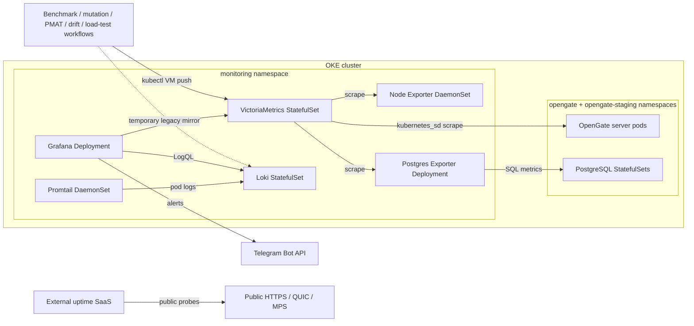

# Monitoring & Observability

## Overview

OpenGate monitoring runs inside the same OKE cluster as the application. The
intended topology is the Helm chart at
[`deploy/helm/monitoring`](../deploy/helm/monitoring/); live reconciliation on
2026-06-18 showed the `monitoring` Helm release deployed with all monitoring
workloads Ready, plus the production and staging app releases running in their
own namespaces.

The old VPS/Docker Compose monitoring stack is no longer the production path.
The compose files under [`deploy/`](../deploy/) remain local or dormant
compatibility artifacts; current production monitoring is Kubernetes-native.

## Architecture



## Sources Of Truth

| Concern | Source |
|---|---|
| Monitoring chart | [`deploy/helm/monitoring`](../deploy/helm/monitoring/) |
| Monitoring values | [`values.yaml`](../deploy/helm/monitoring/values.yaml) |
| App chart and overlays | [`deploy/helm/opengate`](../deploy/helm/opengate/) |
| Grafana dashboards and alerting ConfigMaps | [`deploy/grafana/provisioning`](../deploy/grafana/provisioning/) |
| VictoriaMetrics scrape config | [`vmagent-scrape.yaml`](../deploy/helm/monitoring/files/vmagent-scrape.yaml) |
| Promtail pod-log config | [`promtail-config.yaml`](../deploy/helm/monitoring/files/promtail-config.yaml) |
| Loki retention/config | [`loki-config.yml`](../deploy/helm/monitoring/files/loki-config.yml) |
| CI trend VM transport | [`scripts/lib/vm-push.sh`](../scripts/lib/vm-push.sh) |
| Temporary legacy Loki transport | [`scripts/lib/loki-push.sh`](../scripts/lib/loki-push.sh) |

## Components

The component inventory is rendered from the monitoring chart, not manually
maintained here. Current chart components are:

| Component | Kubernetes object | Purpose |
|---|---|---|
| VictoriaMetrics | StatefulSet + Service + RBAC | Metrics store and Kubernetes service-discovery scraper. |
| Loki | StatefulSet + Service | Log store for pod logs and temporary legacy trend rows. |
| Grafana | Deployment + Service | Dashboards, datasource provisioning, and alert UI. |
| Promtail | DaemonSet + RBAC | Node-level pod-log collection from `/var/log/pods`. |
| Node Exporter | DaemonSet + Service | Node metrics. |
| Postgres Exporter | Deployment + Service | PostgreSQL metrics for the production Postgres service. |

Image tags, resource requests/limits, retention, storage class, and persistence
settings live in [`values.yaml`](../deploy/helm/monitoring/values.yaml). Do not
copy those values into prose; link to the values file when exact numbers matter.

## Storage Model

The intended free-tier storage model is recorded in
[ADR-035](./adr/ADR-035-oke-free-tier-block-volume-remediation.md):

- VictoriaMetrics and Loki keep block-backed PVCs.
- Grafana uses `emptyDir`; dashboards, datasources, and alerting config are
  provisioned from ConfigMaps.
- Uptime Kuma is not deployed in-cluster; public uptime monitoring is external.

Live reconciliation on 2026-06-18 matched this intended shape: only three PVCs
were present across the app and monitoring namespaces — production Postgres,
VictoriaMetrics, and Loki.

## Access

| Tool | Access method | Source |
|---|---|---|
| Grafana | `make tunnel` → `kubectl port-forward svc/monitoring-grafana` | [`Makefile`](../Makefile) |
| VictoriaMetrics | ClusterIP Service, queried by Grafana or one-shot kubectl pods | [`values.yaml`](../deploy/helm/monitoring/values.yaml) |
| Loki | ClusterIP Service, queried by Grafana and temporary legacy workflow push scripts | [`scripts/lib/loki-push.sh`](../scripts/lib/loki-push.sh) |
| Public uptime | External SaaS probing the public app endpoints | [ADR-035](./adr/ADR-035-oke-free-tier-block-volume-remediation.md) |

No monitoring ingress is rendered by the monitoring chart. The public HTTP edge
is owned by ingress-nginx and the app chart; QUIC and MPS remain L4 hostPorts on
the production server pod per [Kubernetes.md](./Kubernetes.md#l4-quic--mps).

## Application Instrumentation

The Go server exposes Prometheus metrics on the same HTTP listener as the REST
API. The in-cluster VictoriaMetrics scrape configuration discovers the server
Services via Kubernetes endpoint metadata rather than hard-coded Docker hostnames.
Metric names and registration live under
[`server/internal/metrics`](../server/internal/metrics/).

Promtail reads Kubernetes pod logs, enriches each stream with Kubernetes labels,
and pushes to Loki. The previous Docker-log path under
[`deploy/promtail/promtail-config.yml`](../deploy/promtail/promtail-config.yml)
is a compose-era artifact; the active chart uses
[`deploy/helm/monitoring/files/promtail-config.yaml`](../deploy/helm/monitoring/files/promtail-config.yaml).

## Dashboards And Alerts

Grafana dashboards and alerting files are canonical in
[`deploy/grafana/provisioning`](../deploy/grafana/provisioning/). The monitoring
chart intentionally does not duplicate dashboard JSON; its
[`NOTES.txt`](../deploy/helm/monitoring/templates/NOTES.txt) documents creating
ConfigMaps from the canonical files.

Current dashboard files include the app overview, DB performance, PostgreSQL,
benchmark trend, mutation trend, PMAT trend, terraform-drift trend, and load-test trend
dashboards. Numeric CI trend workflows write Prometheus samples to
VictoriaMetrics:

- [`benchmark.yml`](../.github/workflows/benchmark.yml) →
  [`scripts/benchmark-vm-push.sh`](../scripts/benchmark-vm-push.sh)
- [`mutation.yml`](../.github/workflows/mutation.yml) →
  [`scripts/mutation-vm-push.sh`](../scripts/mutation-vm-push.sh)
- [`pmat-trend.yml`](../.github/workflows/pmat-trend.yml) →
  [`scripts/pmat-vm-push.sh`](../scripts/pmat-vm-push.sh)
- [`terraform-drift.yml`](../.github/workflows/terraform-drift.yml) →
  [`scripts/terraform-drift-vm-push.sh`](../scripts/terraform-drift-vm-push.sh)
- [`load-test.yml`](../.github/workflows/load-test.yml) →
  [`scripts/loadtest-vm-push.sh`](../scripts/loadtest-vm-push.sh)

During the B3→B5 migration window, mutation/PMAT/terraform-drift still keep
their Loki push scripts as a temporary mirror. PMAT also reads its previous
day-over-day baseline from Loki until the legacy trend path is retired after VM
verification.

### CI Trend Metric Convention

Numeric CI trends use VictoriaMetrics through
[`scripts/lib/vm-push.sh`](../scripts/lib/vm-push.sh), which uses the same
private kubectl-curl-pod transport shape as the Loki helper and posts Prometheus
text to the in-cluster VictoriaMetrics import endpoint. New and migrated CI trend
series must use:

- metric names that identify the family and unit, for example `*_ns_op`,
  `*_allocs_op`, `*_bytes_op`, `mutation_score`, `pmat_*`,
  `terraform_drift_*`, `loadtest_latency_*`, `loadtest_rps`, and
  `loadtest_error_rate`;
- mandatory labels on every sample: `commit="<sha>"`, `env="ci"`, plus
  pipeline-specific labels such as `lang`, `language`, `benchmark`, `scenario`,
  `run_id`, `action`, or `type`;
- no explicit timestamps unless a future backfill path is deliberately added.

Telegram credentials are held in the monitoring Secret described by
[`values.yaml`](../deploy/helm/monitoring/values.yaml) and chart
[`NOTES.txt`](../deploy/helm/monitoring/templates/NOTES.txt). Workflow-level
alerts use GitHub environment secrets directly.

## Deployment And Validation

The monitoring chart is a Helm release in the `monitoring` namespace. The app CD
workflow deploys the application releases; monitoring release lifecycle is an
operator action until explicitly wired into CD.

Validation sources:

- [`make lint-k8s`](../Makefile) renders and validates the app and monitoring
  charts.
- [`deploy/helm/monitoring/templates/NOTES.txt`](../deploy/helm/monitoring/templates/NOTES.txt)
  lists required out-of-band Secrets and ConfigMaps.
- [`scripts/tests/loki-transport.test.sh`](../scripts/tests/loki-transport.test.sh)
  verifies the shared kubectl Loki push transport without reaching the live
  cluster.
- [`scripts/tests/vm-transport.test.sh`](../scripts/tests/vm-transport.test.sh)
  verifies the shared kubectl VictoriaMetrics push transport without reaching the
  live cluster.
- [`scripts/tests/benchmark-summarize.test.sh`](../scripts/tests/benchmark-summarize.test.sh)
  verifies benchmark parsing, baseline generation, deterministic allocation
  regression detection, and `ns/op` advisory-only behavior.
- [`scripts/tests/ci-trend-vm-push.test.sh`](../scripts/tests/ci-trend-vm-push.test.sh)
  verifies mutation, PMAT, and terraform-drift canonical rows map to Prometheus
  text before reaching the shared VM transport.
- [`scripts/tests/loadtest-summarize.test.sh`](../scripts/tests/loadtest-summarize.test.sh)
  verifies k6 summary-export and QUIC harness output parsing for load-test
  trend rows, including partial failed-run capture.
- [`scripts/tests/loadtest-vm-push.test.sh`](../scripts/tests/loadtest-vm-push.test.sh)
  verifies load-test trend rows map to Prometheus text before reaching the
  shared VM transport.

## Ad-hoc Investigation

Use `/observe` or the underlying kubectl/Loki helpers instead of SSHing to a
retired VM path. The active investigation path is cluster-native:

```bash
kubectl -n monitoring get pods
kubectl -n monitoring logs deploy/monitoring-grafana
kubectl -n monitoring port-forward svc/monitoring-grafana 3000:3000
```

For ad-hoc trend checks, prefer the repository scripts that already use
temporary kubectl pods and clean themselves up. For app health, use
[`deploy/scripts/smoke-test.sh`](../deploy/scripts/smoke-test.sh) through a
Service port-forward, matching [`cd.yml`](../.github/workflows/cd.yml).
