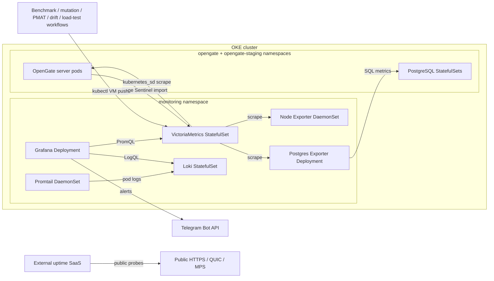

# Monitoring & Observability

## Overview

OpenGate monitoring runs inside the same OKE cluster as the application. The
intended topology is the Helm chart at
[`deploy/helm/monitoring`](../deploy/helm/monitoring/); live reconciliation on
2026-06-18 showed the `monitoring` Helm release deployed with all monitoring
workloads Ready, plus the production and staging app releases running in their
own namespaces.

Production monitoring is entirely Kubernetes-native, delivered by the
`monitoring` Helm release.

## Architecture


```mermaid
flowchart LR
  subgraph OKE[OKE cluster]
    subgraph App[opengate + opengate-staging namespaces]
      Server[OpenGate server pods]
      PG[PostgreSQL StatefulSets]
    end

    subgraph Mon[monitoring namespace]
      VM[VictoriaMetrics StatefulSet]
      Loki[Loki StatefulSet]
      Grafana[Grafana Deployment]
      Promtail[Promtail DaemonSet]
      NodeExporter[Node Exporter DaemonSet]
      PgExporter[Postgres Exporter Deployment]
    end
  end

  VM -- kubernetes_sd scrape --> Server
  Server -- Edge Sentinel import --> VM
  VM -- scrape --> NodeExporter
  VM -- scrape --> PgExporter
  PgExporter -- SQL metrics --> PG
  Promtail -- pod logs --> Loki
  Grafana -- PromQL --> VM
  Grafana -- LogQL --> Loki
  Grafana -- alerts --> Telegram[Telegram Bot API]
  Nightly[Benchmark / mutation / PMAT / drift / load-test workflows] -- kubectl VM push --> VM
  External[External uptime SaaS] -- public probes --> Ingress[Public HTTPS / QUIC / MPS]
```

## Sources Of Truth

| Concern | Source |
|---|---|
| Monitoring chart | [`deploy/helm/monitoring`](../deploy/helm/monitoring/) |
| Monitoring values | [`values.yaml`](../deploy/helm/monitoring/values.yaml) |
| App chart and overlays | [`deploy/helm/opengate`](../deploy/helm/opengate/) |
| Grafana dashboards and alerting ConfigMaps | [`deploy/grafana/provisioning`](../deploy/grafana/provisioning/) |
| VictoriaMetrics scrape config | [`vmagent-scrape.yaml`](../deploy/helm/monitoring/files/vmagent-scrape.yaml) |
| Edge Sentinel stream aggregation | [`edge-sentinel-stream-aggr.yaml`](../deploy/helm/monitoring/files/edge-sentinel-stream-aggr.yaml) |
| Promtail pod-log config | [`promtail-config.yaml`](../deploy/helm/monitoring/files/promtail-config.yaml) |
| Loki retention/config | [`loki-config.yml`](../deploy/helm/monitoring/files/loki-config.yml) |
| CI trend VM transport | [`scripts/lib/vm-push.sh`](../scripts/lib/vm-push.sh) |
| CI trend-store decision | [ADR-038](./adr/ADR-038-victoriametrics-ci-trend-store.md) |
| Load-test regression decision | [ADR-045](./adr/ADR-045-load-test-regression-gate.md) |
| Edge Sentinel telemetry-store decision | [ADR-044](./adr/ADR-044-edge-sentinel-server-telemetry-ingest.md) |

## Components

The component inventory is rendered from the monitoring chart, not manually
maintained here. Current chart components are:

| Component | Kubernetes object | Purpose |
|---|---|---|
| VictoriaMetrics | StatefulSet + Service + RBAC | Metrics store and Kubernetes service-discovery scraper. |
| Loki | StatefulSet + Service | Log store for pod logs. |
| Grafana | Deployment + Service | Dashboards, datasource provisioning, and alert UI. |
| Promtail | DaemonSet + RBAC | Node-level pod-log collection from `/var/log/pods`. |
| Node Exporter | DaemonSet + Service | Node metrics. |
| Postgres Exporter | Deployment + Service | PostgreSQL metrics for the production Postgres service. |

Image tags, resource requests/limits, retention, storage class, and persistence
settings live in [`values.yaml`](../deploy/helm/monitoring/values.yaml). Do not
copy those values into prose; link to the values file when exact numbers matter.

## Storage Model

The intended free-tier storage model is recorded in
[ADR-035](./adr/ADR-035-oke-free-tier-block-volume-remediation.md):

- VictoriaMetrics and Loki keep block-backed PVCs.
- Grafana uses `emptyDir`; dashboards, datasources, and alerting config are
  provisioned from ConfigMaps.
- Uptime Kuma is not deployed in-cluster; public uptime monitoring is external.

Live reconciliation on 2026-06-18 matched this intended shape: only three PVCs
were present across the app and monitoring namespaces — production Postgres,
VictoriaMetrics, and Loki.

## Access

| Tool | Access method | Source |
|---|---|---|
| Grafana | `make tunnel` → `kubectl port-forward svc/monitoring-grafana` | [`Makefile`](../Makefile) |
| VictoriaMetrics | ClusterIP Service, queried by Grafana or one-shot kubectl pods | [`values.yaml`](../deploy/helm/monitoring/values.yaml) |
| Loki | ClusterIP Service, written by Promtail and queried by Grafana | [`promtail-config.yaml`](../deploy/helm/monitoring/files/promtail-config.yaml) |
| Public uptime | External SaaS probing the public app endpoints | [ADR-035](./adr/ADR-035-oke-free-tier-block-volume-remediation.md) |

No monitoring ingress is rendered by the monitoring chart. The public HTTP edge
is owned by ingress-nginx and the app chart; QUIC and MPS remain L4 hostPorts on
the production server pod per [Kubernetes.md](./Kubernetes.md#l4-quic--mps).

## Application Instrumentation

The Go server exposes Prometheus metrics on the same HTTP listener as the REST
API. The in-cluster VictoriaMetrics scrape configuration discovers the server
Services via Kubernetes endpoint metadata rather than hard-coded Docker hostnames.
Metric names and registration live under
[`server/internal/metrics`](../server/internal/metrics/).

The host-resource dimensions an agent reports are listed in
[Wire-Protocol](Wire-Protocol.md). Disk is reported per mount and reduced to two
numbers by [`sampler.rs`](../agent/crates/mesh-agent-core/src/ml/sampler.rs):
**`disk.used_percent` is the fullest mount** and `disk.mounts_critical` counts
how many mounts sit at or above the critical-usage threshold. The fullest mount
is what an operator can act on — a file server with a small system volume at 98 %
beside a 2 TB data volume at 10 % pools to about 15 %, and a threshold rule
watching a pooled figure never fires for the volume that is about to fill.

Edge Sentinel numeric telemetry is pushed by the server, not scraped from
agents. The app chart wires the VM endpoint into the server through
[`server-deployment.yaml`](../deploy/helm/opengate/templates/server-deployment.yaml),
and the scoped client lives in
[`server/internal/telemetry`](../server/internal/telemetry/). VM reads go through
that client so the server injects the authoritative `tenant_id` matcher. Process
snapshots with basenames and optional command-line hashes stay in Postgres RLS;
see [Database](Database.md#device-processes-table).

Host logs are edge-stored and server-proxied: raw lines stay on the device and
are read on demand, never centralized. The System Logs pane pulls them through
the transient broker with `source=host`, filtered by severity/time/search and an
optional unit; see [ADR-057](adr/ADR-057-live-host-metric-streaming-and-system-logs.md).
The pane's output starts collapsed and pulls once, on its first open per device;
its filters stay live either way, and the caret collapses the returned lines
alone. The response is cached for the browser session, so returning to a device
page renders the lines it already has and every later pull is an explicit
control — a window button, a unit or severity filter, or a search.
The host log source is read through its first-party CLI (`journalctl -o json`)
rather than a GPL journal library, per
[ADR-050](adr/ADR-050-edge-sentinel-log-reader-sourcing.md).

Raw log lines are never centralized — they are brokered on demand, redacted, and
streamed straight back to an administrator with nothing persisted; see
[ADR-046](adr/ADR-046-edge-sentinel-raw-log-broker.md). Reading raw logs is
admin-elevated and writes a `device.logs.read` audit event on every pull. On top
of those structural controls, redaction runs as defense-in-depth through two
independent guards — the agent scrubs each line at the edge, and the server
scrubs again before the browser — over a shared corpus of secret shapes
(auth headers, credential assignments, JWTs, cloud keys, credentialed connection
strings, PEM keys); see
[ADR-049](adr/ADR-049-edge-sentinel-raw-log-privacy.md). The broker exposes
`opengate_device_log_pulls_total` (by outcome; the `ok` series is the audited-read
count) and `opengate_device_log_pull_duration_seconds`, charted by the
Edge-Sentinel Logs dashboard.

The monitoring chart passes the Edge Sentinel stream-aggregation config to
single-node VictoriaMetrics through
[`victoriametrics.yaml`](../deploy/helm/monitoring/templates/victoriametrics.yaml).
The [rollup config](../deploy/helm/monitoring/files/edge-sentinel-stream-aggr.yaml)
produces coarse `avg`-only rollups for `opengate_edge_*` metrics at two intervals
while `-streamAggr.keepInput` preserves the raw matched input. Central rollups
carry `avg` alone because each aggregate is its own series, so emitting
min/max/last centrally would multiply active series past the budget measured in
[`spike_test.go`](../server/tests/vmcardinality/spike_test.go); chart bands are
computed from min/max over the raw 60 s samples instead.

### The vitals contract

A device writes a fixed vocabulary of central series, and cardinality — not
sample rate — is what bounds the central store. Each of the six host-resource
gauges ships its 60 s average, and the four where a within-minute spike is the
signal (cpu, memory, and both net rates) ship the window maximum beside it: over
a minute at 1 Hz, five seconds pinned at 100 % move a 20 % average to 26.7 %,
while the maximum reads 100. Five stall vitals and three disk-performance vitals
ship beside them, and those eighteen dims plus the node-wide anomaly rate and the
five per-family rates are exactly the 24 series a Linux device may occupy. The
cap is spent: the next vital of any kind is a decision about the cap itself
rather than something that fits quietly.

A host that supplies neither Linux-only source writes the sixteen
platform-neutral series and reports the missing eight as unsupported — it ships
no dim for them at all, because a run of zeroes would read as a calm machine
rather than as a machine nobody is measuring.

### Stall vitals

`stall.cpu.some`, `stall.mem.some`, `stall.mem.full`, `stall.io.some` and
`stall.io.full` are each the share of the last 60 s that tasks spent stalled
waiting on that resource, read straight from the kernel's pressure accounting by
[`pressure.rs`](../agent/crates/mesh-agent-core/src/ml/pressure.rs). The kernel
has already reduced the whole minute into one number, so a stall vital costs one
file read and no cardinality, its averaging window is exactly the cadence it
ships on, and its 60 s bucket carries the latest reading rather than a mean of
sixty overlapping averages. The CPU `full` line is not published: the kernel
defines it as always zero.

An agent running inside a container reads its own cgroup's pressure files rather
than the host's, so it never reports its neighbours' stalls as its own; if that
cgroup publishes none, the vitals are absent rather than filled from the host.

These five ship from a Linux agent. A platform with no time-in-stall measurement
of its own gets no substitute built from counters that measure something else —
that would put two meanings behind one name — so it reports `stall.*` as
unsupported and ships nothing. **An absent stall vital is absent, never zero:**
zero is the answer for a host that was measured and never stalled, which is a
different fact from a host that cannot measure stalling.

### Disk-performance vitals

`disk.used_percent` answers "is the disk full". `disk.await_ms`,
`disk.await_ms.max` and `disk.queue_depth` answer "is it slow", which is a
different question about a different entity — capacity is a property of a mount,
service time of a physical device. [`diskperf.rs`](../agent/crates/mesh-agent-core/src/ml/diskperf.rs)
derives them from the kernel's per-device I/O counters: average time one I/O
took, its within-minute peak, and how many I/Os were outstanding on average.

**Worst device, per vital, independently.** The device with the slowest service
time and the device with the deepest queue are routinely different — a wearing
system disk beside a data disk taking a backup — and each vital answers its own
question, so a mean across them would describe neither. Per-device detail rides
alert evidence rather than central series, so the reduction costs no cardinality.
The devices measured are the whole block devices the kernel lists, which excludes
partitions by construction, minus the loop, ram and zram pseudo-devices; mapper
and RAID devices are included, because encryption and RAID overhead is latency
the user waits for.

There is deliberately no busy-percentage vital. SSD and NVMe service many I/Os in
parallel, so a utilization percentage pins at 100 % with substantial headroom
left; queue depth keeps scaling where it saturates, which is what distinguishes
"busy but healthy" from "overloaded".

A virtual machine needs no special handling: the latency its guest kernel
measures already includes host contention and volume throttling, which is
precisely what makes the customer's application slow. A **containerized** agent
reports these vitals as unsupported instead — the kernel's disk counters are not
per-container, so a number here would be its neighbours' I/O reported as its own,
and the cgroup's own I/O accounting carries no service time to substitute. What
the container keeps is a genuine I/O-stall signal through `stall.io.*`.

The vocabulary is fixed on both sides: the agent builds it from one series
mapping ([`store_sink.rs`](../agent/crates/mesh-agent-core/src/ml/store_sink.rs))
and the server allowlists it before writing a label
([`vitals.go`](../server/internal/agentapi/vitals.go)), so a dim name arriving on
the wire cannot enlarge the store — an unlisted one is dropped and counted under
`opengate_edge_telemetry_drops_total{reason="unknown_dim"}`. The two lists are
pinned together by the cross-language golden fixture for a metric window, and
the per-device cost is measured against a real VictoriaMetrics in
[`spike_test.go`](../server/tests/vmcardinality/spike_test.go).

### What an active series costs the central store

The contract bounds how many series a fleet creates; what one series then costs
is measured. The harness in
[`vmramseries`](../server/tests/vmramseries/vmram_test.go) provisions a
VictoriaMetrics that no other test writes to, loads it with a growing fleet, and
reads the store's own accounting — resident memory, active series, rows stored,
and bytes on disk. It runs at fleet scale on every suite run and changes no
limit; the numbers below are its output, and sizing decisions are taken against
them elsewhere.

The load is written at the per-device **cap** of 24, which is what a Linux device
occupies. A capacity plan must not assume the cheaper platform mix: eight of those
series come from Linux-only kernel sources, and the fleet is Linux.

**Memory is a fit, not a division.** Dividing one resident-memory reading by the
series present charges VictoriaMetrics' fixed baseline to those series, and the
baseline dominates at any size a test can afford — at fleet shape that division
answers ≈ 1.1 KB per series, roughly twice the marginal cost. The store also
allocates lazily, so a warm-up load runs first and its reading is excluded; every
fit point sits past the startup ramp.

**Each point is read after forcing the store to collect**, because two numbers
are in play and only one of them scales with series. Left to itself the Go
runtime frees what an import allocated whenever it next collects, so resident
memory holds a plateau of garbage that is steady to look at, unrelated to the
series held, and capable of reading *lower* at a larger load. Collecting first
puts every point in the same runtime state, which is what makes a line through
them mean anything.

Fleet-scale run — 5 000 devices × 24 series, VictoriaMetrics v1.114.0,
2026-08-11:

| Active series | Resident memory, collected |
|---|---|
| 24 000 *(warm-up, excluded)* | 76.3 MB |
| 48 000 | 91.2 MB |
| 62 400 | 99.0 MB |
| 76 800 | 103.1 MB |
| 91 200 | 108.9 MB |
| 105 600 | 119.0 MB |
| 120 000 | 129.8 MB |

Fit: **514 B per active series**, R² = 0.97, over a **65.4 MB** baseline, which
projects **127.0 MB** to hold the fleet's 120 000 series. Across runs the slope
holds within a few percent of 0.5 KB per series.

**Size the pod above that projection, not at it.** The fit measures what the data
costs; a store that is not being asked to collect also holds the garbage of
whatever it last ingested, and that is real resident memory the pod has to have.
In the run above the process sat at **223.2 MB** with the import still
uncollected against the 129.8 MB it needed to hold the same series — the gap is
the working memory of ingestion, and it is the larger of the two numbers that a
memory limit has to clear.

**Disk is a compression measurement**, so it depends on series length and on what
the values look like. The harness writes slow-drifting gauges reported to a tenth
of a percent — a constant would measure VictoriaMetrics' best case and full
entropy its worst — and lengthens the same series rather than adding new ones, so
the index amortises the way it does in production:

| Samples per series | Bytes per sample | Projected 30 d at 120 000 series |
|---|---|---|
| 60 (1 h) | 3.058 | 15.85 GB |
| 720 (12 h) | 0.831 | 4.31 GB |
| 2 880 (2 d) | 0.573 | 2.97 GB |
| 5 760 (4 d) | 0.542 | 2.81 GB |

The production store's own cost per sample — data size over
`vm_rows_added_to_storage_total`, on real fleet telemetry — is **0.316 B**, which
projects to **1.64 GB** over 30 d at 120 000 series. Real vitals repeat more than
the synthetic drift does, so the two bracket the answer: 1.64 GB on measured
production data, 2.81 GB as the harness's conservative upper bound.

### Reconnect backfill and deep-history pull

An agent stores its own metric history in the durable local tiers
([`edge-tsdb`](../agent/crates/edge-tsdb)), so an
offline window loses nothing centrally. On reconnect the agent advertises the
`Backfill` capability and requests a server-coordinated admission slot; the
scheduler ([`backfill_scheduler.go`](../server/internal/agentapi/backfill_scheduler.go))
grants a rate or defers under live load. Once granted, the agent drives the pure
replay engine ([`backfill.rs`](../agent/crates/mesh-agent-core/src/ml/backfill.rs))
from the control loop ([`backfill_loop.rs`](../agent/crates/mesh-agent/src/backfill_loop.rs)):
it drains the recent window first as 60 s points — the same grid the live stream
emits on, so a backfilled point and a live point for the same second are the same
point — then the older 1 min and 1 hr rollups oldest-first, throttled to the
granted rate and one acked batch at a time. Each bucket carries its average and,
for the gauges that have one, its maximum, taken from the stored rollup rather
than recomputed from averages. Full-resolution 1 s raw is never pushed; a durable per-tier watermark
advances only on each `MetricBackfillAck`, so an interrupted drain resumes
without re-sending.

The server writes each batch to the matching VM tier at the sample's original
timestamp through the import API, never the live stream-aggregation pipeline —
stream aggregation buckets by arrival time, so historical rollups would land in
the wrong buckets ([`conn_backfill.go`](../server/internal/agentapi/conn_backfill.go),
[`spike_test.go`](../server/tests/vmbackfill/spike_test.go)). Samples are clamped
to VM retention and bounded against wild clocks on both sides. History older than
retention, or full-resolution 1 s detail, is reachable through an admin-gated,
single-host deep-history pull (`GET /devices/{id}/history`) that the server
brokers to the agent as a bounded `RequestLocalHistory`; the agent answers it
from its local T0 raw tier.

### Threshold alerts

Alongside the unsupervised anomaly detector, an agent evaluates a set of
declarative **threshold rules** locally every sample — a metric gauge, a
comparator, a fire threshold, a hysteresis clear boundary, and a sustain duration
([`alerts`](../agent/crates/mesh-agent-core/src/alerts/)). A breach must hold
continuously for its sustain duration before it fires (suppressing brief spikes),
then stays firing until the metric recovers past the clear boundary (suppressing
flapping around the threshold). A rule's `disk.used_percent` gauge reads the
fullest mount, so it fires for the volume that is filling; a host with no
measurable mount has no reading and no disk rule fires on it. The server delivers
each connecting agent's ruleset over a capability-gated `PushAlertRules` control
message ([`alert_rules.go`](../server/internal/agentapi/alert_rules.go)),
assembled for the machine's own place in the tenancy ladder, so one customer's
rules never reach another's machines even inside a single tenant. A firing breach rides additively in an `AgentHealthSummary`,
which the server ingests as `opengate_edge_alert_breach` scoped to the resolved
tenant and charts on the Edge-Sentinel Soak dashboard. Delivery is
**investigation-aid only** — no auto-notify — until the false-positive soak; see
[ADR-053](adr/ADR-053-edge-sentinel-threshold-alerts.md).

**What a rule can say.** Besides comparing the reading itself, a rule may compare
how fast it is changing, or its largest or mean value over a window, and may
require several dimensions at once. That covers the failures a single
instantaneous threshold cannot state: a disk whose service time is drifting
2 ms → 40 ms over a fortnight crosses no line on any given second, and a queue
28 deep at a healthy 3 ms is a nightly backup rather than a device in trouble —
it takes both sides together to tell them apart. The vocabulary is the vitals
dimensions, so a rule can only watch something the fleet actually collects, and
the two legacy names `mem.used` and `disk.used` still resolve to
`mem.used_percent` and `disk.used_percent` so rules already on the fleet keep
firing. Every shape is bounded and its cost computable from the rule's own text;
the wire fields and their limits are in
[Wire-Protocol](Wire-Protocol.md#alert-rules-breaches-and-coverage).

**Where a rule comes from, and what a customer can change about it.** A rule has
three layers, separated by how mutable each one is.

Its *definition* — predicate, window, grouping key, the evidence its alerts
carry, and the numbers it ships with — is versioned YAML compiled into the server
from [`catalogue/`](../server/internal/rules/catalogue/). Definitions are
immutable per `(rule_id, version)`: loading refuses one whose meaning changed
without its version changing, checked against the digests committed in
`catalogue.lock`. That is what lets an alert raised last week still mean what it
meant then. Keeping definitions out of the database is also what makes the
program's highest-leverage gate possible — every rule's evaluation cost, the
readings it asks an endpoint to hold, is computed from its own text and bounded
in CI, per rule and across the whole pack, before it can reach an endpoint.

A customer's *bindings* live in Postgres and retune the numbers the rule declares
tunable, within the bounds that rule declares, validated on write. They resolve
down the tenancy ladder — machine, then site, then customer, then tenant, then
what shipped — using the ordering in
[`internal/settings`](../server/internal/settings/settings.go), and each
parameter resolves on its own, so a customer-wide sustain window survives one
machine's retuned threshold. A binding may also carry a bounded tag selector with
an operator-set `precedence` breaking ties; across rungs the narrower one always
wins.

A rule's *rollout state* lives in Postgres too, because stopping a rule cannot
require a deploy. A customer with no row has not configured the rule and gets it
as shipped — absence is never read as "switched off". See
[Database](Database.md) for the schema and
[ADR-071](adr/ADR-071-rule-catalogue-bindings-and-durable-coverage.md) for the decision.

**Coverage: which machines a rule is actually watching.** Per rule, every device
in the fleet is exactly one of three things, and the three always add up to the
fleet:

| State | Meaning |
|---|---|
| `active` | The device is evaluating the rule |
| `unsupported` | The rule is producing no answer here: its metric is outside the vocabulary, its predicate outside the grammar's bounds, or the reading is not arriving (a kernel with no pressure accounting, a container whose disk counters are its neighbours', a disk that completed no I/O) |
| `unknown` | The device has reported nothing — offline, or never seen |

`unsupported` is a first-class answer rather than an error path, because "no
kernel pressure information here" is a permanent platform gap and reads
completely differently from a machine that is merely quiet. A rule that is
answering nothing is reported that way whether the gap is permanent or passing —
claiming a rule watches a machine it produces nothing for is the failure coverage
exists to prevent, and a rule that starts answering reports itself active on its
next reading. Agents report their
own state per rule in `AgentHealthSummary.rule_coverage`
([`conn_coverage.go`](../server/internal/agentapi/conn_coverage.go)).

The three states are not stored the same way, because they are not the same kind
of fact. `active` and `unknown` are liveness: they are *supposed* to reset when
the server loses sight of the fleet, so they live in memory. A device that
disconnects moves to `unknown` rather than vanishing from the count, and a server
restart is correct by construction rather than by a cleanup job — a stored
`active` would let a machine unplugged three weeks ago keep claiming it is being
watched. Being unable to evaluate a rule is durable: a containerized agent can
never read the kernel's per-host pressure accounting, so that is a standing hole
in an estate's monitoring, and it must answer the same after a deploy as before
one. That third state is persisted, written through only when it changes — a
machine repeating itself costs no write at all — and a machine that can evaluate
the rule again has its row deleted rather than flipped, so nothing stored can go
stale. Deleting a machine takes its coverage rows with it.

### System-event rules

Some failures never cross a threshold, because nothing about them is a number.
A task stuck for two minutes, memory reclaimed by killing a process, a disk that
stopped answering its bus, a processor slowing itself down to survive its own
heat — the machine reports every one of these about itself, in words, in its own
log. A curated pack of four Linux rules reads them from the systemd journal
([`event.rs`](../agent/crates/mesh-agent-core/src/alerts/event.rs)), and a fifth
rule counts something no single record says: one service producing errors over
and over for a day.

Each rule matches on alternatives and, more importantly, on **exclusions**. Every
subsystem that reports a failure also reports its recovery, usually naming the
same component in nearly the same words — a disk that resets its link announces
the link coming back up, a throttled core announces its temperature returning to
normal. A rule without exclusions looks correct until it pages someone for a
machine that just got better, so the fixture corpus carries a near-miss per rule
and the pack is tested against both halves.

**The reader is a bounded on-demand read, not a stream**, so the watch is a poll
whose window reaches back further than the interval between polls and therefore
re-presents records it has already seen. A cursor is what makes that free
([`event_watch.rs`](../agent/crates/mesh-agent/src/event_watch.rs)): a record
newer than the cursor fires, a record at the cursor's instant fires only if it
was not already answered for there, and a record older than it never fires. The
last of those is a deliberate trade — a record arriving late is lost rather than
duplicated, because an alert delivered twice costs more trust than one delivered
never. What the poll fetches is bounded by the level floor the pack states about
itself, so a rule watching something less severe widens the read by existing
rather than by anyone remembering to widen it.

**A poll that comes back at the reader's line cap saw only the newest end of its
window.** How many records fell off the old end is not knowable, so the poll is
counted as an event in itself and no number of lost records is invented.
Alongside it the watch counts records it could not place in time and services the
tracking cap turned away. A record a curated rule already explained does not also
feed the per-service count: reporting one event twice, the second time under a
vaguer name, is worse than reporting it once.

Maintenance mode **suppresses** the window rather than deferring it. An admin
rebooting a host produces exactly the records this pack matches, so holding them
until maintenance ends would page someone for the maintenance itself.

Every alert is redacted at the edge before it exists
([ADR-049](adr/ADR-049-edge-sentinel-raw-log-privacy.md)), since an alert is the
one path that lifts a log line off a host outside the Logs pane. Alerts from
every edge producer land in one bounded per-device sink
([`sink.rs`](../agent/crates/mesh-agent-core/src/alerts/sink.rs)) that drops its
**oldest** entry when full — the newest alert describes what the device is doing
now — and admits at most 20 alerts per rolling hour, so one host in a loop cannot
drown the detection of every other host. Both limits lose alerts by design and
both count every alert they cost; a suppression nobody counts is
indistinguishable from a quiet device.

### Ranking what broke

An alert says what crossed a line. The question straight after it is what else
moved at the same time, and the device is the only place that can answer with
detail: it keeps 1 s readings locally, while what reaches the centre is a 60 s
average per dimension, in which a ten-second I/O collapse is a bump.

So the agent ranks its own dimensions over the event window
([`correlate`](../agent/crates/mesh-agent-core/src/correlate/)) against the
stretch immediately before it, and the ranking travels with the alert. Three
signals blend into one score in `[0, 1]`: how much a dimension's distribution
changed shape (a two-sample Kolmogorov–Smirnov statistic), how many readings in
the event window fell outside the baseline's normal band, and how far the mean
moved measured against the baseline's own scale. The third is what stops a
service time that went from 0.40 ms to 0.44 ms outranking one that went from
0.4 ms to 40 ms — the first two saturate on any clean separation, however small.

Degenerate windows are answered with a number rather than a NaN: a dimension
with fewer than two readings on either side is left out instead of scored from
nothing, a gauge that read the same value all hour has no band so any different
reading counts, and a reading that is not a real number is dropped where it
enters. Ties are broken by shape change and then by label, so the same readings
always produce the same order.

The read is an MVCC snapshot of the local store, so a correlation running while
the sampler writes neither blocks ingestion nor sees a moving target. Every run
is bounded three ways — how many dimensions are examined, how many readings each
window carries, and how long the whole thing may take — because the moment this
code runs is the moment the machine is already in trouble.

### Telemetry load and observability

Edge-Sentinel telemetry runs on every enrolled device. The control-plane holds
its budgets under that load: control-plane query p99 stays within ~20% of the
telemetry-free baseline, VM active-series cardinality and disk growth track the
avg-only model, and the reconnect-storm scheduler drains gradually without
starving live traffic. Those budgets are exercised by the load harness and
watched on the dashboard below.

The load driver is the QUIC agent load harness
([`server/tests/loadtest`](../server/tests/loadtest)). Beyond raw connect/register
timing it can drive the **default telemetry shape** per agent (`-default-telemetry`:
a health summary, a host metric window, and a minimal process report), spread
agents across tenant cohorts (`-tenants`), and run a **fleet-wide reconnect storm**
(`-backfill-batches`) in which a cohort returns at once with offline backlogs and
drains through the admission scheduler one acked batch at a time. Run it through
the Docker/e2e stack lifecycle, never bare tooling.

The server instruments the ingest path so it stays observable: accepted
telemetry (`opengate_edge_telemetry_ingested_total` by control type), server-side
drops (`opengate_edge_telemetry_drops_total` by reason — `persist_slots_full` is
the queue-saturation signal, since bounded per-connection persist slots shed
telemetry rather than backpressuring heartbeat/session/control), and the
reconnect-backfill scheduler state (`opengate_edge_backfill_active_slots`,
`opengate_edge_backfill_decisions_total` by grant/defer, and
`opengate_edge_backfill_grant_rate_samples_per_second`).

Those two telemetry counters form a closed ledger: every message counted as
ingested either produces a write or files exactly one typed drop, so
`ingested − drops` tracks what was actually persisted. The reasons cover the
admission bounds (`payload_too_large`, `interval_floor`, and their
`discovery_*` counterparts), a payload that carries nothing to store
(`empty_dims`, `empty_summary`, `empty_processes`, `empty_summaries`,
`empty_discovery`), the persist path (`tenant_missing`, `persist_failed`,
`persist_slots_full`), a purged device (`tombstoned`), and reconnect backfill
skipping samples older than its own retention floor
(`backfill_out_of_retention`). A discarded coalesced batch reports every message
it carried, so the two sides stay comparable. The invariant is pinned by
`TestTelemetryAccountingInvariant` in
[`conn_accounting_test.go`](../server/internal/agentapi/conn_accounting_test.go),
which also fails when a new telemetry control type joins the dispatch switch
without joining the ledger.

Agent clocks are corrected rather than trusted: a timestamp outside the accepted
window is pulled to the nearer bound and counted on
`opengate_edge_telemetry_clock_clamped_total` by `direction` (`future`, `past`).
A clamped message is still persisted — only its timestamp changes — so this is
deliberately its own counter and never a drop reason. The bounds live next to
the handlers in
[`conn_telemetry.go`](../server/internal/agentapi/conn_telemetry.go); reconnect
backfill keeps its own, far wider retention floor in
[`conn_backfill.go`](../server/internal/agentapi/conn_backfill.go) so replaying
months of pre-rolled history is never truncated by the live-path window.

The **Edge-Sentinel Soak**
Grafana dashboard charts these alongside anomaly rate, VM cardinality + disk
growth, and control-plane query p99 over the VM datasource. The
`opengate_*` series require the server `/metrics` scrape; the `vm_*` series require
the VictoriaMetrics self-scrape.

### Maintenance mode

An administrator can put a device into **maintenance mode** to quiet it during
disruptive host work — package upgrades, service restarts, reboots — that would
otherwise spike metrics, churn the discovered footprint, and trip anomaly and
threshold-alert breaches. Maintenance is a per-device desired state held on the
server (default Active) and pushed to the agent over the control channel; while it
is set the agent stops sampling, discovery, and log collection and suppresses
alert evaluation, so the intended disruption never counts. Remote management stays
live and the control channel stays connected, so the device is distinguishable
from one that has crashed and the server can push an exit. On leaving maintenance
the agent re-baselines anomaly detection, retraining the post-change footprint as
the new normal. Maintenance is manual-only with no auto-expiry; a Maintenance
badge, a fleet-level count, and an escalating day-counter keep a forgotten device
visible instead of silently blind. See
[ADR-056](adr/ADR-056-device-maintenance-mode.md).

### Web telemetry surface

The React client renders this telemetry through a thin adapter over uPlot
(canvas-2D): React owns the chrome, the renderer owns the pixels via typed
arrays, so a polling refresh never reconciles thousands of points. The adapter
([`TimeSeriesChart`](../web/src/features/devices/charts/TimeSeriesChart.tsx)) is
the only module importing uPlot and is code-split into a dedicated `charts`
chunk with its own budget in [`.size-limit.json`](../web/.size-limit.json).

Charts draw the window that was asked for. The device metrics endpoint returns a
bucket grid derived from the request rather than from the samples the store
holds ([API Reference](API-Reference.md)), so a wide window over a sparsely
reporting device arrives as that whole window with `null` in the buckets nobody
reported. [`aligned-data.ts`](../web/src/features/devices/charts/aligned-data.ts)
projects each column onto that grid — padding or trimming so a reading can never
land against the wrong instant — maps `null` to `NaN`, and keeps `spanGaps` off
on every drawn series including the band edges. The hole stays a hole: a line
across a device-offline stretch would assert measurements nobody took.

The device-detail panel
([`DeviceMetrics`](../web/src/features/devices/DeviceMetrics.tsx)) shows the
current edge-health anomaly rate, per-family metric timelines (avg line plus a
band whose `min_max_source` provenance is labelled honestly — `avg_of_60s` is
min/max across the 60 s averages, not host extrema) over the window a preset
chooses. Which dimensions broke pattern is ranked on the device itself and
arrives inside the alert, so the panel reads its window and asks the server
nothing else. The virtualized device grid and the dashboard carry only scalar
health badges
([`HealthBadge`](../web/src/features/devices/HealthBadge.tsx),
[`FleetHealth`](../web/src/features/devices/FleetHealth.tsx)) — no per-device
series on the grid.

Raw logs are read through the on-demand broker in the logs explorer
([`DeviceLogs`](../web/src/features/devices/DeviceLogs.tsx)) with level, time-range,
and full-text filters plus level facets over the returned page, rendering only the
redacted lines the broker returns. A jump from the metrics panel carries its
window straight into the explorer.

### Long-term (cold) tier

Single-node OSS VictoriaMetrics applies **one global retention window** set by
`victoriametrics.retention` in
[`values.yaml`](../deploy/helm/monitoring/values.yaml) — per-series retention and
downsampling are Enterprise features, so raw 60 s samples and the `avg` rollups
share the same window. The rollups exist for query efficiency: a long range reads
coarse pre-aggregated series instead of scanning raw. Within that window
VictoriaMetrics is the source of truth for central numeric telemetry, stored with
its native Gorilla compression.

Promtail reads Kubernetes pod logs, enriches each stream with Kubernetes labels,
and pushes to Loki via
[`deploy/helm/monitoring/files/promtail-config.yaml`](../deploy/helm/monitoring/files/promtail-config.yaml).

## Dashboards And Alerts

Grafana dashboards and alerting files are canonical in
[`deploy/grafana/provisioning`](../deploy/grafana/provisioning/). The monitoring
chart intentionally does not duplicate dashboard JSON; its
[`NOTES.txt`](../deploy/helm/monitoring/templates/NOTES.txt) documents creating
ConfigMaps from the canonical files.

Current dashboard files include the app overview, DB performance, PostgreSQL,
the Edge-Sentinel Logs dashboard (raw-log pull rate/latency and audited reads),
the Edge-Sentinel Soak dashboard (telemetry ingest/drop rates, VM
cardinality + disk growth, control-plane query p99,
reconnect-backfill scheduler state, and threshold-alert breach counts),
benchmark trend, mutation trend, PMAT trend,
terraform-drift trend, and load-test trend dashboards. Numeric CI trend workflows
write Prometheus samples to VictoriaMetrics:

- [`benchmark.yml`](../.github/workflows/benchmark.yml) →
  [`scripts/benchmark-vm-push.sh`](../scripts/benchmark-vm-push.sh)
- [`mutation.yml`](../.github/workflows/mutation.yml) →
  [`scripts/mutation-vm-push.sh`](../scripts/mutation-vm-push.sh) +
  [`scripts/mutation-status-vm-push.sh`](../scripts/mutation-status-vm-push.sh)
- [`pmat-trend.yml`](../.github/workflows/pmat-trend.yml) →
  [`scripts/pmat-vm-push.sh`](../scripts/pmat-vm-push.sh)
- [`terraform-drift.yml`](../.github/workflows/terraform-drift.yml) →
  [`scripts/terraform-drift-vm-push.sh`](../scripts/terraform-drift-vm-push.sh)
- [`load-test.yml`](../.github/workflows/load-test.yml) →
  [`scripts/loadtest-regression-check.sh`](../scripts/loadtest-regression-check.sh) →
  [`scripts/loadtest-vm-push.sh`](../scripts/loadtest-vm-push.sh)

VictoriaMetrics is the canonical numeric CI-trend store; Loki is reserved for
logs per [ADR-038](./adr/ADR-038-victoriametrics-ci-trend-store.md). Load-test
regression semantics are recorded in
[ADR-045](./adr/ADR-045-load-test-regression-gate.md). PMAT reads its previous
day-over-day baseline through
[`pmat-vm-query.sh`](../scripts/pmat-vm-query.sh) before publishing the current
sample.

### CI Trend Metric Convention

Numeric CI trends use VictoriaMetrics through
[`scripts/lib/vm-push.sh`](../scripts/lib/vm-push.sh). That transport is the
executable source for required labels and payload validation. Family names,
units, and extra labels live in the adjacent `*-vm-push.sh` wrappers and are
pinned by [`ci-trend-vm-push.test.sh`](../scripts/tests/ci-trend-vm-push.test.sh),
[`benchmark-vm-push.test.sh`](../scripts/tests/benchmark-vm-push.test.sh), and
[`loadtest-vm-push.test.sh`](../scripts/tests/loadtest-vm-push.test.sh). New
families follow those sources instead of copying a convention into prose.

Telegram credentials are held in the monitoring Secret described by
[`values.yaml`](../deploy/helm/monitoring/values.yaml) and chart
[`NOTES.txt`](../deploy/helm/monitoring/templates/NOTES.txt). Workflow-level
alerts use GitHub environment secrets directly.

## Deployment And Validation

The monitoring chart is a Helm release in the `monitoring` namespace. The app CD
workflow deploys the application releases; monitoring release lifecycle is an
operator action until explicitly wired into CD.

Validation sources:

- [`make lint-k8s`](../Makefile) renders and validates the app and monitoring
  charts.
- [`deploy/helm/monitoring/templates/NOTES.txt`](../deploy/helm/monitoring/templates/NOTES.txt)
  lists required out-of-band Secrets and ConfigMaps.
- [`scripts/tests/vm-transport.test.sh`](../scripts/tests/vm-transport.test.sh)
  verifies the shared kubectl VictoriaMetrics push transport without reaching the
  live cluster.
- [`scripts/tests/pmat-vm-query.test.sh`](../scripts/tests/pmat-vm-query.test.sh)
  verifies newest-sample selection and fail-soft PMAT baseline reads.
- [`scripts/tests/ci-trend-retirement.test.sh`](../scripts/tests/ci-trend-retirement.test.sh)
  keeps the CI trend transport VictoriaMetrics-only and pins Loki's runtime log
  deployment.
- [`scripts/tests/benchmark-summarize.test.sh`](../scripts/tests/benchmark-summarize.test.sh)
  verifies benchmark parsing, baseline generation, deterministic allocation
  regression detection, and `ns/op` advisory-only behavior.
- [`scripts/tests/ci-trend-vm-push.test.sh`](../scripts/tests/ci-trend-vm-push.test.sh)
  verifies mutation scores, mutation completion status, PMAT, and terraform-drift
  rows map to Prometheus text before reaching the shared VM transport.
- [`scripts/tests/loadtest-summarize.test.sh`](../scripts/tests/loadtest-summarize.test.sh)
  verifies k6 summary-export and QUIC harness output parsing for load-test
  trend rows, including partial failed-run capture.
- [`scripts/tests/loadtest-k6-run.test.sh`](../scripts/tests/loadtest-k6-run.test.sh)
  verifies that a k6 scenario which aborts contributes no trend row while a
  failed threshold still does, and that the workflow runs every scenario
  through the runner.
- [`scripts/tests/loadtest-regression-check.test.sh`](../scripts/tests/loadtest-regression-check.test.sh)
  verifies per-series VM read-back regression checks, p99 advisory behavior,
  cold-start handling, and VM fail-open behavior.
- [`scripts/tests/loadtest-vm-push.test.sh`](../scripts/tests/loadtest-vm-push.test.sh)
  verifies load-test trend rows map to Prometheus text before reaching the
  shared VM transport.

## Ad-hoc Investigation

Use `/observe` or the underlying kubectl/Loki helpers. The investigation path
is cluster-native:

```bash
kubectl -n monitoring get pods
kubectl -n monitoring logs deploy/monitoring-grafana
kubectl -n monitoring port-forward svc/monitoring-grafana 3000:3000
```

For ad-hoc trend checks, prefer the repository scripts that already use
temporary kubectl pods and clean themselves up. For app health, use
[`deploy/scripts/smoke-test.sh`](../deploy/scripts/smoke-test.sh) through a
Service port-forward, matching [`cd.yml`](../.github/workflows/cd.yml).
