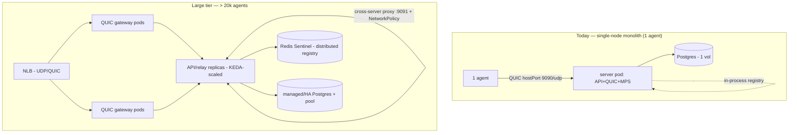

# Multiscale Readiness

**Status:** Living document. **Single source of truth** for scaling OpenGate toward
the design's **Large tier** — more than **20,000 simultaneously connected agents**.
It records where production actually stands, what scale-out machinery already
exists versus is missing, the functional and non-functional work the cutover
entails, and the architecture changes required. It consolidates the scaling
tech-debt entries that were previously scattered in
[`.claude/techdebt.md`](../.claude/techdebt.md) (see [§10](#10-tech-debt-consolidated-here)).

**Audience:** engineers who will execute the scale-out when demand arrives. Today
there is no demand (see §1) — this is a readiness map, not a backlog.

> **Provenance.** The production facts in §1 were **verified against the live OKE
> cluster and OCI tenancy on 2026-06-11** via `kubectl`, the `oci` CLI, and the
> server's `/metrics` endpoint — not inferred from the Helm chart. They are a
> point-in-time snapshot; re-verify before acting. Durable specs (ports,
> thresholds, flags) link to the code/config that owns them, per
> [docs/README.md](./README.md).

---

## 1. Where production actually stands today (verified 2026-06-11)

| Dimension | Production today | Verified via | Large-tier target |
|---|---|---|---|
| Cluster nodes | **1** (OCI A1.Flex, **2 OCPU / ~12 GiB**, ARM64, Oracle Linux 8.10, k8s v1.34.2) | `kubectl get nodes`; `oci search resource` (1 instance) | fleet of ≥16 GiB nodes ([design §4.3](#2-the-target--design-scaling-tiers)) |
| Server replicas | **1** (CD pins `--set server.replicas=1` in [`cd.yml`](../.github/workflows/cd.yml)) | `kubectl -n opengate get deploy` (`1/1`) | N replicas behind an autoscaler |
| **Connected agents** | **1** (`opengate_agents_connected 1`; `devices` table = 1 total / 1 online) | server `/metrics`; prod `psql` count | **> 20,000** |
| Topology | **monolithic** pod — API + QUIC + MPS + internal listener in one container | pod `containers[0].ports` | API tier + relay pool + QUIC gateway (3 tiers) |
| Session registry | **in-process** (`REGISTRY_BACKEND` unset → default) | deploy env (no `REGISTRY_BACKEND`) | distributed (Redis), cross-server |
| QUIC (agent) exposure | node **hostPort** `9090/udp` straight to the node IP (`quic.opengate.cloudisland.net`) | pod `hostPort=9090`; OCI = **1 LB (HTTP only), 0 NLB** | L4/UDP across the fleet (NLB or ingress-nginx udp-services) |
| MPS (AMT) exposure | node **hostPort** `4433/tcp` | pod `hostPort=4433` | same as QUIC |
| HTTP/SPA/API | ingress-nginx → OCI LoadBalancer (`146.235.218.205:80/443`) | `kubectl -n ingress-nginx get svc`; OCI LB | unchanged (already LB-fronted) |
| Database | **1** Postgres pod, **1** block volume (50 Gi `oci-bv`, RWO) | `kubectl -n opengate get pvc/sts` | managed/HA Postgres, pooling |
| Autoscaling | **none** — KEDA operator **not installed** | no `scaledobject` CRD; no HPA | KEDA `ScaledObject` active |
| HA / disruption | **none** — single replica, no PDB | no PDB in ns | PDB + multi-replica + Redis Sentinel |
| NetworkPolicy | **none** (flat overlay; `:9091` internal listener unrestricted) | `kubectl -n opengate get networkpolicy` (empty) | NetworkPolicy on `:9091`, mandatory proxy secret |
| Shared keys | **ON, secret populated** — `/data` is `emptyDir`; `opengate-secrets` carries `ca.crt`, `ca.key`, `vapid.json`, `update-signing.json` | secret key names; `/data` volume = `emptyDir` | (done — see §3) |
| Block-volume budget | **3 × 50 Gi + 50 Gi boot = 200 GB** (prod Postgres + monitoring Loki + VictoriaMetrics) | `kubectl get pvc -A`; OCI volume list | grows with managed DB / Redis |

**Net:** production is **Small-tier compute** (one 2-OCPU free-tier node, one pod,
one agent) on a **Medium-tier database** (PostgreSQL). The Large-tier topology does
not exist, and at one agent there is no scaling pressure of any kind today.

---

## 2. The target — design scaling tiers

The original Architecture Design (v1.0, §4.3 "Scaling Tiers") defines three tiers
by **database + topology**, not by any single component:

| Tier | Agents | Database | Architecture | Min RAM/node |
|---|---|---|---|---|
| Small | < 2,000 | SQLite (embedded) | single binary, single server | 512 MB |
| Medium | < 20,000 | PostgreSQL | API server + relay pool | 4 GB |
| **Large** | **> 20,000** | PostgreSQL (managed) | **Kubernetes: API + relay pool + QUIC gateway** | 16 GB+ |

OpenGate already runs PostgreSQL (ADR-014) and Kubernetes (ADR-030), so the DB and
orchestration prerequisites for the Large tier exist. What's missing is the
**multi-replica, multi-tier, storm-resilient** shape of the Large tier.

Two design facts shape what "scale" means for the **server**:

- **Active session data offloads to the agents.** Established sessions upgrade to
  **WebRTC P2P** (design §6.3), so desktop frames / terminal / file bytes flow
  peer-to-peer and bypass the server. The relay (two `io.Copy` goroutines per
  session, design §4.2) only carries fallback sessions.
- Therefore the server's scale concern at 20k is **(a)** holding ~20k idle QUIC
  control connections + heartbeats, **(b)** surviving **reconnection storms**, and
  **(c)** routing browser↔agent sessions **across replicas**. Stream ownership and
  the fast-reconnect path (§4) dominate (b); the distributed registry + cross-server
  proxy (§3) own (c).

---

## 3. Readiness inventory (verified against the chart + live cluster)

Four states: **Active** (running in prod), **Dormant** (built, flag-gated off,
lint-validated, runtime-unproven), **Designed-only** (specced, not built), and
**Half-ready** (present but incomplete/untuned).

### Active in production
| Capability | ADR | Evidence | Note |
|---|---|---|---|
| Shared keys via Secret | [ADR-034](./adr/) | `sharedKeys.enabled: true` ([values-production.yaml](../deploy/helm/opengate/values-production.yaml)); secret populated (verified §1) | Only the **single-replica** path is exercised. Multi-replica key-sharing (rolling updates serving identical CA/VAPID/signing, cross-replica mTLS) is still **unproven at runtime**. |
| Cross-server relay proxy listener | [ADR-023 Amendment 2](./adr/ADR-023-relay-extraction-redis-session-registry.md#amendments) | [`internal_relay.go`](../server/internal/api/internal_relay.go) route + `HTTPPeerDialer` wired in [`main.go`](../server/cmd/meshserver/main.go) | The `:9091` listener **binds in the pod** and the `/internal/relay/{token}` route is live, but with the in-process registry the owner is always *self*, so the `PeerDialer` is **never consulted** — inert. **No NetworkPolicy** restricts it (see §6 Security). |

### Dormant — built, gated off, runtime-unproven
| Capability | ADR | Gate | Gap to 20k |
|---|---|---|---|
| Redis Sentinel distributed `SessionRegistry` | [ADR-023 Amendment 1](./adr/ADR-023-relay-extraction-redis-session-registry.md#amendments) | `redis.enabled: false`; `REGISTRY_BACKEND=inprocess` | The [`RedisRegistry`](../server/internal/relay/redis_registry.go) adapter + Sentinel-HA chart exist and pass `make lint-k8s` + miniredis unit tests, but **never ran on a live cluster** (no Redis pods exist — verified). No real-Redis integration test, no Redis backup CronJob, no Redis monitoring. Master rediscovery / failover / replica re-pointing unproven. |
| KEDA autoscaling | [ADR-034](./adr/) | `autoscaling.enabled: false`; **KEDA operator not installed** (no `scaledobject` CRD — verified) | [`server-scaledobject.yaml`](../deploy/helm/opengate/templates/server-scaledobject.yaml) scales on CPU + `opengate_relay_active_sessions`. Also blocked by `hostPortL4: true` (one pod per node) and the in-process registry. |
| PodDisruptionBudget | [ADR-034](./adr/) | `podDisruptionBudget.enabled: false` | [`server-pdb.yaml`](../deploy/helm/opengate/templates/server-pdb.yaml); only meaningful at >1 replica. |
| Multi-node L4 QUIC path | [ADR-030](./adr/) | `l4.ingressNginxConfigMaps: false` | [`l4-tcp-udp-configmap.yaml`](../deploy/helm/opengate/templates/l4-tcp-udp-configmap.yaml) forwards QUIC/MPS via ingress-nginx tcp/udp-services — the multi-node alternative to today's single-node hostPort. |

### Designed-only — specced, not built
| Capability | Source | Status |
|---|---|---|
| **QUIC fast-reconnect** (0-RTT, cached server-cert-hash, `0x14` skip-signature) | design §1 / §2.1 / §3.3 | **Not implemented.** The agent only has `reconnect_with_backoff` (full handshake every time); the server `quic.Config` has no `Allow0RTT`. The `0x14` (`MsgSkipAuth`) path is a **constant + a hardcoded-`false` `HandshakeResult.Skipped` fossil** — and is **structurally foreclosed** by the server-opens workaround (§4). This is the single highest-leverage 20k gap. See the [fast-path master plan](../.claude/plans/fast-path-reconnect-fix.md). |
| Relay-pool / QUIC-gateway tier separation | design §4.3 / §7.2 | The monolithic pod *is* all three tiers. Never separated. |
| memberlist / gossip discovery | [ADR-023](./adr/) | Explicitly deferred "until >20 servers or Pub/Sub becomes the hot path." Direct pod-IP addressing (ADR-023 Amendment 2) is the interim. |

### Half-ready — present but incomplete
| Capability | Status |
|---|---|
| Postgres scaling | PostgreSQL is in use (ADR-014), but **single instance, no read replicas, no explicit connection-pool tuning** (no `pgxpool` `MaxConns`/`MinConns` set in [`server/internal/db`](../server/internal/db/)). The Large-tier "managed Postgres + read scaling" is absent. |

---

## 4. The reconnection-storm problem (the crux for 20k)

At 20k agents the server's dominant cost is **not** holding idle connections — it's
**reconnection storms**: a QUIC-gateway pod restart, a node drain, or a network
blip re-dials thousands of agents at once. Each reconnect runs a full **TLS 1.3
handshake with client-cert verification** (`RequireAndVerifyClientCert`, [cert.go](../server/internal/cert/cert.go))
**plus** the app-layer signature exchange (`[0x12]`/`[0x13]`, ECDSA sign+verify in
[handshaker.go](../server/internal/agentapi/handshaker.go)). Multiply by thousands
and the server CPU thunders.

> The design's purpose-built defense against exactly this is the **three
> fast-reconnect mechanisms**: QUIC **0-RTT** (§1), **cached server-cert-hash**
> (§2.1), and the **`0x14` fast path** (§3.3: *"skip full signature exchange"*).
> Their whole reason to exist is to make a storm cheap — verify a 48-byte hash
> instead of running signatures.

**None of the three are implemented**, and the `0x14` path is not merely unbuilt —
it is **foreclosed** by the QUIC control-stream **server-opens workaround**. That
workaround was applied in Phase 4 to fix a deadlock **misdiagnosed as a quic-go
mTLS bug**; it is in fact standard QUIC stream-discovery (the stream opener must
write first). With the server opening *and* speaking first, the agent can never
send `0x14` first, so the designed agent-initiated fast path cannot exist. Full
root-cause evidence (a TLS/mTLS matrix on quic-go v0.60.0, the design-doc intent,
the git history) lives in the [fast-path master plan](../.claude/plans/fast-path-reconnect-fix.md);
its empirical conclusion is summarized in §4 of that plan.

> There's a real design question the fast-path work should settle: at scale, do you
> need **both** the TLS mTLS client-cert verify **and** the `[0x10–0x13]` signature
> exchange on every reconnect, or does QUIC 0-RTT / session-resumption + the `0x14`
> hash-check give you the same security for far less per-reconnect CPU? That's the
> actual 20k-readiness conversation, and the current server-opens code can't even
> start it.

**Implementation reality (verified):** the handshake today is **mTLS + a single
`0x10`/`0x11` nonce/cert-hash exchange, with no app-layer signatures** (`0x12`/`0x13`
are defined-but-unimplemented constants). So the design's "skip the signature
exchange" is moot — the dominant per-reconnect cost is the **TLS mTLS handshake
itself**, which the `0x14` app-layer path does *not* avoid. **QUIC 0-RTT / session
resumption is the actual TLS-cost lever** and outranks `0x14` for storm resilience.

**Implication for sequencing:** fixing stream ownership (client-first handshake) is
a **prerequisite** for both the `0x14` round-trip optimization and 0-RTT/resumption.
It is necessary, not sufficient.

---

## 5. Functional readiness areas

1. **QUIC control-stream ownership + handshake order.** Move to **agent-opens /
   agent-speaks-first** (client-first), restoring even (client-initiated) stream
   IDs and unblocking the fast path. Touches the Go handshaker, the Rust agent,
   golden files, and integration tests. (Master plan owns this.)
2. **Fast-reconnect.** Implement the `0x14` cached-cert-hash skip-signature path;
   evaluate QUIC 0-RTT / TLS session resumption (the design question in §4).
3. **Distributed session routing.** Flip `REGISTRY_BACKEND=redis`; exercise
   `ClaimAffinity`/`LookupOwner` across replicas; prove the cross-server proxy
   actually proxies (it has never run with a foreign owner).
4. **Cross-server relay proxy.** Make the inert `:9091` path live and correct
   (loop guard, affinity TTL teardown) under real multi-replica traffic.
5. **L4 QUIC exposure across nodes.** Replace single-node hostPort with either an
   **OCI Network Load Balancer** (UDP-capable; the current classic LB is not) or
   ingress-nginx udp-services, preserving source IP where the protocol needs it.
6. **Feature parity under scale.** Confirm device logs, file transfer, agent
   auto-update, AMT/MPS, and WebRTC signaling behave when sessions span replicas.

---

## 6. Non-functional readiness areas

- **Performance / capacity.** Define a per-replica session budget (KEDA already
  targets `opengate_relay_active_sessions`); validate the relay memory model
  (design §4.2: ~2 goroutines × ~4 KB per fallback session) and that WebRTC
  offload (§6.3) actually keeps the server out of the data path at scale.
- **Availability / HA.** Multi-replica with PDB + RollingUpdate; Redis Sentinel
  quorum + master-failover drill; kill-the-master and node-drain game days. None
  has run.
- **Security.** Add a **NetworkPolicy** admitting `:9091` only from sibling server
  pods; make `OPENGATE_PROXY_SECRET` **mandatory** in production; re-examine the
  mTLS-plus-signature redundancy (§4); confirm cert rotation / CA continuity under
  rolling updates (shared keys make this possible — verify it).
- **Observability.** Per-replica metrics + dashboards for connection churn and
  reconnection storms; autoscaling signal health (VictoriaMetrics → KEDA); Redis
  health/lag panels; alerting on storm onset.
- **Operability.** Redis backup CronJob (model: the Postgres one); Postgres
  connection-pool tuning; managed-Postgres migration plan; runbooks for node-pool
  scaling and the QUIC NLB.
- **Cost / free-tier ceiling.** Today is **OCI Always-Free** (one 2-OCPU/12 GiB ARM
  node; classic LB; 200 GB block budget per [ADR-035](./adr/ADR-035-oke-free-tier-block-volume-remediation.md)).
  The Large tier (16 GB+ nodes, a node *fleet*, an NLB for UDP, managed Postgres,
  Redis) **exceeds free tier** and is a deliberate paid-tier decision.
- **Data layer.** Managed/HA Postgres, read-replica strategy, migration-under-load,
  pool sizing; Redis persistence (AOF+RDB) + backup/restore.

---

## 7. Architecture changes the cutover entails

Concrete deltas from today to the Large tier:

1. **Node pool ≥ N nodes** (paid shapes, 16 GB+), replacing the single free-tier node.
2. **Drop `hostPortL4`**, add an **OCI NLB** (or ingress-nginx udp-services) for QUIC
   UDP across nodes — a classic OCI LB cannot carry UDP (verified: the tenancy has a
   classic `LoadBalancer`, zero `NetworkLoadBalancer`).
3. **Enable Redis** (`redis.enabled=true`, `REGISTRY_BACKEND=redis`) + its
   operational surface (backups, monitoring).
4. **Enable KEDA** (install the operator) + the `ScaledObject` + PDB; switch the
   server Deployment to `RollingUpdate` with shared keys (already on).
5. **Client-first QUIC handshake + `0x14` fast path** (master plan) — the storm
   defense.
6. **NetworkPolicy** for `:9091`; mandatory proxy secret.
7. **(Optional, design §4.3/§7.2)** split the QUIC gateway / relay pool into their
   own tiers if the monolith replica becomes the bottleneck.

---

## 8. Mutual gating / sequencing

These are not independent toggles — they gate each other. You cannot flip one
without the others:

- **Autoscaling (>1 replica)** requires: Redis (cross-server routing), dropping
  hostPort (one pod/node today), shared keys (done), PDB, and proven HA.
- **Redis** requires: real-Redis integration test, backups, monitoring, a failover
  drill — before any overlay sets `REGISTRY_BACKEND=redis`.
- **Cross-server proxy** only becomes live once Redis is on (foreign owners exist);
  needs the NetworkPolicy + mandatory secret first.
- **Fast path / 0-RTT** requires the **client-first handshake** (master plan) to
  exist at all.
- **QUIC across nodes** requires the NLB / udp-services path (paid NLB).

A safe order: client-first handshake + fast path → NLB/multi-node QUIC →
NetworkPolicy + mandatory proxy secret → Redis (with tests/backups/monitoring) →
KEDA + PDB + multi-replica → HA drills.

---

## 9. Open design questions

1. **mTLS vs. app-layer signatures (§4).** Keep both per reconnect, or lean on QUIC
   0-RTT/resumption + the `0x14` hash-check for equivalent security at lower CPU?
   The fast-path work must settle this.
2. **QUIC L4: OCI NLB vs. ingress-nginx udp-services.** Cost, source-IP
   preservation, and connection-migration behavior differ.
3. **Managed vs. self-hosted Postgres** at the Large tier (OCI's managed offering vs.
   the current in-cluster StatefulSet).
4. **memberlist threshold** ([ADR-023](./adr/)) — when does direct pod-IP addressing
   stop scaling and gossip become worth it?

---

## 10. Tech-debt consolidated here

The following entries moved out of [`.claude/techdebt.md`](../.claude/techdebt.md) —
this document is now their single source of truth:

- **Shared keys runtime-unverified** (ADR-034) → §3 Active / §6 HA. *Correction:*
  the old entry claimed "staging/production keep `sharedKeys.enabled=false`"; live
  verification shows **production runs `sharedKeys.enabled=true` with the secret
  populated**. The residual is *multi-replica* runtime proof only.
- **Redis Sentinel operational surface + dormant-untested HA** (ADR-023 Amendment 1) → §3 Dormant.
- **Internal relay listener has no NetworkPolicy** (ADR-023 Amendment 2) → §3 Active / §6 Security.
- **No Postgres pool tuning / Redis backups** → §3 Half-ready / §6 Operability.

Items intentionally **left** in `techdebt.md` (not scaling-readiness): cutover doc
drift, ADR-035 external follow-ups, ADR-024 WebRTC mutants, gremlins timeout,
test-technique gaps, Docker Hub fallback verification.

---

## 11. References

- **Original Architecture Design** (v1.0): §1 transport/0-RTT, §2.1 connection
  model, §3.3 handshake + `0x14` fast path, §4.2 relay model, §4.3 scaling tiers,
  §6.3 WebRTC switchover, §7.2 multi-server topology. *(Out-of-repo planning doc;
  the durable in-repo records are the ADRs below.)*
- ADRs: [ADR-023](./adr/) (registry port + Redis backend + cross-server proxy
  amendments), [ADR-030](./adr/) (OKE/Helm),
  [ADR-034](./adr/) (KEDA + shared keys), [ADR-035](./adr/ADR-035-oke-free-tier-block-volume-remediation.md)
  (block-volume budget). Index: [`.claude/decisions.md`](../.claude/decisions.md).
- Fix plan for the storm-defense prerequisite:
  [fast-path master plan](../.claude/plans/fast-path-reconnect-fix.md).
- Chart: [`deploy/helm/opengate`](../deploy/helm/opengate); overlays
  [`values-production.yaml`](../deploy/helm/opengate/values-production.yaml).
