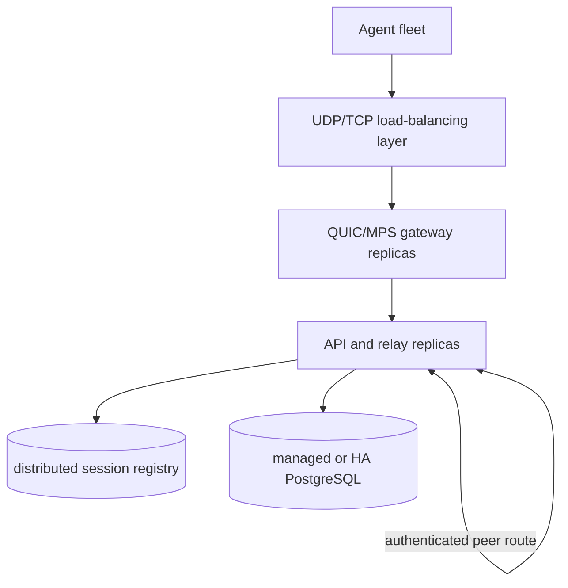

# Multiscale Readiness

**Status:** Living rebuild specification for moving OpenGate from its current
single-replica topology to a multi-replica Large-tier deployment.

This page is the single source of truth for the scale-out requirements that are
deliberately absent from the runtime. It records the retained seams, the
capabilities that must be rebuilt together, and the evidence required before
activation.

## 1. Current Deployment Shape

| Dimension | Current state | Source of truth |
|---|---|---|
| Server topology | One server replica containing API, QUIC, MPS, and relay | [`cd.yml`](../.github/workflows/cd.yml), [`server-deployment.yaml`](../deploy/helm/opengate/templates/server-deployment.yaml) |
| Session registry | Slim `SessionRegistry` port with the in-process adapter | [`registry.go`](../server/internal/relay/registry.go), [`main.go`](../server/cmd/meshserver/main.go) |
| HTTP edge | ingress-nginx and cert-manager | [ADR-030](./adr/ADR-030-kubernetes-adoption-oke-helm.md) |
| QUIC and MPS | Direct node `hostPort` exposure | [`values.yaml`](../deploy/helm/opengate/values.yaml) |
| Database | In-cluster PostgreSQL | [`postgres-statefulset.yaml`](../deploy/helm/opengate/templates/postgres-statefulset.yaml) |
| Shared keys | Production Secret mounted into `/data` | [ADR-034](./adr/ADR-034-scale-out-keda-shared-keys.md), [`values-production.yaml`](../deploy/helm/opengate/values-production.yaml) |
| Storage envelope | Production stays within the OCI free-tier block-volume design | [ADR-035](./adr/ADR-035-oke-free-tier-block-volume-remediation.md) |

The current architecture optimizes for operational simplicity and one live
pairing process. Multi-replica routing is not a dormant switch; it is a rebuild
with explicit readiness gates.

## 2. Target Shape

The Large tier separates concerns that are colocated today:

- a fleet-facing QUIC gateway;
- API and relay replicas;
- distributed session ownership and peer routing;
- managed or highly available PostgreSQL; and
- multi-node L4 load balancing.

Established remote-control sessions should continue to prefer WebRTC
peer-to-peer transport. The server scaling problem is therefore dominated by
idle control connections, reconnection storms, and routing agent/browser pairs
that land on different replicas.

## 3. Retained and Removed Capabilities

### Retained

| Capability | Current role | Scale-out value |
|---|---|---|
| `SessionRegistry` | Records local session metadata through `SaveSession`, `DeleteSession`, and `Ping` | Preserves an adapter boundary for a future distributed registry |
| Shared server keys | Keeps CA, VAPID, and update-signing identity stable across redeploys | Allows future replicas to present identical trust material |
| Per-replica relay metrics | Reports active relay work | Supplies an input for future capacity and autoscaling policy |

### Removed; rebuild required

| Capability | Preserved decision record | Rebuild requirements |
|---|---|---|
| Distributed session registry | [ADR-023](./adr/ADR-023-relay-extraction-redis-session-registry.md) | Atomic ownership, lifecycle events, deterministic adapter tests, backup/restore, monitoring, and failover drills |
| Cross-server relay proxy | [ADR-023](./adr/ADR-023-relay-extraction-redis-session-registry.md) | Authenticated peer routing, loop prevention, bounded teardown, network isolation, and foreign-owner end-to-end tests |
| Session-aware autoscaling | [ADR-034](./adr/ADR-034-scale-out-keda-shared-keys.md) | Capacity model, relay metric validation, safe replica ownership, and rollout tests |
| Pod disruption policy | [ADR-034](./adr/ADR-034-scale-out-keda-shared-keys.md) | Multi-replica availability target and node-drain evidence |
| Multi-node QUIC/MPS exposure | [ADR-030](./adr/ADR-030-kubernetes-adoption-oke-helm.md) | OCI NLB or ingress-nginx L4 decision, source-IP validation, and failover tests |

## 4. Reconnection-Storm Readiness

A node restart or network interruption can make many agents reconnect
simultaneously. Every reconnect currently performs the QUIC/TLS and application
handshake implemented by
[`connection.go`](../agent/crates/mesh-agent-core/src/connection.rs) and
[`handshaker.go`](../server/internal/agentapi/handshaker.go).

The scale-out design must benchmark and bound:

- TLS and certificate-verification CPU per reconnect;
- connection-attempt backoff and jitter;
- control-stream ownership and first-message ordering;
- QUIC session resumption or 0-RTT safety; and
- recovery when a gateway or relay replica disappears.

The existing wire constants alone are not evidence of a fast path. Activation
requires cross-language tests and measured reconnect-storm behavior.

## 5. Functional Requirements

1. **Distributed ownership.** Two replicas registering opposite sides of one
   token must converge on one owner without split-brain.
2. **Peer routing.** A non-owner must relay frames to the owner while preserving
   ordering, close semantics, and redacted logging.
3. **Owner loss.** Ownership must become reclaimable within a bounded interval,
   and both clients must receive a deterministic reconnect path.
4. **Registry loss.** Existing sessions and new-session admission need an
   explicit, tested policy.
5. **Multi-node L4.** QUIC and MPS must reach healthy replicas across workers
   without relying on a single node's host ports.
6. **Feature parity.** Device logs, file transfer, updates, AMT/MPS, WebRTC
   signaling, and browser relay must work when connections span replicas.

## 6. Non-Functional Requirements

- **Performance:** define per-replica connection and relay budgets; load-test
  direct and cross-replica paths.
- **Availability:** prove rolling updates, node drains, owner loss, registry
  failover, and database failover.
- **Security:** isolate peer traffic with NetworkPolicy, require peer
  authentication, rotate shared keys safely, and prevent token disclosure.
- **Observability:** expose ownership, peer-dial, reconnect-storm, registry, and
  per-replica saturation signals with actionable alerts.
- **Operability:** provide backup/restore, failover, scaling, and rollback
  runbooks.
- **Cost:** treat the Large tier as a paid topology; do not compromise HA or
  storage design to fit the current free-tier envelope.
- **Data layer:** define pool sizing, managed/HA PostgreSQL, migration under
  load, and distributed-registry persistence.

## 7. Target Topology

## 8. Dependency Order

The scale-out capabilities are mutually dependent:

1. Establish and benchmark the reconnect-storm strategy.
2. Choose and validate multi-node QUIC/MPS exposure.
3. Rebuild distributed ownership with its operational surface.
4. Rebuild authenticated cross-server routing and network isolation.
5. Prove shared-key continuity and rolling updates across replicas.
6. Add session-aware autoscaling and disruption policy.
7. Run failure drills before enabling production traffic.

Autoscaling must not precede correct cross-replica routing. Cross-server routing
must not precede authenticated peer isolation. A distributed registry must not
ship without backup, monitoring, and failover evidence.

## 9. Open Decisions

1. OCI NLB versus ingress-nginx L4 services for QUIC and MPS.
2. Redis-compatible registry versus another atomic ownership/event substrate.
3. Managed versus self-hosted PostgreSQL at the paid tier.
4. Monolithic replicas versus separate gateway and relay pools.
5. QUIC resumption and application fast-path security boundaries.

## 10. References

- [ADR-023](./adr/ADR-023-relay-extraction-redis-session-registry.md) — retained
  registry seam and removed distributed-routing design
- [ADR-030](./adr/ADR-030-kubernetes-adoption-oke-helm.md) — current OKE and L4
  posture
- [ADR-034](./adr/ADR-034-scale-out-keda-shared-keys.md) — shared keys and
  removed autoscaling design
- [ADR-035](./adr/ADR-035-oke-free-tier-block-volume-remediation.md) — current
  storage envelope
- [`relay`](../server/internal/relay/) — local pairing and registry seam
- [`deploy/helm/opengate`](../deploy/helm/opengate/) — current deployment shape
