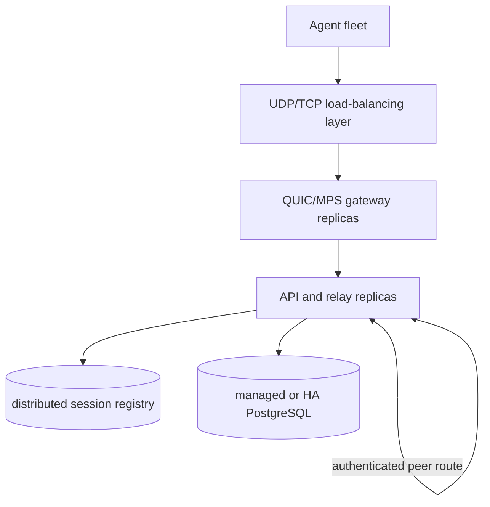

# Multiscale Readiness

**Status:** Living readiness specification for two growth paths: a free-tier
Medium-Free capacity tier that keeps one fleet-facing gateway, and the paid
multi-replica Large-tier deployment.

This page is the single source of truth for scale requirements that are
deliberately absent from the runtime. It records the retained seams, the
free-tier middle ground, the capabilities that must be rebuilt together, and the
evidence required before activation.

## 1. Current Deployment Shape

| Dimension | Current state | Source of truth |
|---|---|---|
| Server topology | One server replica containing API, QUIC, MPS, and relay | [`cd.yml`](../.github/workflows/cd.yml), [`server-deployment.yaml`](../deploy/helm/opengate/templates/server-deployment.yaml) |
| Session registry | Slim `SessionRegistry` port with the in-process adapter | [`registry.go`](../server/internal/relay/registry.go), [`main.go`](../server/cmd/meshserver/main.go) |
| HTTP edge | ingress-nginx and cert-manager | [ADR-030](./adr/ADR-030-kubernetes-adoption-oke-helm.md) |
| QUIC and MPS | Direct node `hostPort` exposure | [`values.yaml`](../deploy/helm/opengate/values.yaml) |
| Database | In-cluster PostgreSQL | [`postgres-statefulset.yaml`](../deploy/helm/opengate/templates/postgres-statefulset.yaml) |
| Shared keys | Production Secret mounted into `/data` | [ADR-034](./adr/ADR-034-scale-out-keda-shared-keys.md), [`values-production.yaml`](../deploy/helm/opengate/values-production.yaml) |
| Storage envelope | Production stays within the OCI free-tier block-volume design | [ADR-035](./adr/ADR-035-oke-free-tier-block-volume-remediation.md) |

The current architecture optimizes for operational simplicity and one live
pairing process. Multi-replica routing is not a dormant switch; it is a rebuild
with explicit readiness gates.

## 2. Medium-Free Tier

Medium-Free is the middle-ground tier between the current singleton and the
paid Large tier. Its scope is capacity and cost control inside the OCI free-tier
envelope. It is **not** active-active server availability, and it must not turn
`server.replicas` above one for the combined API/QUIC/MPS/relay process.

### Scope

- Keep exactly one fleet-facing full server replica until distributed session
  ownership and cross-server relay routing are rebuilt.
- Increase headroom by tuning the existing singleton, moving only clearly
  stateless work out of the gateway, and keeping edge telemetry summarized.
- Stay within the live OCI Always Free limits verified from the OCI console/API
  before activation, not from stale assumptions in repository comments.
- Preserve the current security model: mTLS agent auth, shared production keys,
  private monitoring, write-only off-cluster backups, and no public database or
  metrics endpoints.

Medium-Free excludes distributed registry, cross-server relay proxying,
session-aware autoscaling, managed/HA PostgreSQL, and multi-replica QUIC/MPS
admission. Those are Large-tier concerns.

### Direct Proofs

| Constraint | Proof | Impact |
|---|---|---|
| The current app is a single full server | `server.replicas: 1`, `server.hostPortL4: true`, and QUIC/MPS `hostPort`s in [`values.yaml`](../deploy/helm/opengate/values.yaml) and [`server-deployment.yaml`](../deploy/helm/opengate/templates/server-deployment.yaml) | Two full replicas on one node cannot both bind the same host ports; two nodes still lack safe session ownership |
| Relay/session state is local | [ADR-023](./adr/ADR-023-relay-extraction-redis-session-registry.md) documents the retained seam and removed distributed routing design | A browser and agent landing on different replicas would not be a safe configuration today |
| Shared keys are necessary but insufficient | [ADR-034](./adr/ADR-034-scale-out-keda-shared-keys.md) preserves key continuity but removed KEDA/PDB scale-out | Key sharing avoids trust split; it does not add distributed routing |
| Storage is already at the free-tier design cap | [ADR-035](./adr/ADR-035-oke-free-tier-block-volume-remediation.md) records prod Postgres, VictoriaMetrics, Loki, and node boot volume as the full free block-volume envelope | A second worker boot volume requires deleting, externalizing, or making ephemeral one existing persistent store |
| The compute cap is enforced at the live free-tier entitlement | [`free_tier.tftest.hcl`](../deploy/terraform/modules/oke/tests/free_tier.tftest.hcl) asserts ≤2 OCPU / ≤12 GB total, matching Oracle's current Always Free A1 entitlement (1,500 OCPU-hrs / 9,000 GB-hrs per month) | A node-count or shape change that exceeds 2 OCPU / 12 GB fails the Terraform test at plan time; growth above the public baseline requires verified tenancy limits recorded in an ADR |
| OCI networking has a free NLB option | Oracle's Always Free docs include one Network Load Balancer | An NLB can be evaluated for L4 exposure, but it does not solve application-level session ownership |

Empirical checks for every Medium-Free proposal:

```bash
helm template opengate deploy/helm/opengate -f deploy/helm/opengate/values-production.yaml
helm template monitoring deploy/helm/monitoring
terraform -chdir=deploy/terraform/modules/oke test
make lint-k8s
```

The rendered manifests must prove one full server replica, bounded `hostPort`
usage, no accidental new PVCs, and resource requests that fit the selected node
shape with measured headroom.

### Options

| Option | Shape | Fits free tier when | What it buys | What it does not buy | Recommendation |
|---|---|---|---|---|---|
| A. Tuned singleton | One A1.Flex OKE node, one full server replica, resource budgets raised only after load evidence | Live OCI limits allow the chosen single-node shape and storage remains at the ADR-035 volume count | More CPU/memory headroom for agents, API, relay, and Edge-Sentinel summaries | No node HA, no active-active server, no safe `server.replicas: 2` | **Default Medium-Free path** |
| B. Two small nodes, singleton gateway | Two workers, still one full server replica pinned/scheduled for QUIC/MPS, other workloads moved where safe | Live OCI limits allow two workers and one existing persistent store is removed, externalized, or made ephemeral | Some scheduling isolation for monitoring/API-adjacent work | Still no active-active gateway; tighter CPU per node if the current 2 OCPU / 12 GB limit applies | Use only if storage and compute limits are verified and a store tradeoff is accepted |
| C. API/UI split, singleton gateway | New role separation: one QUIC/MPS/relay gateway plus separately scalable stateless HTTP/API/UI work | HTTP commands that touch agent sessions are routed through an authenticated internal gateway path | Removes some HTTP/UI load from the fleet gateway | Does not solve relay ownership; adds code and operational complexity | Consider after load tests show HTTP/API load, not QUIC/relay load, is the bottleneck |
| D. Full two-replica server | `server.replicas: 2` for the existing combined process | It does not fit the current correctness model | More pods on paper | Broken cross-replica pairing, hostPort scheduling limits, unsafe owner loss | Reject for Medium-Free; belongs behind Large-tier gates |

### Expected Output

Before Medium-Free can be activated, the implementation must deliver:

1. A capacity target: agent count, reconnect-storm size, concurrent browser
   sessions, Edge-Sentinel report cadence, and retention.
2. A rendered Helm/Terraform evidence bundle showing free-tier compute, storage,
   PVC, and L4 exposure counts.
3. Load-test evidence from [`load-test.yml`](../.github/workflows/load-test.yml)
   and `make load-test-quic`, including p95/p99 latency, error rate, reconnect
   behavior, and node CPU/memory saturation.
4. A rollback runbook that returns to the current singleton values without data
   loss.
5. An ADR if the chosen option changes topology, storage durability, L4
   exposure, or server process roles.

### Quality Gates

| Requirement | Gate |
|---|---|
| Performance | p95/p99 API, QUIC handshake, registration, relay, and reconnect-storm metrics stay within the documented SLO under the chosen target fleet; server and Postgres CPU/memory have sustained headroom after the run |
| Security | mTLS remains mandatory, shared keys remain Secret-backed, monitoring stays private, internal split-role traffic is authenticated, and logs never expose session tokens or peer credentials |
| Maintainability | No dormant distributed code path is introduced; each new role or storage tradeoff has tests, docs, and an ADR |
| Operability | Helm render, `make lint-k8s`, backup restore, upgrade rollback, node restart, and reconnect-storm drills are repeatable |
| Cost | OCI usage after deployment shows no paid compute, boot/block storage, load-balancing, or observability resources beyond Always Free limits |
| Observability | VictoriaMetrics cardinality and bytes/day are measured before adding Edge-Sentinel metrics; central telemetry defaults to summaries, not raw high-frequency per-agent series |

### Clarifying Questions

1. What is the Medium-Free fleet target: 100, 500, or another number of enrolled
   agents, and how many concurrent remote-control sessions?
2. Is it acceptable to make Loki, VictoriaMetrics, or another store less durable
   to afford a second worker boot volume inside the free storage envelope?
3. Should Medium-Free optimize first for more connected idle agents, more
   concurrent remote-control sessions, or Edge-Sentinel reporting volume?
4. Is an API/UI split worth the extra code before paid Large-tier work, or should
   all engineering effort stay on the tuned singleton plus Large-tier rebuild?
5. Which OCI tenancy class is production using now, and what do the live Limits,
   Quotas and Usage values report for A1 OCPU, memory, boot volume, block volume,
   Load Balancer, and Network Load Balancer?

## 3. Large-Tier Target Shape

The Large tier separates concerns that are colocated today:

- a fleet-facing QUIC gateway;
- API and relay replicas;
- distributed session ownership and peer routing;
- managed or highly available PostgreSQL; and
- multi-node L4 load balancing.

Established remote-control sessions should continue to prefer WebRTC
peer-to-peer transport. The server scaling problem is therefore dominated by
idle control connections, reconnection storms, and routing agent/browser pairs
that land on different replicas.

## 4. Retained and Removed Capabilities

### Retained

| Capability | Current role | Scale-out value |
|---|---|---|
| `SessionRegistry` | Records local session metadata through `SaveSession`, `DeleteSession`, and `Ping` | Preserves an adapter boundary for a future distributed registry |
| Shared server keys | Keeps CA, VAPID, and update-signing identity stable across redeploys | Allows future replicas to present identical trust material |
| Per-replica relay metrics | Reports active relay work | Supplies an input for future capacity and autoscaling policy |

### Removed; rebuild required

| Capability | Preserved decision record | Rebuild requirements |
|---|---|---|
| Distributed session registry | [ADR-023](./adr/ADR-023-relay-extraction-redis-session-registry.md) | Atomic ownership, lifecycle events, deterministic adapter tests, backup/restore, monitoring, and failover drills |
| Cross-server relay proxy | [ADR-023](./adr/ADR-023-relay-extraction-redis-session-registry.md) | Authenticated peer routing, loop prevention, bounded teardown, network isolation, and foreign-owner end-to-end tests |
| Session-aware autoscaling | [ADR-034](./adr/ADR-034-scale-out-keda-shared-keys.md) | Capacity model, relay metric validation, safe replica ownership, and rollout tests |
| Pod disruption policy | [ADR-034](./adr/ADR-034-scale-out-keda-shared-keys.md) | Multi-replica availability target and node-drain evidence |
| Multi-node QUIC/MPS exposure | [ADR-030](./adr/ADR-030-kubernetes-adoption-oke-helm.md) | OCI NLB or ingress-nginx L4 decision, source-IP validation, and failover tests |

## 5. Reconnection-Storm Readiness

A node restart or network interruption can make many agents reconnect
simultaneously. The current control stream is client-first: the agent opens the
QUIC stream and sends either `0x11` `AgentHello` for the full handshake or
`0x14` `SkipAuth` for the reconnect fast path implemented by
[`main.rs`](../agent/crates/mesh-agent/src/main.rs) and
[`handshaker.go`](../server/internal/agentapi/handshaker.go).

The fast path skips the ServerHello/AgentHello round-trip when the cached CA
hash is current; it does **not** remove mTLS certificate verification. ADR-037
records the settled model: authentication is mTLS-only, `0x12`/`0x13` proof
messages are retired, 1-RTT TLS session resumption is the TLS-cost lever, and
0-RTT is deferred pending replay analysis.

The scale-out design must benchmark and bound:

- TLS and certificate-verification CPU per reconnect, including observed 1-RTT
  session-resumption rates once the agent has a ticket cache;
- connection-attempt backoff and jitter;
- client-first control-stream ordering and stale-hash fallback;
- 0-RTT safety before any early-data enablement; and
- recovery when a gateway or relay replica disappears.

The agent side of "connection-attempt backoff and jitter" has landed:
[`reconnect_with_backoff`](../agent/crates/mesh-agent-core/src/connection.rs)
applies full-jitter exponential backoff to connect attempts, and
[`ReconnectGovernor`](../agent/crates/mesh-agent-core/src/connection.rs) bounds
the reconnect rate when a *registered* session flaps — drops within a stability
window of registering — so a connection the server accepts then immediately
closes can no longer respin at the dial rate. What remains for activation is the
measured storm behavior and production evidence below.

The existing wire constants alone are not evidence of storm readiness.
Activation requires cross-language tests, measured reconnect-storm behavior,
and production evidence that reconnecting agents actually resume TLS sessions.

## 6. Functional Requirements

1. **Distributed ownership.** Two replicas registering opposite sides of one
   token must converge on one owner without split-brain.
2. **Peer routing.** A non-owner must relay frames to the owner while preserving
   ordering, close semantics, and redacted logging.
3. **Owner loss.** Ownership must become reclaimable within a bounded interval,
   and both clients must receive a deterministic reconnect path.
4. **Registry loss.** Existing sessions and new-session admission need an
   explicit, tested policy.
5. **Multi-node L4.** QUIC and MPS must reach healthy replicas across workers
   without relying on a single node's host ports.
6. **Feature parity.** Device logs, file transfer, updates, AMT/MPS, WebRTC
   signaling, and browser relay must work when connections span replicas.

## 7. Non-Functional Requirements

- **Performance:** define per-replica connection and relay budgets; load-test
  direct and cross-replica paths.
- **Availability:** prove rolling updates, node drains, owner loss, registry
  failover, and database failover.
- **Security:** isolate peer traffic with NetworkPolicy, require peer
  authentication, rotate shared keys safely, and prevent token disclosure.
- **Observability:** expose ownership, peer-dial, reconnect-storm, registry, and
  per-replica saturation signals with actionable alerts.
- **Operability:** provide backup/restore, failover, scaling, and rollback
  runbooks.
- **Cost:** treat the Large tier as a paid topology; do not compromise HA or
  storage design to fit the current free-tier envelope.
- **Data layer:** define pool sizing, managed/HA PostgreSQL, migration under
  load, and distributed-registry persistence.

## 8. Large-Tier Target Topology



## 9. Dependency Order

The scale-out capabilities are mutually dependent:

1. Establish and benchmark the reconnect-storm strategy.
2. Choose and validate multi-node QUIC/MPS exposure.
3. Rebuild distributed ownership with its operational surface.
4. Rebuild authenticated cross-server routing and network isolation.
5. Prove shared-key continuity and rolling updates across replicas.
6. Add session-aware autoscaling and disruption policy.
7. Run failure drills before enabling production traffic.

Autoscaling must not precede correct cross-replica routing. Cross-server routing
must not precede authenticated peer isolation. A distributed registry must not
ship without backup, monitoring, and failover evidence.

## 10. Large-Tier Open Decisions

1. OCI NLB versus ingress-nginx L4 services for QUIC and MPS.
2. Redis-compatible registry versus another atomic ownership/event substrate.
3. Managed versus self-hosted PostgreSQL at the paid tier.
4. Monolithic replicas versus separate gateway and relay pools.
5. Agent-side TLS session-ticket cache design and 0-RTT replay boundaries.

## 11. References

- [ADR-023](./adr/ADR-023-relay-extraction-redis-session-registry.md) — retained
  registry seam and removed distributed-routing design
- [ADR-030](./adr/ADR-030-kubernetes-adoption-oke-helm.md) — current OKE and L4
  posture
- [ADR-034](./adr/ADR-034-scale-out-keda-shared-keys.md) — shared keys and
  removed autoscaling design
- [ADR-035](./adr/ADR-035-oke-free-tier-block-volume-remediation.md) — current
  storage envelope
- [ADR-037](./adr/ADR-037-client-first-fast-path-reconnect.md) — current
  client-first reconnect model
- [Oracle Always Free Resources](https://docs.oracle.com/en-us/iaas/Content/FreeTier/freetier_topic-Always_Free_Resources.htm)
  — current OCI free compute, storage, load-balancing, and service-limit guidance
- [`relay`](../server/internal/relay/) — local pairing and registry seam
- [`deploy/helm/opengate`](../deploy/helm/opengate/) — current deployment shape
