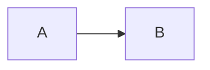

# OpenGate Documentation

Canonical developer documentation for the OpenGate remote device management
platform. All long-form docs live here, in the same git repo as the code they
describe.

Start at [Home.md](./Home.md) for the chapter index.

---

## Why docs live in the repo

Docs sit beside the code so one review covers both: a PR that changes behaviour
carries its doc update in the same diff, `CODEOWNERS` and path-based CI checks
can ask for one when a watched path moves without `docs/` being touched, and code
search finds every doc reference to a renamed symbol. Doc lint runs as part of
the normal CI rather than as a separate push.

---

## Documentation conventions

### 1. Link, don't paraphrase

If the source of truth for a fact lives in code or config, **link to it, do
not restate it in prose**. Any number, version pin, flag name, file path, or
port that you copy into docs will eventually drift from the source.

**Test for drift risk:** "If the underlying code changes, would I need to come
back and edit this sentence?" If yes, replace the sentence with a link.

**Examples — bad:**

> Rust coverage threshold is 80%, enforced by `cargo llvm-cov nextest
> --fail-under-lines 80` in CI.

> The server listens on port 8080 by default.

> Go version 1.26.0 is pinned in CI.

**Examples — good:**

> Rust coverage threshold is enforced in the `test-rust` job in
> [`ci.yml`](../.github/workflows/ci.yml) (search for `fail-under-lines`).

> The default HTTP listen address is the `-listen` flag default in
> [`cmd/meshserver/main.go`](../server/cmd/meshserver/main.go).

> CI runs against the Go version pinned in [`go.mod`](../server/go.mod).

When you must state a number inline (e.g. in a summary table), place it
adjacent to the link so a reader can one-click verify it.

**Product chapters are the exception, deliberately.** [`product/`](./product/) is
written for the operator using the console, not for the engineer changing it, so
those chapters link sibling chapters and the architecture tree rather than source
files. A number a technician needs in order to act (a grouping window, a
retention horizon, a state name) may be stated there in prose or a table; the
source-linked statement of the same fact lives in the architecture or
infrastructure chapter that owns it.

### 2. Per-file ADRs are mutable; supersede only for decision *changes*

An Architecture Decision Record documents a decision. Per-file ADRs in
[`adr/`](./adr/) (ADR-013 onward) are **mutable** — edit them in place to keep
them accurate against current state: fix a rotted link, correct a moved path,
strip chronological noise from the body. git history (`git log --follow` per
file) is the audit trail.

Supersession is still used for genuine **decision changes** (a reversal or
replacement, not a correction): create a new ADR with the next number, set its
`supersedes:` frontmatter, and update the prior ADR's `status:`. The lineage
stays explicit so a reader asking "why was it X, and what changed?" can trace
`ADR-014 → supersedes ADR-003`. Mutability keeps an ADR *true*; supersession
records what *changed*.

ADR bodies follow the same current-state doctrine as the rest of the docs:
purge chronological/logistical noise, but **rewrite to preserve the fact and the
why — never delete substantive rationale**, and keep the
`date:`/`status:`/`supersedes:` frontmatter. An ADR may link a plan only under
`plans/archive/…` (active plans rot); fold other pointers inline or into the
[`index`](../.claude/decisions.md).

New ADRs live as individual files using the `ADR-NNN-kebab-title.md` naming
convention. The combined
[`Architecture-Decision-Records.md`](./Architecture-Decision-Records.md) holds
ADR-001 … ADR-012 in one file and is **mutable on the same terms** — edit it in
place to keep it accurate against current state. The compact
[`index`](../.claude/decisions.md) is updated for every new ADR. See
[`adr/ADR-036`](./adr/ADR-036-mutable-adrs-current-state-doctrine.md) for the
full doctrine.

### 3. No paraphrased ADR bodies

Do not copy ADR text into other pages. Other pages link to the ADR and
summarise only the one fact the reader needs in context. This prevents the
same fact from existing in two places and going stale in one.

### 4. Mermaid diagrams only

Use Mermaid fenced blocks for diagrams:

````markdown

````

Do not commit rendered SVG blobs, D2 sources, or a diagram-rendering toolchain.
GitHub renders Mermaid server-side, so docs stay reviewable as plain Markdown
without Puppeteer, a JRE, or generated image drift. Keep diagrams hand-curated at
the architecture level; structural drift is caught by the boundary linters wired
through [`scripts/precommit-gauntlet.sh`](../scripts/precommit-gauntlet.sh) and
[`.github/workflows/ci.yml`](../.github/workflows/ci.yml), not by auto-extracting
graphs from source.

Every `mermaid` fence is syntax-checked in CI by the `Docs Validate` workflow
([`docs-validate.yml`](../.github/workflows/docs-validate.yml)) using the official
Mermaid parser. The local gauntlet stays grep-only; all Mermaid parsing runs in
CI.

#### C4 architecture diagrams

The rationale for everything in this section — C4 adoption, the render gate, the
CI validator, the drift guard, and the coverage standard — is recorded in
[ADR-039](./adr/ADR-039-diagrams-as-code-part-2.md).

For architecture-level structure, use the native Mermaid **C4** block types so
the views follow the [C4 model](https://c4model.com/):

- `C4Context` — system context (L1): people, the system, and external systems.
- `C4Container` — container view (L2): the system's deployable containers.
- `C4Component` — component view (L3): internals of a single container. Use
  sparingly, only where it adds value.
- `C4Dynamic` — a runtime flow expressed along C4 lines (optional). Plain
  `sequenceDiagram` remains the default for protocol flows.

**Render-fallback rule (mandatory).** Native Mermaid C4 is marked experimental
and is fragile on GitHub's renderer. Every C4 block must be confirmed to render
**legibly** on GitHub before it ships — not merely free of an error box, but with
relationship labels that do not overlap nodes or each other and node labels that
are not clipped (inspect at full resolution, not a thumbnail). If a C4 block will
not render legibly, fall back to a plain `flowchart` (or `sequenceDiagram`)
arranged along the same C4 level — same containers and relationships, robust
rendering — and note the fallback where the diagram lives. The CI syntax
validator is a fast pre-filter; GitHub's renderer is authoritative.

In practice native C4 overlaps its relationship labels on GitHub, so the
Architecture context and container views use this `flowchart` fallback today
(keep node labels short and wrap long ones with `<br/>` so they fit their boxes).

#### Diagram coverage standard

The docs must carry at least these diagrams; each is pinned by
[`scripts/tests/docs-diagrams.test.sh`](../scripts/tests/docs-diagrams.test.sh)
so it cannot be dropped silently:

1. **System context** — a C4 context (L1) view —
   [architecture/System-Architecture.md](architecture/System-Architecture.md) (currently the
   `flowchart` fallback per the render rule above).
2. **Container topology** — a C4 container (L2) view —
   [architecture/System-Architecture.md](architecture/System-Architecture.md) (currently the
   `flowchart` fallback).
3. **Each cross-component protocol flow** — a `sequenceDiagram` (agent handshake,
   relay) — [architecture/System-Architecture.md](architecture/System-Architecture.md) and
   [architecture/Wire-Protocol.md](architecture/Wire-Protocol.md).
4. **Deploy topology** — the OKE cluster shape —
   [infrastructure/Kubernetes.md](infrastructure/Kubernetes.md).
5. **CI/CD flow** — dev → CI gate → merge-to-main → deploy —
   [infrastructure/Continuous-Deployment.md](infrastructure/Continuous-Deployment.md).
6. **Session lifecycle** — establish → stream → teardown —
   [architecture/System-Architecture.md](architecture/System-Architecture.md).

New cross-component behavior of one of these kinds ships with the matching
diagram (and its pin) updated in the same change.

---

## Directory layout

Three trees, one rule: **a fact has one home, and everything else links to it.**

```
docs/
├── README.md                           This file
├── Home.md                             Chapter index — the authoritative list of chapters
├── Architecture-Decision-Records.md    ADR log (ADR-001 … ADR-012)
├── product/                            What the system does — one chapter per capability
├── architecture/                       How it is built — components, protocol, API, schema
├── infrastructure/                     How it runs — cluster, IaC, CI/CD, observability, test tooling
├── adr/                                Per-file ADRs (ADR-013+)
│   └── ADR-NNN-title.md
└── api/                                Generated Scalar OpenAPI reference
    └── index.html
```

One test decides which tree a paragraph belongs in: *does it describe something a
technician or a customer can see or do, or does it describe how we build, deploy
and run it?* Semantics on one side, mechanism on the other. "A stall vital is the
share of the last minute tasks spent waiting on disk" is product; "it is a gauge
scraped into VictoriaMetrics with stream aggregation producing avg-only rollups"
is infrastructure.

The trees are enforced by
[`scripts/tests/docs-seam.test.sh`](../scripts/tests/docs-seam.test.sh): every
chapter lives in exactly one tree, appears in exactly one `Home.md` row, and no
product chapter links a deploy, workflow, `Makefile` or `scripts/` path.

[Home.md](./Home.md) enumerates the chapters; adding a chapter means adding its
row there, not maintaining a second list here.

---

## Keeping docs in sync with code

Two defences run continuously:

1. **`/wiki-audit` skill** (at [`.claude/skills/wiki-audit/`](../.claude/skills/wiki-audit/SKILL.md))
   greps the docs for drift-prone patterns (percentages, version pins, file
   paths, config flags, port numbers) and flags candidates for review. Run it
   before shipping a PR that changes any of those underlying values.

2. **Path-based CI warning.** When a PR touches `ci.yml`,
   `sonar-project.properties`, `Cargo.toml`, `go.mod`, `package.json`, or
   deploy configs without touching `docs/`, CI leaves a comment asking the
   author to confirm no doc update is needed. This is advisory, not blocking.
