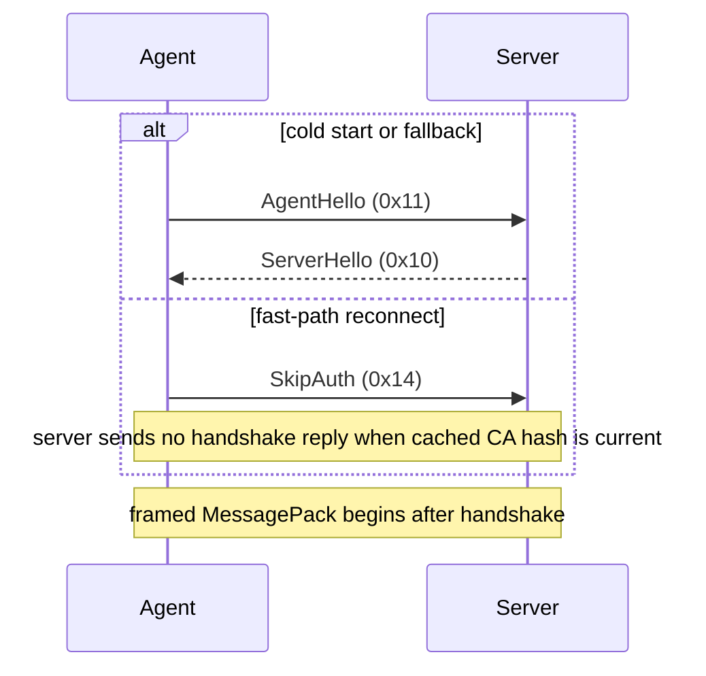

# Wire Protocol

## Frame Format

All control messages are wrapped in a framed transport:

```
┌──────────────┬─────────────────────┬───────────────────────┐
│ Frame Type   │ Payload Length      │ Payload               │
│ (1 byte)     │ (4 bytes, BE)       │ (variable)            │
└──────────────┴─────────────────────┴───────────────────────┘
```

### Frame Types

| Type Byte | Name | Payload |
|-----------|------|---------|
| `0x01` | Control | MessagePack-encoded control message |
| `0x02` | Desktop | MessagePack-encoded `DesktopFrame` (screen capture) |
| `0x03` | Terminal | MessagePack-encoded `TerminalFrame` (terminal I/O) |
| `0x04` | File | MessagePack-encoded `FileFrame` (file transfer chunk) |
| `0x05` | Ping | None (single byte, no length/payload) |
| `0x06` | Pong | None (single byte, no length/payload) |

Ping and Pong are special: they consist of a single byte with no length prefix or payload.

## Handshake

The handshake uses **raw binary encoding** (not MessagePack) and occurs before
any framed messages. The agent opens the control stream and speaks first; the
server branches on the first handshake byte:



Active handshake type bytes are `0x10` (`ServerHello`), `0x11`
(`AgentHello`), `0x14` (`SkipAuth`), and `0x15` (`ExpectHash`). The former
proof-message reservations `0x12` and `0x13` are retired and rejected by both
decoders. The canonical constants live in
[`server/internal/protocol/types.go`](../server/internal/protocol/types.go) and
[`agent/crates/mesh-protocol/src/types/handshake.rs`](../agent/crates/mesh-protocol/src/types/handshake.rs).

## Control Messages

After the handshake, all control messages use MessagePack encoding with internally tagged enums:

```rust
#[serde(tag = "type")]
enum ControlMessage {
    Register { ... },
    Heartbeat { ... },
    SessionRequest { ... },
    // ...
}
```

The `type` field is a string that identifies the variant, enabling cross-language deserialization between Rust (`rmp-serde`) and Go (`vmihailenco/msgpack`).

Unknown future control types are tolerated at the message-dispatch layer. The
Go server decodes the unknown `type` string and logs/ignores it without dropping
the agent connection. The Rust protocol crate decodes unknown server-to-agent
tags into `ControlMessage::Unknown`, allowing the agent control loop to ignore
the frame and continue. Malformed frames and oversized payloads remain fatal.

### Control Message Variants

| Variant | Direction | Fields |
|---------|-----------|--------|
| `AgentRegister` | Agent → Server | `capabilities`, `hostname`, `os`, `arch`, `version` |
| `AgentHeartbeat` | Agent → Server | `timestamp` |
| `AgentHealthSummary` | Agent → Server | `ts`, `org_id`, `node_anomaly_rate`, `per_family_rates`, `recent_bitmask`, `sampler_ver`, `model_ver` |
| `AgentMetricWindow` | Agent → Server | `ts`, `org_id`, `dims` |
| `ProcessReport` | Agent → Server | `ts`, `org_id`, `top_n` |
| `SessionAccept` | Agent → Server | `token`, `relay_url` |
| `SessionReject` | Agent → Server | `token`, `reason` |
| `SessionRequest` | Server → Agent | `token`, `relay_url`, `permissions` |
| `AgentUpdate` | Server → Agent | `version`, `url`, `sha256`, `signature` |
| `AgentUpdateAck` | Agent → Server | `version`, `success`, `error` |
| `AgentDeregistered` | Server → Agent | `reason` |
| `RelayReady` | Bidirectional | _(none)_ |
| `SwitchToWebRTC` | Bidirectional | `sdp_offer` |
| `SwitchAck` | Bidirectional | _(none)_ |
| `IceCandidate` | Bidirectional | `candidate`, `mid` |
| `MouseMove` | Browser → Agent | `x`, `y` |
| `MouseClick` | Browser → Agent | `button`, `pressed`, `x`, `y` |
| `KeyPress` | Browser → Agent | `key`, `pressed` |
| `TerminalResize` | Browser → Agent | `cols`, `rows` |
| `FileListRequest` | Browser → Agent | `path` |
| `FileListResponse` | Agent → Browser | `path`, `entries` |
| `FileListError` | Agent → Browser | `path`, `error` |
| `FileDownloadRequest` | Browser → Agent | `path` |
| `FileUploadRequest` | Browser → Agent | `path`, `total_size` |
| `ChatMessage` | Bidirectional | `text`, `sender` |
| `RestartAgent` | Server → Agent | `reason` |
| `RequestHardwareReport` | Server → Agent | _(none)_ |
| `HardwareReport` | Agent → Server | `cpu_model`, `cpu_cores`, `ram_total_mb`, `disk_total_mb`, `disk_free_mb`, `network_interfaces` |
| `HardwareReportError` | Agent → Server | `error` |
| `RequestUpdate` | Agent → Server | _(none)_ |
| `UpdateCheckResponse` | Server → Agent | `available`, `version`, `url`, `sha256`, `signature` |
| `RequestChatToken` | Agent → Server | `device_id` |
| `ChatTokenResponse` | Server → Agent | `url`, `token`, `expires_at` |
| `RequestDeviceLogs` | Server → Agent | `log_level`, `time_from`, `time_to`, `search`, `log_offset`, `log_limit`, `source`, `unit` |
| `DeviceLogsResponse` | Agent → Server | `log_entries` (Vec\<LogEntry\>), `total_count`, `has_more` |
| `DeviceLogsError` | Agent → Server | `error` |
| `RequestHealthWindow` | Server → Agent | `since_ts`, `limit` |
| `HealthWindowResponse` | Agent → Server | `summaries` |
| `DiscoveryReport` | Agent → Server | `ts`, `org_id`, `ports`, `services`, `db_engines`, `containers`, `packages`, `truncated` |
| `SetMaintenanceMode` | Server → Agent | `enabled` |
| `MaintenanceApplied` | Agent → Server | `enabled` |

The Edge Sentinel telemetry variants are ingested by the server when received.
The agent sampler runs on every device
([ADR-056](./adr/ADR-056-device-maintenance-mode.md)); it pauses only while the
device is in maintenance mode. Server ingest ignores payload `org_id` for
authorization, resolves the device's authoritative organization after handshake,
applies a telemetry payload cap and interval floor, and drops/counts telemetry
when the bounded persistence path is saturated. The source-of-truth payload definitions are the Rust
[`ControlMessage`](../agent/crates/mesh-protocol/src/control.rs) enum and Go
[`ControlMessage`](../server/internal/protocol/control.go) flat struct; the
store decision is [ADR-044](./adr/ADR-044-edge-sentinel-server-telemetry-ingest.md).

Endpoint log-rate signals reuse `AgentMetricWindow`: each `dims` entry is named
`log.rate.<source>.<field>`, where `<source>` is `self`, `journald`, or `windows`
and `<field>` is a severity level (`error`/`warn`/`info`/`debug`/`trace`), a
top-emitting-unit rank (`unit_rank1`–`unit_rank3`), or `volume`. The dims carry
only counts and ranks — never a unit name or message text — so central series stay
bounded. The agent's host log readers produce these windows and forward them over
a bounded channel that drops under pressure, so log bursts never backpressure the
control stream. On the on-demand query,
`RequestDeviceLogs.source` selects a host log source and `unit` narrows to one
emitting unit; an empty `source` reads the agent's own files.

`DiscoveryReport` carries a non-intrusive, read-only host profile: listening
ports (transport, port, owning process basename), host services (systemd unit /
Windows service name + run state), database engines inferred from listening
ports (engine family + port, no probe), containers from a local runtime
(runtime, image, name, state), and installed packages (name, version). Each
category is per-device bounded on the agent, and `truncated` is set when any hit
its cap; the payload never carries a bound address, connection string, or
credential. The agent's discovery task profiles on a long interval and forwards a
report over a bounded channel **only when the profile changed** since the last one
shipped — so a
steady host is silent and a burst never backpressures the control stream. The
server assigns the authoritative organization, so the agent leaves `org_id`
empty.

`SetMaintenanceMode` carries the server's desired maintenance state for the
device (`enabled`), pushed on the Active↔Maintenance transition and, for a device
already in maintenance, on reconnect. The agent applies it — suppressing the
sampler, discovery, log readers, and alert evaluation while `enabled` is true —
and echoes `MaintenanceApplied { enabled }` as its applied-state report. Both
carry an explicit boolean, so a `false` (resume) is distinct from an absent field.
`SetMaintenanceMode` is universal control and is not capability-gated; the agent
resets to Active on every registration and suppresses only when the server pushes
`true`. See [ADR-056](./adr/ADR-056-device-maintenance-mode.md).

### Capabilities

`AgentRegister.capabilities` is the negotiation surface for additive
server-to-agent control messages. The server must not send a new
server-to-agent variant unless the connected agent advertised the matching
capability. Current additive gates:

| Capability | Gates |
|------------|-------|
| `HardwareInventory` | `RequestHardwareReport` |
| `DeviceLogs` | `RequestDeviceLogs` |
| `HealthWindow` | `RequestHealthWindow` |
| `Backfill` | `GrantBackfill`, `DeferBackfill`, `MetricBackfillAck`, `RequestLocalHistory` |

`Discovery` gates no server-to-agent message; the agent advertises it to signal
that it emits `DiscoveryReport` inventory (so the server knows to ingest it).

Tolerant unknown-message decoding is a backstop for mixed fleets; capability
gating is the primary safety mechanism.

### LogEntry Struct

The `DeviceLogsResponse` message carries an array of `LogEntry` structs:

| Field | Type | Description |
|-------|------|-------------|
| `timestamp` | string | ISO 8601 timestamp of the log line |
| `level` | string | Log level (`TRACE`, `DEBUG`, `INFO`, `WARN`, `ERROR`) |
| `target` | string | Rust tracing target (module path) |
| `message` | string | Log message body |

The agent parses daily-rotated log files written by `tracing-subscriber` and returns matching entries. The server redacts known secrets from the bounded response and streams it straight back to the requesting administrator; nothing is persisted centrally (see [ADR-046](adr/ADR-046-edge-sentinel-raw-log-broker.md)).

### Data Frame Types

**DesktopFrame**: `sequence`, `x`, `y`, `width`, `height`, `encoding` (Raw/Zlib/Zstd/Jpeg/H264Idr/H264Delta), `data` (raw bytes)

**TerminalFrame**: `data` (raw bytes)

**FileFrame**: `offset`, `total_size`, `data` (raw bytes, 256 KiB chunks). The browser sends a `FileDownloadRequest` control message, then the agent streams back FileFrame chunks. The browser accumulates chunks via `DownloadAccumulator` and on completion either triggers a browser download (save-to-disk) or displays the content in an in-browser file viewer. Empty files produce a single frame with `total_size: 0` and empty `data`.

## Cross-Language Compatibility

Golden file tests guarantee bit-identical encoding between Rust and Go:

```
  Rust (encoder)                         Go (decoder)
       │                                      │
       │── generate fixtures ──►  testdata/golden/*.bin
       │                                      │
       │                          verify fixtures ──►  pass/fail
```

1. Rust tests serialize known messages to binary and write them to `testdata/golden/`
2. Go tests read the same files and deserialize, asserting field-level equality
3. Go reverse-golden tests serialize representative frames to `go_*.bin`
4. Rust reverse-golden tests read those files and assert field-level equality

This catches encoding drift in both directions. Unknown future control-type
fixtures are included for both agent-to-server and server-to-agent compatibility.
The CI pipeline sequences the golden verification job after the Rust test job
to ensure fixtures are always freshly generated.

### Fixture Location

```
testdata/golden/
├── control_message_*.bin    # Framed control messages
├── desktop_frame.bin        # Desktop frame (Zstd encoding)
├── desktop_frame_jpeg.bin   # Desktop frame (Jpeg encoding)
├── handshake_*.bin          # Raw handshake messages
└── ...
```
