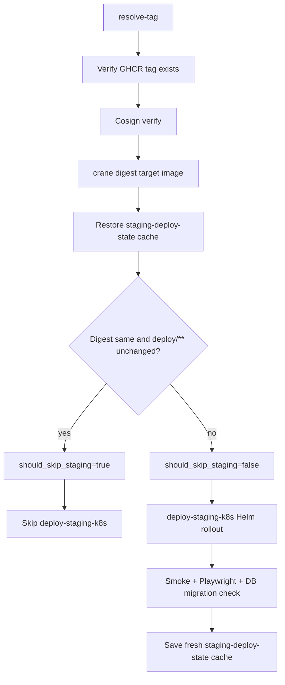

# ADR-025: CD pre-flight digest check to short-circuit no-op staging deploys

Date: 2026-05-20
Status: Accepted

## Context

The container-image workflow already avoids unnecessary builds:

1. [`build-image.yml`](../../.github/workflows/build-image.yml) runs
   [`scripts/build-image-gate.sh`](../../scripts/build-image-gate.sh) and skips
   the expensive multi-arch `build-and-push` job when the diff does not touch
   image inputs.
2. When the image is unchanged, the `tag-forward` job uses `crane copy` so the
   new `sha-<7>` tag still exists in GHCR. CD deploys immutable `sha-<7>` tags,
   so docs-only or CI-only commits still have a resolvable image reference.

That build-side optimization does not automatically skip the downstream CD
workflow. GitHub's `workflow_run` trigger has no `paths` filter, so
[`cd.yml`](../../.github/workflows/cd.yml) still runs after a successful image
workflow on `main`.

The current CD substrate is OKE + Helm:

- `resolve-tag` verifies the target GHCR tag and cosign signature, then performs
  the pre-flight digest/cache check.
- `deploy-staging-k8s` is gated by `should_skip_staging != 'true'` and otherwise
  runs `oci-kube-setup`, creates/updates Kubernetes Secrets, performs
  `helm upgrade --install`, waits for rollout, smoke-tests through
  `kubectl port-forward`, runs Playwright, verifies DB migrations, and saves
  the fresh staging deploy state.
- `deploy-production-k8s` remains behind the GitHub Environment approval gate and
  does not use the staging skip.

## Decision

Keep the **pre-flight digest check inside `resolve-tag`**. The check uses
`crane digest` against GHCR plus a GitHub Actions cache of the prior successful
staging deployment. When the target image digest matches the cached digest and
`deploy/**` did not change since the cached `git_sha`, `resolve-tag` outputs
`should_skip_staging=true`; `deploy-staging-k8s` is skipped.

This is a fail-open fast path. A cache miss, malformed cache, manual
`workflow_dispatch`, digest lookup failure, or deploy-config diff all fall
through to the full Helm rollout. The cache is a performance hint, not the
cluster source of truth.

### Design



Cache key: `cd-deploy-state-staging-v1-${{ github.run_id }}`. Restore key
prefix: `cd-deploy-state-staging-v1-`.

Cached payload (`staging-deploy-state.json`):

```json
{
  "git_sha": "9137516...",
  "image_digest": "sha256:abc...",
  "image_tag": "sha-9137516"
}
```

### Edge Cases

| Scenario | Behavior |
|---|---|
| First run after cache miss | Full `deploy-staging-k8s` runs, then saves a fresh cache entry. |
| `workflow_dispatch` | Pre-flight ignored; manual deploy intent always proceeds. |
| `deploy/**` changed | Full Helm rollout, even if image digest is unchanged. |
| Stale cache after manual cluster intervention | Pre-flight may skip staging if digest and deploy config are unchanged. Mitigation: run CD manually with `workflow_dispatch` or delete the matching `cd-deploy-state-staging-v1-*` cache entry to force a full rollout. |
| Cache eviction | Falls through to full `deploy-staging-k8s`. |
| `crane digest` fails | Falls through to full `deploy-staging-k8s` and logs the failure. |
| Image tag exists but is unsigned | Cosign verification fails before the pre-flight decision; deploy remains blocked. |
| Production deploy | Out of scope. Production has an environment approval gate, so skipping its rollout has a different risk/reward profile. |

### Implementation

`cd.yml` owns the implementation:

1. `resolve-tag` checks out with `fetch-depth: 0` so it can diff `deploy/**`.
2. `resolve-tag` installs cosign and `crane`, verifies the image signature, and
   computes the target image digest.
3. `actions/cache/restore@v5` restores the newest
   `cd-deploy-state-staging-v1-*` cache entry into `staging-deploy-state.json`.
4. The pre-flight step writes `should_skip_staging` to `$GITHUB_OUTPUT`.
5. `deploy-staging-k8s` includes `needs.resolve-tag.outputs.should_skip_staging != 'true'`.
6. Successful staging deploys save a fresh cache via `actions/cache/save@v5`.

## Out Of Scope

- **Production environment pre-flight.** Production has manual approval; revisit
  only if no-op production approvals become a recurring operational cost.
- **Skipping cosign verification on cache hit.** Signature verification is cheap
  and protects every deploy decision.
- **Skipping `resolve-tag` itself.** It contains image existence and signature
  verification.
- **Skipping `Build & Push Container Image`.** The upstream workflow already has
  its own path gate.
- **External state store for deploy cache.** GitHub Actions cache is sufficient
  for this best-effort staging optimization.

## Consequences

**Positive.**

- Saves the OKE/Helm staging rollout and browser-test cost for no-op deploys.
- Reduces GitHub Actions minutes spent on docs-only and CI-only changes.
- Keeps signature verification always-on.
- Fails open to a full deploy whenever cache evidence is missing or ambiguous.

**Accepted trade-offs.**

- Cache state can be stale after manual cluster intervention; manual
  `workflow_dispatch` or cache deletion forces reconciliation.
- Cache key versioning (`v1`) means schema changes require a key bump, forcing one
  full deploy. Acceptable.
- First deploy after cache eviction pays the full staging cost. Acceptable.

## References

- Workflow being optimized: [`.github/workflows/cd.yml`](../../.github/workflows/cd.yml)
- Build-side path gate: [`scripts/build-image-gate.sh`](../../scripts/build-image-gate.sh)
- Image workflow: [`.github/workflows/build-image.yml`](../../.github/workflows/build-image.yml)
- GitHub Actions cache docs: [actions/cache](https://github.com/actions/cache)
