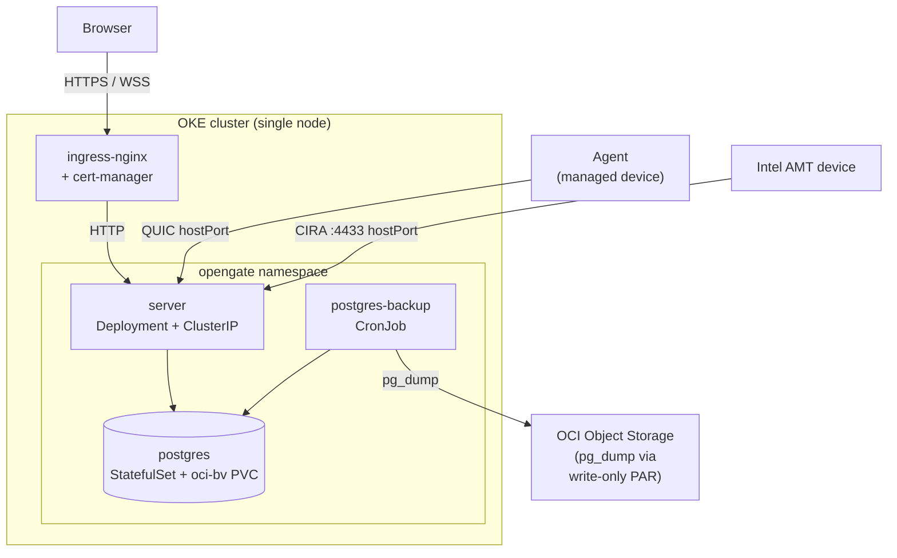

# Kubernetes

- [Cluster layout](#cluster-layout)
- [The Helm chart](#the-helm-chart)
  - [Prerequisites](#prerequisites)
  - [Secrets](#secrets)
  - [QUIC and MPS traffic](#quic-and-mps-traffic)
  - [Shared keys](#shared-keys)
- [Validation](#validation)

OpenGate runs on **Oracle Kubernetes Engine (OKE)** via a Helm chart. The
platform decisions are recorded in
[ADR-030](../adr/ADR-030-kubernetes-on-oke.md).

## Cluster layout

The serving shape on the single-node start: HTTP/WSS rides ingress-nginx, while
the non-HTTP L4 transports (QUIC, MPS CIRA) bind the node directly via
`hostPort`. The observability stack is diagrammed separately in
[Monitoring.md](./Monitoring.md).



## The Helm chart

The application chart is [`deploy/helm/opengate`](../../deploy/helm/opengate). Its
templates translate the compose services one-for-one:

| Compose service | Kubernetes object |
|---|---|
| `server` | Deployment + ClusterIP Service (HTTP) + hostPort L4 (QUIC/MPS) |
| `postgres` | StatefulSet + headless Service + `oci-bv` PVC |
| `postgres-backup` | CronJob (`pg_dump` → OCI Object Storage via a write-only PAR; [ADR-035](../adr/ADR-035-block-volume-budget.md)) |
| `caddy` | `Ingress` (ingress-nginx) + cert-manager `ClusterIssuer` |
| `web-init` + `web-assets` volume | *removed* — the server serves the SPA itself (`-web-dir`) |

Environment overlays mirror the compose split:
[`values-staging.yaml`](../../deploy/helm/opengate/values-staging.yaml) and
[`values-production.yaml`](../../deploy/helm/opengate/values-production.yaml). The
tunable surface is documented inline in
[`values.yaml`](../../deploy/helm/opengate/values.yaml).

### Prerequisites

Installed once per cluster, outside the chart (the chart's
[`NOTES.txt`](../../deploy/helm/opengate/templates/NOTES.txt) prints the exact
commands): **ingress-nginx** (snippet annotations disabled; security headers are
applied controller-side via the `add-headers` ConfigMap rendered by
[`custom-headers-configmap.yaml`](../../deploy/helm/opengate/templates/custom-headers-configmap.yaml))
and **cert-manager** (CRDs + controller). The OKE cluster + node pool are
provisioned by the [`oke` Terraform module](../../deploy/terraform/modules/oke).

### Secrets

The chart never embeds secret material — it references an `existingSecret`
(`server.existingSecret`) created out-of-band, so no secret value lands in git
or in the Helm release history.
[`secrets.example.yaml`](../../deploy/helm/opengate/secrets.example.yaml) lists
every key the secret carries, and the chart's
[`NOTES.txt`](../../deploy/helm/opengate/templates/NOTES.txt) prints the create
command for the release. The passwords and the token-signing secret are
generated:

```bash
kubectl create secret generic opengate-secrets \
  --namespace opengate \
  --from-literal=JWT_SECRET="$(openssl rand -base64 48)" \
  --from-literal=POSTGRES_PASSWORD="$(openssl rand -base64 32)" \
  --from-literal=POSTGRES_APP_PASSWORD="$(openssl rand -base64 32)" \
  --from-literal=AMT_PASS="<intel-amt-admin-password>" \
  --from-literal=VAPID_CONTACT="mailto:ops@example.com" \
  --from-literal=BACKUP_PAR_URL="<par-base-url-ending-in-/o/>"
```

`BACKUP_PAR_URL` is needed only when `postgres.backup.enabled`. It is the base
URL of a write-only OCI Object Storage pre-authenticated request, ending in
`/o/`: the
[backup CronJob](../../deploy/helm/opengate/templates/postgres-backup-cronjob.yaml)
appends a timestamped object name and uploads the dump there. The request
allows writes only, so a leaked URL cannot read the backups back. `NOTES.txt`
prints the commands that create the bucket, the request and its retention
policy.

### QUIC and MPS traffic

QUIC (agent transport, UDP) and Intel AMT CIRA (MPS, TCP) are non-HTTP and
cannot ride the ingress. On the single-node start they bind to the node's
public IP via `hostPort` (`server.hostPortL4`) — see ADR-030 for the
rationale.

### Shared keys

- **`sharedKeys.enabled`** — multi-replica correctness prerequisite. Switches
  `/data` from the per-replica RWO PVC to an `emptyDir` and mounts the enrollment
  CA, VAPID, and agent-update signing keypairs read-only from `existingSecret`, so
  every replica serves identical key material (the server loads keys if present —
  no code change).

The four key files are generated once: the server runs as a single replica on
its volume and writes them to `/data`, they are copied out, and the secret is
recreated with them under the keys `ca.crt`, `ca.key`, `vapid.json` and
`update-signing.json`, beside the values from [Secrets](#secrets):

```bash
mkdir keys && for f in ca.crt ca.key vapid.json update-signing.json; do
  kubectl exec --namespace opengate deploy/opengate-server -- cat "/data/$f" > "keys/$f"
done
kubectl create secret generic opengate-secrets --namespace opengate \
  --from-literal=JWT_SECRET=... \
  --from-file=ca.crt=keys/ca.crt --from-file=ca.key=keys/ca.key \
  --from-file=vapid.json=keys/vapid.json \
  --from-file=update-signing.json=keys/update-signing.json
```

The production overlay enables shared keys. The chart contains only the current
single-replica path: one server replica, in-process relay pairing, and shared key
material mounted from the secret. Serving more than one replica requires a
session-aware autoscaler, a cross-replica session registry, and an L4 path that
pins an agent's control connection — none of which the chart carries.

## Validation

`make lint-k8s` is the chart gate (wired into `make lint-deploy`, the precommit
gauntlet, and the CI `config-lint` job):

- `helm lint` + `helm template … | kubeconform -strict` (schema validation,
  CRDs ignored)
- `conftest verify`/`test` against [`policy/k8s`](../../policy/k8s) — image-tag
  hygiene, resource limits, run-as-non-root, health probes
- Checkov's `helm` framework (`make iac-policy`), residual findings tracked as
  documented `skip-check` entries in [`.checkov.yaml`](../../.checkov.yaml)

See [Testing](./Testing.md) for the broader test-layer map and
[CI Pipeline](./CI-Pipeline.md) for where these run.
