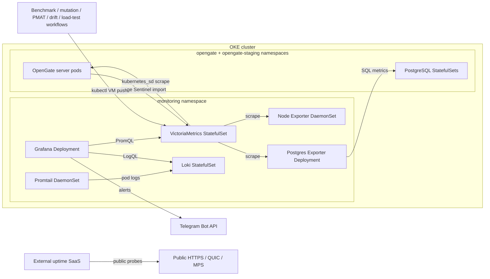

# Monitoring & Observability

## Overview

OpenGate monitoring runs inside the same OKE cluster as the application. The
topology is the Helm chart at
[`deploy/helm/monitoring`](../../deploy/helm/monitoring), deployed as the
`monitoring` Helm release; the production and staging app releases run in their
own namespaces alongside it.

Production monitoring is entirely Kubernetes-native, delivered by that release.

## Architecture



## Sources Of Truth

| Concern | Source |
|---|---|
| Monitoring chart | [`deploy/helm/monitoring`](../../deploy/helm/monitoring) |
| Monitoring values | [`values.yaml`](../../deploy/helm/monitoring/values.yaml) |
| App chart and overlays | [`deploy/helm/opengate`](../../deploy/helm/opengate) |
| Grafana dashboards and alerting ConfigMaps | [`deploy/grafana/provisioning`](../../deploy/grafana/provisioning) |
| VictoriaMetrics scrape config | [`vmagent-scrape.yaml`](../../deploy/helm/monitoring/files/vmagent-scrape.yaml) |
| Edge Sentinel stream aggregation | [`edge-sentinel-stream-aggr.yaml`](../../deploy/helm/monitoring/files/edge-sentinel-stream-aggr.yaml) |
| Promtail pod-log config | [`promtail-config.yaml`](../../deploy/helm/monitoring/files/promtail-config.yaml) |
| Loki retention/config | [`loki-config.yml`](../../deploy/helm/monitoring/files/loki-config.yml) |
| CI trend VM transport | [`scripts/lib/vm-push.sh`](../../scripts/lib/vm-push.sh) |
| CI trend-store decision | [ADR-038](../adr/ADR-038-victoriametrics-ci-trend-store.md) |
| Load-test regression decision | [ADR-045](../adr/ADR-045-load-test-regression-gate.md) |
| Edge Sentinel telemetry-store decision | [ADR-044](../adr/ADR-044-edge-sentinel-server-telemetry-ingest.md) |

## Components

The component inventory is rendered from the monitoring chart, not manually
maintained here. Current chart components are:

| Component | Kubernetes object | Purpose |
|---|---|---|
| VictoriaMetrics | StatefulSet + Service + RBAC | Metrics store and Kubernetes service-discovery scraper. |
| Loki | StatefulSet + Service | Log store for pod logs. |
| Grafana | Deployment + Service | Dashboards, datasource provisioning, and alert UI. |
| Promtail | DaemonSet + RBAC | Node-level pod-log collection from `/var/log/pods`. |
| Node Exporter | DaemonSet + Service | Node metrics. |
| Postgres Exporter | Deployment + Service | PostgreSQL metrics for the production Postgres service. |

Image tags, resource requests/limits, retention, storage class, and persistence
settings live in [`values.yaml`](../../deploy/helm/monitoring/values.yaml). Do not
copy those values into prose; link to the values file when exact numbers matter.

## Storage Model

The intended free-tier storage model is recorded in
[ADR-035](../adr/ADR-035-oke-free-tier-block-volume-remediation.md):

- VictoriaMetrics and Loki keep block-backed PVCs.
- Grafana uses `emptyDir`; dashboards, datasources, and alerting config are
  provisioned from ConfigMaps.
- Uptime Kuma is not deployed in-cluster; public uptime monitoring is external.

Live reconciliation on 2026-06-18 matched this intended shape: only three PVCs
were present across the app and monitoring namespaces — production Postgres,
VictoriaMetrics, and Loki.

## Access

| Tool | Access method | Source |
|---|---|---|
| Grafana | `make tunnel` → `kubectl port-forward svc/monitoring-grafana` | [`Makefile`](../../Makefile) |
| VictoriaMetrics | ClusterIP Service, queried by Grafana or one-shot kubectl pods | [`values.yaml`](../../deploy/helm/monitoring/values.yaml) |
| Loki | ClusterIP Service, written by Promtail and queried by Grafana | [`promtail-config.yaml`](../../deploy/helm/monitoring/files/promtail-config.yaml) |
| Public uptime | External SaaS probing the public app endpoints | [ADR-035](../adr/ADR-035-oke-free-tier-block-volume-remediation.md) |

No monitoring ingress is rendered by the monitoring chart. The public HTTP edge
is owned by ingress-nginx and the app chart; QUIC and MPS remain L4 hostPorts on
the production server pod per [Kubernetes.md](./Kubernetes.md#l4-quic--mps).

## Application Instrumentation

The Go server exposes Prometheus metrics on the same HTTP listener as the REST
API. The in-cluster VictoriaMetrics scrape configuration discovers the server
Services via Kubernetes endpoint metadata rather than hard-coded Docker hostnames.

Every series the server publishes — its name, labels and the population it
counts over — is in
[Metrics Reference](../architecture/Metrics-Reference.md). This chapter covers
how those series are scraped, rolled up, stored, charted and retained.

The vocabulary of host-resource dimensions an agent reports, what each one means,
and which of them a platform may report as unsupported are in
[Device Health](../product/Device-Health.md).

Edge Sentinel numeric telemetry is pushed by the server, not scraped from
agents. The app chart wires the VM endpoint into the server through
[`server-deployment.yaml`](../../deploy/helm/opengate/templates/server-deployment.yaml),
and the scoped client lives in
[`server/internal/telemetry`](../../server/internal/telemetry). VM reads go through
that client so the server injects the authoritative `tenant_id` matcher. Process
snapshots with basenames and optional command-line hashes stay in Postgres RLS;
see [Database](../architecture/Database.md#device-processes-table).

Host logs are edge-stored and server-proxied: raw lines stay on the device, are
read on demand through the transient broker, and are never centralized. The
broker's pull counters are charted by the Edge-Sentinel Logs dashboard. The pull
surface, its redaction guards and its audit trail are in
[Endpoint Logs](../product/Endpoint-Logs.md).

The monitoring chart passes the Edge Sentinel stream-aggregation config to
single-node VictoriaMetrics through
[`victoriametrics.yaml`](../../deploy/helm/monitoring/templates/victoriametrics.yaml).
The [rollup config](../../deploy/helm/monitoring/files/edge-sentinel-stream-aggr.yaml)
produces coarse `avg`-only rollups for `opengate_edge_*` metrics at two intervals
while `-streamAggr.keepInput` preserves the raw matched input. Central rollups
carry `avg` alone because each aggregate is its own series, so emitting
min/max/last centrally would multiply active series past the budget measured in
[`spike_test.go`](../../server/tests/vmcardinality/spike_test.go); chart bands are
computed from min/max over the raw 60 s samples instead.

### What an active series costs the central store

A device occupies at most 24 central series — the ceiling the vitals contract
sets, in [Device Health](../product/Device-Health.md). That contract bounds how
many series a fleet creates; what one series then costs is measured. The harness
in [`vmramseries`](../../server/tests/vmramseries/vmram_test.go) provisions a
VictoriaMetrics that no other test writes to, loads it with a growing fleet, and
reads the store's own accounting — resident memory, active series, rows stored,
and bytes on disk. It runs at fleet scale on every suite run and changes no
limit; the numbers below are its output, and sizing decisions are taken against
them elsewhere.

The load is written at the per-device **cap** of 24, which is what a Linux device
occupies. A capacity plan must not assume the cheaper platform mix: eight of those
series come from Linux-only kernel sources, and the fleet is Linux.

**Memory is a fit, not a division.** Dividing one resident-memory reading by the
series present charges VictoriaMetrics' fixed baseline to those series, and the
baseline dominates at any size a test can afford — at fleet shape that division
answers ≈ 1.1 KB per series, roughly twice the marginal cost. The store also
allocates lazily, so a warm-up load runs first and its reading is excluded; every
fit point sits past the startup ramp.

**Each point is read after forcing the store to collect**, because two numbers
are in play and only one of them scales with series. Left to itself the Go
runtime frees what an import allocated whenever it next collects, so resident
memory holds a plateau of garbage that is steady to look at, unrelated to the
series held, and capable of reading *lower* at a larger load. Collecting first
puts every point in the same runtime state, which is what makes a line through
them mean anything.

Fleet-scale run — 5 000 devices × 24 series, VictoriaMetrics v1.114.0,
2026-08-11:

| Active series | Resident memory, collected |
|---|---|
| 24 000 *(warm-up, excluded)* | 76.3 MB |
| 48 000 | 91.2 MB |
| 62 400 | 99.0 MB |
| 76 800 | 103.1 MB |
| 91 200 | 108.9 MB |
| 105 600 | 119.0 MB |
| 120 000 | 129.8 MB |

Fit: **514 B per active series**, R² = 0.97, over a **65.4 MB** baseline, which
projects **127.0 MB** to hold the fleet's 120 000 series. Across runs the slope
holds within a few percent of 0.5 KB per series.

**Size the pod above that projection, not at it.** The fit measures what the data
costs; a store that is not being asked to collect also holds the garbage of
whatever it last ingested, and that is real resident memory the pod has to have.
In the run above the process sat at **223.2 MB** with the import still
uncollected against the 129.8 MB it needed to hold the same series — the gap is
the working memory of ingestion, and it is the larger of the two numbers that a
memory limit has to clear.

**Disk is a compression measurement**, so it depends on series length and on what
the values look like. The harness writes slow-drifting gauges reported to a tenth
of a percent — a constant would measure VictoriaMetrics' best case and full
entropy its worst — and lengthens the same series rather than adding new ones, so
the index amortises the way it does in production:

| Samples per series | Bytes per sample | Projected 30 d at 120 000 series |
|---|---|---|
| 60 (1 h) | 3.058 | 15.85 GB |
| 720 (12 h) | 0.831 | 4.31 GB |
| 2 880 (2 d) | 0.573 | 2.97 GB |
| 5 760 (4 d) | 0.542 | 2.81 GB |

The production store's own cost per sample — data size over
`vm_rows_added_to_storage_total`, on real fleet telemetry — is **0.316 B**, which
projects to **1.64 GB** over 30 d at 120 000 series. Real vitals repeat more than
the synthetic drift does, so the two bracket the answer: 1.64 GB on measured
production data, 2.81 GB as the harness's conservative upper bound.

**What was decided from these numbers: the pod keeps its limit.** The memory
limit was deliberately left where it was until the measurement existed, because
raising it against the same rule of thumb the experiment was run to replace would
have re-committed the error one layer down. The measurement came back at roughly
a quarter of that rule of thumb — 514 B per series against the ~2 KB commonly
cited — so the fleet's 120 000 series project to 127 MB of data inside a
[512 Mi limit](../../deploy/helm/monitoring/values.yaml), and the 223 MB the process
sat at with an import still uncollected is the number the limit actually has to
clear. Both fit with room, so the vitals set keeps its 24-series cap, the fleet
target stands, and nothing about the deployment changes. Read the disk column the
same way: 30 d at fleet scale lands between 1.64 GB and 2.81 GB against a
[50 Gi volume](../../deploy/helm/monitoring/values.yaml).

Re-run the harness when any of the three inputs move — the cap, the fleet target,
or the VictoriaMetrics version — because the decision is only as good as the
measurement under it.

### Watching the rule pack itself

The server exports five aggregate series covering alerts raised, refusals, the
triage queue and fleet-wide rule coverage; they are defined in
[Metrics Reference](../architecture/Metrics-Reference.md#detection-alerts-incidents-and-coverage),
and what a measured rate obliges is in
[ADR-076](../adr/ADR-076-aggregate-platform-metrics-and-the-measured-alert-rate.md).

The [Rule Rollout And Triage
dashboard](../../deploy/grafana/provisioning/dashboards/rule-rollout.json) reads
them, and its stat panel carries the measured alerts-per-device-per-day rate.
Two alerts watch a bad rollout
([`alert-rules.yml`](../../deploy/grafana/provisioning/alerting/alert-rules.yml)) —
one on the projected per-device alert rate, one on any ceiling suppression at
all.

### Telemetry load and observability

Edge-Sentinel telemetry runs on every enrolled device. The control-plane holds
its budgets under that load: control-plane query p99 stays within ~20% of the
telemetry-free baseline, VM active-series cardinality and disk growth track the
avg-only model, and the reconnect-storm scheduler drains gradually without
starving live traffic. Those budgets are exercised by the load harness and
watched on the dashboard below.

The load driver is the QUIC agent load harness
([`server/tests/loadtest`](../../server/tests/loadtest)). Beyond raw connect/register
timing it can drive the **default telemetry shape** per agent (`-default-telemetry`:
a health summary, a host metric window, and a minimal process report), spread
agents across tenant cohorts (`-tenants`), and run a **fleet-wide reconnect storm**
(`-backfill-batches`) in which a cohort returns at once with offline backlogs and
drains through the admission scheduler one acked batch at a time. Run it through
the Docker/e2e stack lifecycle, never bare tooling.

The server instruments the ingest path so it stays observable: accepted
telemetry, server-side drops by typed reason, agent-clock corrections and the
reconnect-backfill scheduler's own state. Those series, the closed ledger the
first two form and the full reason vocabulary are in
[Metrics Reference](../architecture/Metrics-Reference.md#telemetry-ingest); what
a reading means for a machine is in
[Device Health](../product/Device-Health.md).

The **Edge-Sentinel Soak**
Grafana dashboard charts these alongside anomaly rate, VM cardinality + disk
growth, and control-plane query p99 over the VM datasource. The
`opengate_*` series require the server `/metrics` scrape; the `vm_*` series require
the VictoriaMetrics self-scrape.

### Long-term (cold) tier

Single-node OSS VictoriaMetrics applies **one global retention window** set by
`victoriametrics.retention` in
[`values.yaml`](../../deploy/helm/monitoring/values.yaml) — per-series retention and
downsampling are Enterprise features, so raw 60 s samples and the `avg` rollups
share the same window. The rollups exist for query efficiency: a long range reads
coarse pre-aggregated series instead of scanning raw. Within that window
VictoriaMetrics is the source of truth for central numeric telemetry, stored with
its native Gorilla compression.

Promtail reads Kubernetes pod logs, enriches each stream with Kubernetes labels,
and pushes to Loki via
[`deploy/helm/monitoring/files/promtail-config.yaml`](../../deploy/helm/monitoring/files/promtail-config.yaml).

## Dashboards And Alerts

Grafana dashboards and alerting files are canonical in
[`deploy/grafana/provisioning`](../../deploy/grafana/provisioning). The monitoring
chart intentionally does not duplicate dashboard JSON; its
[`NOTES.txt`](../../deploy/helm/monitoring/templates/NOTES.txt) documents creating
ConfigMaps from the canonical files.

The rule set in
[`alert-rules.yml`](../../deploy/grafana/provisioning/alerting/alert-rules.yml)
is pinned by
[`alert-rules.test.sh`](../../scripts/tests/alert-rules.test.sh), which reads
the file rather than the cluster: every rule carries a condition, a duration, a
severity and a summary, and the rules watching the server process itself are
named there by uid so a refactor cannot quietly drop one. A server process that
was replaced raises `server-process-restarted` off
`process_start_time_seconds`, which is already collected and dates the
replacement to the second.

Current dashboard files include the app overview, DB performance, PostgreSQL,
the Edge-Sentinel Logs dashboard (raw-log pull rate/latency and audited reads),
the Edge-Sentinel Soak dashboard (telemetry ingest/drop rates, VM
cardinality + disk growth, control-plane query p99,
reconnect-backfill scheduler state, and threshold-alert breach counts),
the Rule Rollout And Triage dashboard (alerts raised per rule, refusals by
reason, the measured alerts-per-device-per-day rate, the triage queue by status,
and fleet-wide rule coverage),
benchmark trend, mutation trend, PMAT trend,
terraform-drift trend, and load-test trend dashboards. Numeric CI trend workflows
write Prometheus samples to VictoriaMetrics:

- [`benchmark.yml`](../../.github/workflows/benchmark.yml) →
  [`scripts/benchmark-vm-push.sh`](../../scripts/benchmark-vm-push.sh)
- [`mutation.yml`](../../.github/workflows/mutation.yml) →
  [`scripts/mutation-vm-push.sh`](../../scripts/mutation-vm-push.sh) +
  [`scripts/mutation-status-vm-push.sh`](../../scripts/mutation-status-vm-push.sh)
- [`pmat-trend.yml`](../../.github/workflows/pmat-trend.yml) →
  [`scripts/pmat-vm-push.sh`](../../scripts/pmat-vm-push.sh)
- [`terraform-drift.yml`](../../.github/workflows/terraform-drift.yml) →
  [`scripts/terraform-drift-vm-push.sh`](../../scripts/terraform-drift-vm-push.sh)
- [`load-test.yml`](../../.github/workflows/load-test.yml) →
  [`scripts/loadtest-regression-check.sh`](../../scripts/loadtest-regression-check.sh) →
  [`scripts/loadtest-vm-push.sh`](../../scripts/loadtest-vm-push.sh)

VictoriaMetrics is the canonical numeric CI-trend store; Loki is reserved for
logs per [ADR-038](../adr/ADR-038-victoriametrics-ci-trend-store.md). Load-test
regression semantics are recorded in
[ADR-045](../adr/ADR-045-load-test-regression-gate.md). PMAT reads its previous
day-over-day baseline through
[`pmat-vm-query.sh`](../../scripts/pmat-vm-query.sh) before publishing the current
sample.

### CI Trend Metric Convention

Numeric CI trends use VictoriaMetrics through
[`scripts/lib/vm-push.sh`](../../scripts/lib/vm-push.sh). That transport is the
executable source for required labels and payload validation. Family names,
units, and extra labels live in the adjacent `*-vm-push.sh` wrappers and are
pinned by [`ci-trend-vm-push.test.sh`](../../scripts/tests/ci-trend-vm-push.test.sh),
[`benchmark-vm-push.test.sh`](../../scripts/tests/benchmark-vm-push.test.sh), and
[`loadtest-vm-push.test.sh`](../../scripts/tests/loadtest-vm-push.test.sh). New
families follow those sources instead of copying a convention into prose.

Telegram credentials are held in the monitoring Secret described by
[`values.yaml`](../../deploy/helm/monitoring/values.yaml) and chart
[`NOTES.txt`](../../deploy/helm/monitoring/templates/NOTES.txt). Workflow-level
alerts use GitHub environment secrets directly.

## Deployment And Validation

The monitoring chart is a Helm release in the `monitoring` namespace. The app CD
workflow deploys the application releases; monitoring release lifecycle is an
operator action until explicitly wired into CD.

Validation sources:

- [`make lint-k8s`](../../Makefile) renders and validates the app and monitoring
  charts.
- [`deploy/helm/monitoring/templates/NOTES.txt`](../../deploy/helm/monitoring/templates/NOTES.txt)
  lists required out-of-band Secrets and ConfigMaps.
- [`scripts/tests/vm-transport.test.sh`](../../scripts/tests/vm-transport.test.sh)
  verifies the shared kubectl VictoriaMetrics push transport without reaching the
  live cluster.
- [`scripts/tests/pmat-vm-query.test.sh`](../../scripts/tests/pmat-vm-query.test.sh)
  verifies newest-sample selection and fail-soft PMAT baseline reads.
- [`scripts/tests/ci-trend-retirement.test.sh`](../../scripts/tests/ci-trend-retirement.test.sh)
  keeps the CI trend transport VictoriaMetrics-only and pins Loki's runtime log
  deployment.
- [`scripts/tests/benchmark-summarize.test.sh`](../../scripts/tests/benchmark-summarize.test.sh)
  verifies benchmark parsing, baseline generation, deterministic allocation
  regression detection, and `ns/op` advisory-only behavior.
- [`scripts/tests/ci-trend-vm-push.test.sh`](../../scripts/tests/ci-trend-vm-push.test.sh)
  verifies mutation scores, mutation completion status, PMAT, and terraform-drift
  rows map to Prometheus text before reaching the shared VM transport.
- [`scripts/tests/loadtest-summarize.test.sh`](../../scripts/tests/loadtest-summarize.test.sh)
  verifies k6 summary-export and QUIC harness output parsing for load-test
  trend rows, including partial failed-run capture.
- [`scripts/tests/loadtest-k6-run.test.sh`](../../scripts/tests/loadtest-k6-run.test.sh)
  verifies that a k6 scenario which aborts contributes no trend row while a
  failed threshold still does, and that the workflow runs every scenario
  through the runner.
- [`scripts/tests/loadtest-k6-incluster.test.sh`](../../scripts/tests/loadtest-k6-incluster.test.sh)
  verifies that k6 runs inside the staging cluster with its arguments intact,
  that its summary export reaches the runner on every exit status, and that the
  workflow keeps addressing the server over the cluster network.
- [`scripts/tests/loadtest-regression-check.test.sh`](../../scripts/tests/loadtest-regression-check.test.sh)
  verifies per-series VM read-back regression checks, p99 advisory behavior,
  cold-start handling, and VM fail-open behavior.
- [`scripts/tests/loadtest-vm-push.test.sh`](../../scripts/tests/loadtest-vm-push.test.sh)
  verifies load-test trend rows map to Prometheus text before reaching the
  shared VM transport.

## Ad-hoc Investigation

Use `/observe` or the underlying kubectl/Loki helpers. The investigation path
is cluster-native:

```bash
kubectl -n monitoring get pods
kubectl -n monitoring logs deploy/monitoring-grafana
kubectl -n monitoring port-forward svc/monitoring-grafana 3000:3000
```

For ad-hoc trend checks, prefer the repository scripts that already use
temporary kubectl pods and clean themselves up. For app health, use
[`deploy/scripts/smoke-test.sh`](../../deploy/scripts/smoke-test.sh) through a
Service port-forward, matching [`cd.yml`](../../.github/workflows/cd.yml).
