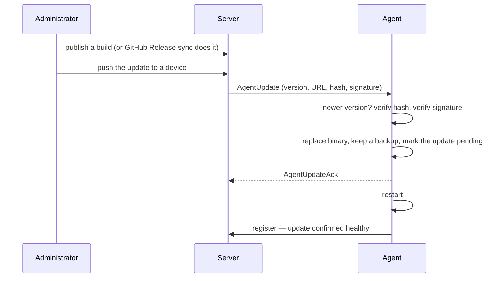

# Agent Updates

Agents update themselves over their existing connection to the server. Every
build is signed, verified twice on the machine before it is installed, and rolled
back automatically if it fails to come back up.

## How an update reaches a machine

## Publishing builds

The server keeps a list of **manifests**: one per version, operating system and
architecture, each carrying the download URL, the SHA-256 hash and the signature.

Manifests reach the server two ways:

| Route | How it works |
|---|---|
| **GitHub Release sync** | The server syncs from a configured GitHub repository on startup and hourly after that. It downloads release assets, computes their hashes, signs them, and stores the manifests |
| **Direct publish** | An administrator posts a manifest to the server's update API |

## Pushing an update

| From | What it does |
|---|---|
| Device detail page | An **upgrade** button appears for one device when a newer manifest matches its operating system and architecture |
| Device list | **Upgrade all agents** pushes to every outdated device, choosing each machine's newest matching build and reporting per-device success and failure counts |

### Matching a build to a machine

Agents report their platform the way the host names it (`Ubuntu 22.04.4 LTS`,
`x86_64`), while manifests use short target names (`linux`, `amd64`). The server
normalises before matching:

| An agent reports | Matched as |
|---|---|
| `Ubuntu …`, `Debian GNU/Linux …`, `Fedora Linux …`, `CentOS Stream …`, `Alpine Linux`, `Arch Linux`, `Red Hat Enterprise Linux` | `linux` |
| `Windows 11 Pro` | `windows` |
| Any other OS name | The name, lowercased |
| `x86_64` | `amd64` |
| `aarch64` | `arm64` |

Publishing for a further operating system needs no server change: a manifest
published for an OS the table does not fold matches agents whose reported name
lowercases to exactly that value.

## What the agent checks before installing

An update is refused, or skipped as unnecessary, unless every check passes.

| Check | Behaviour |
|---|---|
| Version | An incoming version at or below the running one is skipped, acknowledged as *already up to date*. An unparseable version proceeds |
| Same build | The agent hashes its own running binary first. If it already matches the manifest, nothing is downloaded and nothing is swapped |
| Integrity | The downloaded binary must match the manifest's SHA-256 hash |
| Authenticity | The binary must carry a valid signature from the server's signing key |

## Rollback safety

Updating a fleet's agents is the one operation that can take the fleet offline,
so the agent protects itself in four layers:

1. **Backup** — the running binary is kept alongside the new one before the swap.
2. **Pending marker** — after a successful swap the agent records that an update
   is awaiting proof.
3. **Watchdog** — on the next start, an agent carrying that marker has 60 seconds
   to register with the server. If it registers, the marker is cleared and the
   update is confirmed. If it does not, the agent restores the backup and
   restarts.
4. **Loop protection** — after two consecutive rollbacks the agent stops rolling
   back and clears the marker, so two bad binaries cannot bounce a machine
   forever.

## The signing key

Updates are signed by the server and verified on the machine. The public key is
delivered to an agent **during enrollment**, so no key management is needed per
update:

1. The server includes the signing key in the enrollment response.
2. The agent saves it in its data directory and loads it on every start.
3. An explicitly configured key on the agent's command line takes precedence over
   the saved one.

## Enrollment tokens

Enrollment tokens are managed on **Agent Settings** (`/settings/updates`) and on
the **Add Device** page (`/setup`).

| Action | Detail |
|---|---|
| Create | Give the token a label, a use cap and an expiry |
| Reveal or mask | The token value can be shown for copying, then hidden again |
| Delete | Remove one token |
| Clean up | Remove every inactive token — expired or exhausted — behind a confirm step |

A token's badge shows whether it is **Active**, **Expired** or **Exhausted**.

Using a token to install an agent is in
[Agent Deployment](./Agent-Deployment.md).

## Version numbers

An agent's version comes from the build it was produced by: the release tag when
a build comes from CI, the nearest git tag for a local build, and the package
version as a last resort. There is no version to bump by hand, so what a machine
reports in the console is what it is actually running.

## Related

- [Agent Deployment](./Agent-Deployment.md) — first install and enrollment
- [Fleet and Devices](./Fleet-and-Devices.md) — where the upgrade buttons live
- [Wire Protocol](../architecture/Wire-Protocol.md) — the update messages on the wire
