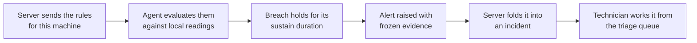

# Alerts and Rules

A rule states a condition. Each device evaluates the rules it has been given
against its own readings, once per sample. When one breaches, the device raises
an **alert** carrying the evidence it froze at that moment.

Nothing is evaluated centrally, and nothing is asked of a machine after the fact.

## How detection works

Two kinds of rule produce alerts:

| Kind | Watches | Example failure it catches |
|---|---|---|
| [Threshold rules](#threshold-alerts) | Numeric readings — the vitals | A mount filling, a disk whose service time is drifting upward |
| [System-event rules](#system-event-alerts) | The machine's own log records | A task hung for two minutes, a process killed to reclaim memory, a processor throttling itself on heat |

> **Alerts never page anyone directly.** Every alert is folded into an incident
> and worked from the triage queue in [Investigations](./Investigations.md).
> Browser notifications carry device and session events only.

## Threshold alerts

A threshold rule names:

| Part | Meaning |
|---|---|
| Metric | Any vitals dimension, under its canonical name or an alias ([Device Health](./Device-Health.md#the-vitals-contract)) |
| Comparator and fire threshold | The line that counts as bad |
| Clear boundary | A separate, safer line the reading must come back past before the rule stops firing |
| Sustain duration | How long the breach must hold continuously before it fires |

The two boundaries do different jobs. **Sustain** suppresses brief spikes: a
backup that pins the processor for ten seconds never fires a rule that requires
five minutes. The **clear boundary** suppresses flapping: a reading hovering on
the line does not alternate between firing and clear.

### What a rule can express

Beyond comparing the reading itself, a rule can compare how the reading is
*changing*, or its behaviour over a window, and can require several conditions at
once.

| Shape | Compares |
|---|---|
| Instant | The reading as it is |
| Rate | How fast the reading is changing per second across the window |
| Window maximum | The largest value in the window |
| Window mean | The average across the window |
| Additional conditions | Further metrics that must all hold at the same instant |

That covers failures a single instantaneous threshold cannot state:

- a disk whose service time drifts from 2 ms to 40 ms over a fortnight crosses no
  line on any given second — but its **rate** does;
- a queue 28 deep at a healthy 3 ms service time is a nightly backup, while the
  same queue at 40 ms is a device in trouble — it takes **both conditions
  together** to tell them apart.

The vocabulary is the vitals dimensions, so a rule can only watch something the
fleet actually collects. Every shape is bounded, and a rule's evaluation cost is
computable from its own text before it ever reaches a machine.

### Where a rule comes from

A rule has three layers, separated by how mutable each one is.

| Layer | Lives in | Who changes it |
|---|---|---|
| **Definition** — what it watches, how the compared number is derived, what its alerts group by, what evidence they carry, and the numbers it ships with | Versioned rule catalogue compiled into the server | Shipped with a release; there is no authoring screen |
| **Tuning** — the numbers the rule declares adjustable, and which machines they apply to | Database, per customer | Administrator, in [Rule Administration](./Rule-Administration.md) |
| **Rollout state** — how far the rule has reached, and whether it runs at all | Database, per customer | Administrator; takes effect without a deploy |

A definition is **immutable for a given rule and version**. A rule whose meaning
changed without its version changing is refused at load. That is what lets an
alert raised last week still mean what it meant then.

Tuning **resolves down the tenancy ladder** — machine, then site, then customer,
then tenant, then what shipped — and **each parameter resolves on its own**, so a
customer-wide sustain window survives one machine's retuned threshold. A customer
with no configuration gets the rule as shipped; absence is never read as
"switched off".

Each machine receives only the rules resolved for its own place in the tenancy
ladder, so one customer's tuning never reaches another customer's machines, even
inside the same tenant.

### Coverage: which machines a rule is actually watching

Per rule, every device in the fleet is exactly one of four things, and together
they always add up to the fleet.

| State | Meaning |
|---|---|
| `active` | The device is evaluating the rule |
| `unsupported` | The rule can produce no answer here — the reading is unavailable on this platform, or the machine cannot supply it (a kernel with no pressure accounting, a container whose disk counters belong to the host, a disk that completed no I/O) |
| `throttled` | The rule cost this device more than its allowance, so the device stopped running it |
| `unknown` | The device has reported nothing — offline, or never seen |

`unsupported` is a first-class answer, not an error. "No kernel pressure
information here" is a permanent platform gap and reads completely differently
from a machine that is merely quiet. Claiming a rule watches a machine it
produces nothing for is exactly the failure coverage exists to prevent.

The states behave differently over time, because they are different kinds of
fact:

- `active`, `throttled` and `unknown` are **liveness**. They reset when the
  server loses sight of the fleet: a device that disconnects moves to `unknown`
  rather than vanishing from the count, so a machine unplugged three weeks ago
  cannot keep claiming it is being watched.
- `unsupported` is **durable**. A containerized agent will never read host
  pressure accounting, so that is a standing hole in the estate's monitoring and
  it answers the same after a restart as before one. A machine that becomes able
  to evaluate the rule stops being counted as unsupported on its next reading.

### What a rule may cost the machine running it

The shipped rule pack is cost-bounded before release, but the endpoint is what
actually pays, so **each machine enforces its own ceiling** over what a rule
really touched, and stops any rule that spends past it.

- The stop is **per rule**. One expensive rule must not silence the cheap ones,
  or a bad rollout would become blanket blindness while still looking contained.
- The stop is **firm**: the rule is not retried on that machine until a
  *different* ruleset arrives, so a flaky link re-pushing the same rules cannot
  spend the allowance again and again.
- The device reports the rule as `throttled`, which is precisely what a staged
  rollout watches for.

### Staged rollout and the stop switch

A curated rule that turns out to be wrong is the one thing here that can degrade
thousands of machines at once, so a rule reaches a customer's estate in stages: a
handful of machines, then a tenth of them, then all of them.

- Each stage is held for a minimum period before it may grow — but what actually
  advances it is the estate having **stayed quiet** while it was held.
- A hit alert ceiling, a machine that throttled the rule, or a rule that failed
  to evaluate sends it back to the population it was last quiet on and restarts
  that stage's clock. A signal that comes and goes cannot ratchet a rule upward.
- A rule already on its smallest population stops there rather than being pulled
  off the machines watching it. Ending it altogether is a **kill**, which is a
  person's decision.
- Which machines a stage covers is worked out one machine at a time from the
  machine, the rule and the reach — there is no stored roster. Every server
  computes the same answer, restarts change nothing, and growing a rollout only
  ever *adds* machines.
- A floor of a handful of machines keeps a stage meaningful on a small estate,
  where a percentage of a dozen machines is nobody.

**Stopping a rule needs no deploy.** A kill reaches a connected machine at the
next push of its ruleset, and an offline one as it reconnects — whichever comes
first. A kill outranks the stage, so the canary machines proving the rule lose it
too. The operator surface for all of this is in
[Rule Administration](./Rule-Administration.md#rollout).

### "Has this happened before?"

When a rule arrives on a machine for the first time, the machine also re-runs it
over the history it already holds. The local store keeps a minute-by-minute
rollup of every vital going back far longer than any central recorder of a whole
fleet's seconds could afford, so the question is answered on the endpoint and
nothing is shipped anywhere to make it possible.

How far back the scan can see depends on how many series the machine stores. At
the shape today's fleet writes, the local store holds **roughly seven months** of
minute-by-minute history before it starts evicting its oldest; a machine storing
more series reaches proportionally less far.

Findings come back as ordinary alerts, marked as having come from history and
stamped with the minute they **happened**. A freeze from three weeks ago stays
three weeks old, which is what lets a whole scan fold into one incident instead
of a queue of things that all appear to be happening at once.

Three properties keep this safe to run on a customer's machine:

1. **A minute is only asked what a minute can answer.** A rule about a span
   shorter than one stored minute is not re-run at all, and reports that. For the
   rest, the reading taken from each minute is the one the rule's own question
   needs: a rule that must *stay* over a line reads the minute's least
   favourable value, so a finding means every second of that minute was over it;
   a rule asking whether a line was *ever* crossed reads the minute's peak. The
   bias is deliberate — a scan that invents an episode is worse than one that
   misses a marginal one.
2. **The scan is scheduled around the machine.** It walks history in fixed-size
   chunks, stands down between them, and suspends entirely during maintenance,
   while the host is busy, and while the host disk is filling. It records where
   it got to, so a busy host or an agent restart costs neither a repeated nor a
   skipped finding.
3. **The scan spends the same alert allowance as everything else**, so a rule
   that matches thousands of minutes cannot flood a customer's queue.

A rule is scanned once per **version**, not once per delivery — the server pushes
the whole ruleset on every reconnect, and re-scanning each time would re-raise
every historical finding whenever a flaky link came back. A retuned threshold is
a new version, and is scanned afresh.

## System-event alerts

Some failures never cross a threshold, because nothing about them is a number: a
task stuck for two minutes, memory reclaimed by killing a process, a disk that
stopped answering its bus, a processor slowing itself down to survive its own
heat. The machine reports every one of these about itself, in words, in its own
log.

A curated pack of Linux rules reads those records from the systemd journal, and
one further rule counts something no single record says: one service producing
errors over and over for a day.

**Exclusions matter as much as matches.** Every subsystem that reports a failure
also reports its recovery, usually naming the same component in nearly the same
words — a disk that resets its link announces the link coming back up; a
throttled processor announces its temperature returning to normal. A rule without
exclusions looks correct right up until it pages someone for a machine that just
got better, so every rule in the pack is tested against both a matching record
and a near-miss.

How the watch behaves:

- **It polls with an overlapping window**, and a cursor decides what is new. A
  record newer than the cursor fires; a record already answered for does not; a
  record older than the cursor never fires. A record that arrives late is
  therefore lost rather than duplicated — an alert delivered twice costs more
  trust than one delivered never.
- **How far back each poll reads** follows the least severe level the pack
  itself asks for, so adding a rule that watches something milder widens the read
  automatically.
- **A poll that comes back full saw only the newest end of its window.** How many
  records fell off the far end is unknowable, so the poll itself is reported as
  an event and no number is invented. Records that cannot be placed in time, and
  services beyond the tracking cap, are counted the same way.
- **A record a curated rule already explained does not also feed the
  repeated-error count.** Reporting one event twice, the second time under a
  vaguer name, is worse than reporting it once.
- **Maintenance suppresses the window rather than deferring it.** An administrator
  rebooting a host produces exactly the records this pack matches; holding them
  until maintenance ends would page someone for the maintenance itself.

## What an alert carries

An alert is **self-contained**. There is no path for asking the device afterwards,
so everything behind a finding is attached when it fires or it exists nowhere.

| Part | What it is |
|---|---|
| Ranked dimensions | Which of the machine's readings broke pattern around the event, ranked by the machine itself |
| Series | A short stretch of those readings around the event |
| Processes | What was running at the instant |
| Log lines | A bounded sample of the machine's own log records, redacted on the device |

The composition is **fixed rather than best-effort** — two incidents a week apart
are only comparable if they were assembled the same way. When the whole thing
exceeds its size cap it gives up its least valuable parts in a stated order, and
says that it did.

Every free-text field is redacted on the device **before the alert exists**,
because an alert is the one path that lifts a log line off a host outside the logs
pane; see [Endpoint Logs](./Endpoint-Logs.md).

### Ranking what broke

An alert says what crossed a line. The next question is what else moved at the
same time — and the device is the only place that can answer with detail, because
it keeps one-second readings locally while what reaches the server is a
sixty-second average, in which a ten-second I/O collapse is a bump.

So the machine ranks its own dimensions over the event window against the stretch
immediately before it, and the ranking travels inside the alert. Three signals
blend into one score:

1. how much the dimension's distribution changed shape;
2. how many readings in the event window fell outside the baseline's normal band;
3. how far the mean moved, measured against the baseline's own spread.

The third is what stops a service time that went from 0.40 ms to 0.44 ms
outranking one that went from 0.4 ms to 40 ms — the first two saturate on any
clean separation, however small.

Degenerate cases get an answer rather than a blank: a dimension with too few
readings on either side is left out instead of scored from nothing; a reading
that held one value all hour has no band, so any different reading counts; ties
break the same way every time, so identical readings always produce identical
ordering. Every run is bounded in how many dimensions it examines, how many
readings it reads, and how long it may take — the moment this runs is the moment
the machine is already in trouble.

## Alert volume limits

Alerts from every producer on a machine land in one bounded per-device queue.
When it is full it drops its **oldest** entry, because the newest alert describes
what the machine is doing now. On top of that, a machine may raise no more than
the per-machine hourly ceiling an administrator set for its customer, and a
customer may store no more than its own hourly ceiling.

Both limits lose alerts by design, and **both count every alert they cost**, so a
suppression is never indistinguishable from a quiet device. What a ceiling turns
away folds into one incident that says how much. The ceilings themselves are in
[Rule Administration](./Rule-Administration.md#alert-limits).

## Related

- [Rule Administration](./Rule-Administration.md) — tuning, labels, rollout and budgets
- [Investigations](./Investigations.md) — what happens to an alert once it exists
- [Device Health](./Device-Health.md) — the readings rules are written against
